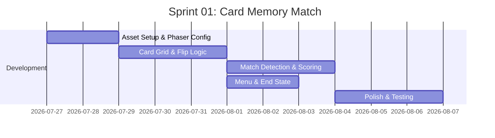

# Sprint 01: Card Memory Match (G008)

**Goal:** Deliver a playable Card Memory Match game with core matching mechanics, basic UI, and score tracking.

**Timeline:** 2026-07-27 → 2026-08-10 (2 weeks)

## 📅 Internal Timeline

## 📋 Committed Stories & Tasks

| ID | Story / Task | Owner | Estimate | Status |
|----|--------------|-------|----------|--------|
| [US-08-01](./user-stories/US-08-01.md) | Card grid display with flip animation | Dev | 4h | [ ] |
| [US-08-02](./user-stories/US-08-02.md) | Card flip and match detection logic | Dev | 4h | [ ] |
| [US-08-03](./user-stories/US-08-03.md) | Move counter and timer display | Dev | 2h | [ ] |
| [US-08-04](./user-stories/US-08-04.md) | Match results screen with stats | Dev | 2h | [ ] |
| [US-08-05](./user-stories/US-08-05.md) | Game restart and new game button | Dev | 2h | [ ] |
| [US-08-06](./user-stories/US-08-06.md) | Mobile-responsive touch support | Dev | 3h | [ ] |
| [US-08-07](./user-stories/US-08-07.md) | Performance optimization & loading | Dev | 2h | [ ] |

## 🛠 Sprint Specifics

- **Definition of Done:** All 7 user stories implemented, tested on mobile and desktop, no critical bugs
- **Risks & Blockers:**
  - Phaser 2 API changes may affect tweening syntax (Mitigation: test early)
  - Kenney assets format compatibility (Mitigation: check .atlas vs .json format)
  - Mobile touch responsiveness (Mitigation: test on real devices early)

## User Stories Summary

| User Story | Acceptance Criteria |
|------------|---------------------|
| US-08-01: Card Grid | 4×4 grid renders, cards shuffle each game, flip animation plays |
| US-08-02: Flip & Match | Click flips card, second click reveals match logic, correct cards stay visible |
| US-08-03: Score Display | Moves counter increments, timer starts on first flip, visible during gameplay |
| US-08-04: Results Screen | Shows total moves, time, accuracy when all pairs matched |
| US-08-05: Restart | "New Game" button shuffles and resets without page reload |
| US-08-06: Mobile Support | Touch events work, responsive layout for phone/tablet |
| US-08-07: Performance | Loads in <2s, no FPS drops, assets preloaded |