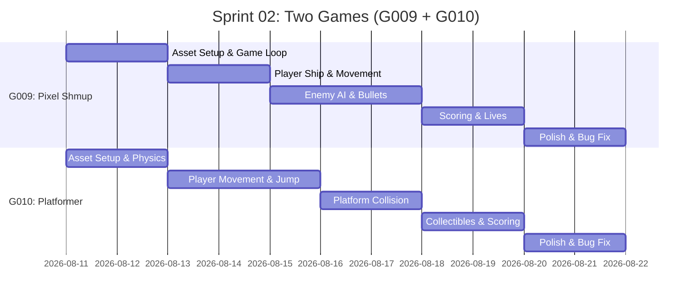

# Sprint 02: Pixel Shmup (G009) + Pico-8 Platformer (G010)

**Goal:** Deliver two complete arcade games — a side-scrolling shooter (G009) and a platformer with Pico-8 style (G010) — both using Phaser 3 and Kenney assets.

**Timeline:** 2026-08-11 → 2026-08-24 (2 weeks)

## 📅 Internal Timeline

## 📋 Committed Stories & Tasks

### G009: Pixel Shmup

| ID | Story / Task | Owner | Estimate | Status |
|----|--------------|-------|----------|--------|
| [US-09-01](./user-stories/US-09-01.md) | Ship movement (left/right/vertical) | Dev | 3h | [ ] |
| [US-09-02](./user-stories/US-09-02.md) | Shoot bullets on input | Dev | 2h | [ ] |
| [US-09-03](./user-stories/US-09-03.md) | Enemy spawning pattern | Dev | 3h | [ ] |
| [US-09-04](./user-stories/US-09-04.md) | Collision detection (bullets-enemies-enemy-ship) | Dev | 3h | [ ] |
| [US-09-05](./user-stories/US-09-05.md) | Score display and enemy destroyed effects | Dev | 2h | [ ] |
| [US-09-06](./user-stories/US-09-06.md) | Lives system and game over screen | Dev | 3h | [ ] |

### G010: Pico-8 Platformer

| ID | Story / Task | Owner | Estimate | Status |
|----|--------------|-------|----------|--------|
| [US-10-01](./user-stories/US-10-01.md) | Player character with gravity & jump physics | Dev | 4h | [ ] |
| [US-10-02](./user-stories/US-10-02.md) | Level tiles/platforms with collision | Dev | 4h | [ ] |
| [US-10-03](./user-stories/US-10-03.md) | Camera follow player through level | Dev | 2h | [ ] |
| [US-10-04](./user-stories/US-10-04.md) | Collectible items (coins/stars) with pickup | Dev | 2h | [ ] |
| [US-10-05](./user-stories/US-10-05.md) | HUD: coin counter, health bar | Dev | 2h | [ ] |
| [US-10-06](./user-stories/US-10-06.md) | Enemy NPC with patrol AI | Dev | 3h | [ ] |
| [US-10-07](./user-stories/US-10-07.md) | Win condition (reach flag/goal) and game over | Dev | 2h | [ ] |

## 🛠 Sprint Specifics

- **Definition of Done:** Both games are fully playable, tested on mobile and desktop, no critical bugs
- **Risks & Blockers:**
  - Parallel development may split focus (Mitigation: work on separate branches, merge before polish)
  - Phaser 3 physics engine complexity for platformer (Mitigation: use Arcade physics, prototype early)
  - Enemy AI design for shmup (Mitigation: start with simple patterns, add complexity later)
  - Platformer tilemap editing (Mitigation: use Tiled or simple array-based level design)

## Dependencies

- **G008 Completion:** Sprint 02 starts after Sprint 01 is complete
- **Asset Reuse:** Both games use Kenney assets — download and organize in Sprint 02 Day 1
- **Phaser 3 Upgrade:** G009 and G010 use Phaser 3 (different from G008's Phaser 2) — ensure runtime setup first
- **Project Structure:** Both games follow the same `public/games/` directory pattern established in Sprint 01