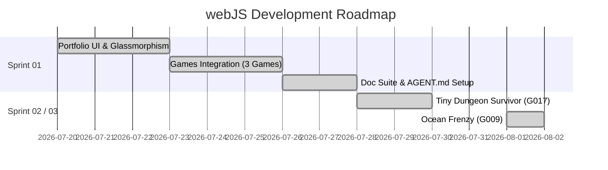

# Sprint Planning & Roadmap — webJS Game Portfolio

**Last Updated:** 2026-08-01 | **Version:** 1.2.0

---

## 📅 Sprint Schedule Overview

| Sprint | Timeline | Focus Area | Status |
|:---|:---|:---|:---|
| [sprint-01](./sprint-backlogs/archive/sprint-01.md) | 2026-07-20 → 2026-07-27 | Portfolio Glassmorphism UI, Native Node HTTP Server, 3 HTML5 Games Integration & Doc Setup | ✅ Completed |
| [sprint-02](./sprint-backlogs/sprint-02.md) | 2026-07-31 → 2026-08-07 | Pixel Shmup (G009) & Pico Platformer (G010) Implementation | 🔵 In Progress |
| [sprint-03](./sprint-backlogs/archive/sprint-03.md) | 2026-07-28 → 2026-08-04 | Tiny Dungeon Survivor (Action Roguelike - G017) Implementation & Integration | ✅ Completed |
| [sprint-08](./sprint-backlogs/sprint-08.md) | 2026-07-29 → 2026-08-12 | Ice Cream Town — Core Match-3 Mechanics | 🏗 Planning |
| [sprint-09](./sprint-backlogs/sprint-09.md) | 2026-08-01 → 2026-08-15 | Ocean Frenzy (G009) Full Mechanics & Economy System | 🔵 In Progress |

---

## 🚀 Roadmap Overview

---

## Related Documents
- Product Backlog: [Product Backlog](./01-product-backlog.md)
- Sprint 01 Details: [Sprint 01 Backlog Archive](./sprint-backlogs/archive/sprint-01.md)
- Sprint 03 Details: [Sprint 03 Backlog Archive](./sprint-backlogs/archive/sprint-03.md)
- Sprint 09 Details: [Sprint 09 Backlog](./sprint-backlogs/sprint-09.md)

