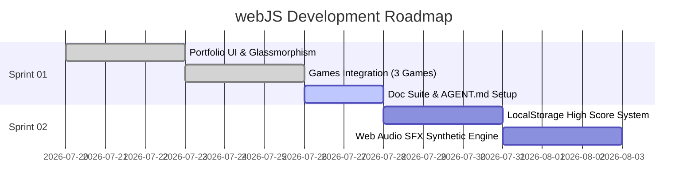

# Sprint Planning & Roadmap — webJS Game Portfolio

**Last Updated:** 2026-07-26 | **Version:** 1.0.0

---

## 📅 Sprint Schedule Overview

| Sprint | Timeline | Focus Area | Status |
|:---|:---|:---|:---|
| [sprint-01](./sprint-backlogs/sprint-01.md) | 2026-07-20 → 2026-07-27 | Portfolio Glassmorphism UI, Native Node HTTP Server, 3 HTML5 Games Integration & Doc Setup | 🔵 In Progress |
| sprint-02 | 2026-07-28 → 2026-08-04 | High Score System & Audio SFX Polish | 🏗 Scheduled |

---

## 🚀 Roadmap Overview

---

## Related Documents
- Product Backlog: [Product Backlog](./01-product-backlog.md)
- Sprint 01 Details: [Sprint 01 Backlog](./sprint-backlogs/sprint-01.md)
