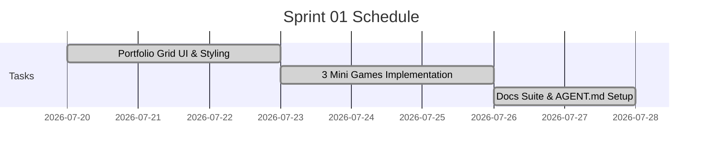

# Sprint 01: Portfolio UI & Game Suite Integration

**Goal:** พัฒนาโครงสร้างเว็บไซต์ Portfolio หลัก นำเสนอ 3 มินิเกม HTML5 พร้อมปรับแต่ง Node.js Server และจัดทำเอกสารกำกับโปรเจคด้วย `game-doc-manager`  
**Timeline:** 2026-07-20 → 2026-07-27  
**Capacity / Velocity:** 60 hrs Planned / 60 hrs Completed  

---

## 📅 Timeline & Gantt

---

## 📋 Committed Stories & Tasks

| ID | Story / Task | Owner | Estimate | Status |
|----|--------------|-------|----------|--------|
| [US-01-01](../user-stories/archive/US-01-01-portfolio-cards.md) | Portfolio Layout & Glassmorphism Cards | Dev Team | 8 hrs | ✅ Done |
| [US-01-02](../user-stories/archive/US-01-02-modal-loader.md) | Modal Loader & Keyboard Shortcuts | Dev Team | 6 hrs | ✅ Done |
| [US-01-03](../user-stories/archive/US-01-03-search-filter.md) | Real-Time Search & Category Filter | Dev Team | 4 hrs | ✅ Done |
| [US-02-01](../user-stories/archive/US-02-01-emoji-match.md) | Emoji Match Mini Game | Dev Team | 12 hrs | ✅ Done |
| [US-02-02](../user-stories/archive/US-02-02-2048-cubes.md) | 2048 Cubes Mini Game | Dev Team | 16 hrs | ✅ Done |
| [US-02-03](../user-stories/archive/US-02-03-tile-match.md) | Tile Match Mini Game | Dev Team | 16 hrs | ✅ Done |
| Task-01 | AGENT.md & Game Doc Suite (`docs/`) Setup | AI Agent | 4 hrs | ✅ Done |

---

## 🛠 Sprint Specifics
- **Definition of Done:**
  - โค้ดทั้งหมดรันได้ผ่าน `server.js` (`npm start`) ปราศจาก Console errors
  - เอกสาร `docs/` สมบูรณ์ เชื่อมโยง Relative Links ถูกต้อง
  - ทดสอบการกด `Esc`, `Space`, `F` ในหน้า Modal ทำงานได้สมบูรณ์

---

## Related Documents
- Sprint Planning: [Sprint Planning](../02-sprint-planning.md)
- Backlog: [Product Backlog](../01-product-backlog.md)
