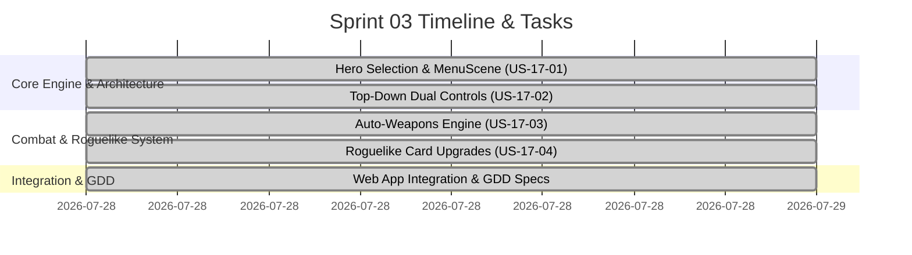

# Sprint 03: Tiny Dungeon Survivor (Action Roguelike)

**Goal:** พัฒนาและเปิดตัวเกมแนว **2D Top-Down Action Roguelike (Tiny Dungeon Survivor)** โดยใช้ Phaser 3 และชุดกราฟิก Kenney Tiny Dungeon บน Next.js Game Hub  
**Timeline:** 2026-07-28 → 2026-08-04  
**Status:** ✅ Completed  

---

## 📅 Internal Sprint Schedule & Tasks

---

## 📋 Committed User Stories

| ID | User Story / Task | Owner | Estimate | Status |
|----|-------------------|-------|----------|--------|
| [US-17-01](../user-stories/archive/US-17-01-hero-selection.md) | Hero Selection & Boot Engine | GameDev | M | ✅ Done |
| [US-17-02](../user-stories/archive/US-17-02-movement-controls.md) | Top-Down Movement & Dual Controls | GameDev | M | ✅ Done |
| [US-17-03](../user-stories/archive/US-17-03-auto-weapons.md) | Auto-Attacks & Weapons Engine | GameDev | L | ✅ Done |
| [US-17-04](../user-stories/archive/US-17-04-card-upgrades.md) | Roguelike Card Upgrade Modal | GameDev | L | ✅ Done |

---

## 🛠 Sprint Specifics & Definition of Done
- [x] เกมเล่นได้อย่างสมบูรณ์ไม่ติดขัดบน PC และอุปกรณ์พกพา/สัมผัส
- [x] ผ่านการทดสอบ Next.js Production Build (`npm run build`)
- [x] จัดทำเอกสาร GDD Spec ใน `docs/gdd/games/tiny-dungeon-roguelike/spec.md`
