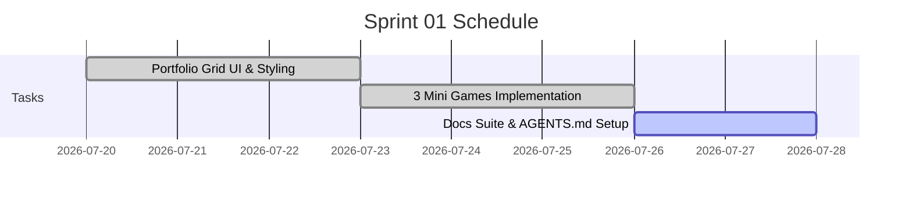

# Sprint 01: Portfolio UI & Game Suite Integration

**Goal:** พัฒนาโครงสร้างเว็บไซต์ Portfolio หลัก นำเสนอ 3 มินิเกม HTML5 พร้อมปรับแต่ง Node.js Server และจัดทำเอกสารกำกับโปรเจคด้วย `game-doc-manager`  
**Timeline:** 2026-07-20 → 2026-07-27  

---

## 📅 Timeline & Gantt

---

## 📋 Committed Stories & Tasks

| ID | Story / Task | Owner | Estimate | Status |
|----|--------------|-------|----------|--------|
| [US-01-01](../user-stories/US-01-portfolio.md) | Portfolio Layout & Glassmorphism Cards | Dev Team | 8 hrs | ✅ Done |
| [US-01-02](../user-stories/US-01-portfolio.md) | Modal Loader & Keyboard Shortcuts | Dev Team | 6 hrs | ✅ Done |
| [US-02-01](../user-stories/US-02-games.md) | Emoji Match Mini Game | Dev Team | 12 hrs | ✅ Done |
| [US-02-02](../user-stories/US-02-games.md) | 2048 Cubes Mini Game | Dev Team | 16 hrs | ✅ Done |
| [US-02-03](../user-stories/US-02-games.md) | Tile Match Mini Game | Dev Team | 16 hrs | ✅ Done |
| US-01-03 | AGENTS.md & Game Doc Suite (`docs/`) | AI Agent | 4 hrs | 🔵 In Progress |

---

## 🛠 Sprint Specifics
- **Definition of Done:**
  - โค้ดทั้งหมดรันได้ผ่าน `server.js` (`npm start`) ปราศจาก Console errors
  - เอกสาร `docs/` สมบูรณ์ เชื่อมโยง Relative Links ถูกต้อง
  - ทดสอบการกด `Esc`, `Space`, `F` ในหน้า Modal ทำงานได้สมบูรณ์

---

## Related Documents
- Sprint Planning: [Sprint Planning](../02-sprint-planning.md)
- Backlog: [Product Backlog](../01-product-backlog.md)
