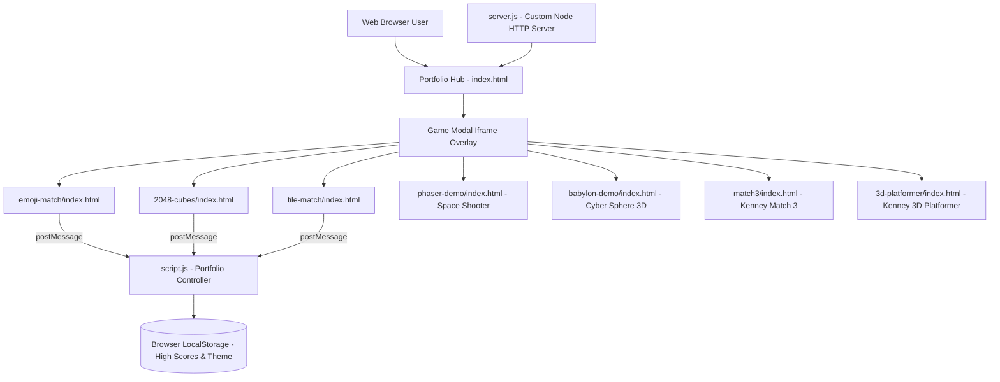

# HTML5 Game Portfolio — Game Concept & Architecture

**Version:** 1.1.0 | **Last Updated:** 2026-07-28 | **Owner:** Noppon / Dev Team

---

## 1. Introduction

### Elevator Pitch
เว็บไซต์ Game Portfolio รวบรวมและนำเสนอเกม HTML5 / Web Browser ที่เล่นได้ทันทีแบบไม่ต้องติดตั้ง โดดเด่นด้วยดีไซน์ Glassmorphism โทนสี Cyan/Turquoise ทันสมัย พร้อมระบบค้นหาแบบ Real-Time, จัดหมวดหมู่เกม, แสดงเกมผ่าน Modal Iframe เล่นเกมได้ลื่นไหลแบบไร้รอยต่อ และระบบบันทึกคะแนนสูงสุด (High Score) ข้ามเกมลงใน LocalStorage

### Target Audience
- ผู้ที่ชอบเล่นเกมแนว Casual / Puzzle / Action บนเว็บเบราว์เซอร์
- นักพัฒนาและผู้เยี่ยมชมผลงานที่ต้องการดูโชว์เคส HTML5 Games

---

## 2. Technical Stack & Development Status

| Layer | Technology | Notes | Agile Status |
|-------|-----------|-------|--------------|
| Frontend Core | HTML5, CSS3, Vanilla JS | ไร้ External Frameworks หนักๆ โหลดเร็ว | ✅ Completed (Sprint 01) |
| UI Style | CSS Custom Properties, Glassmorphism, CSS Grid/Flexbox | ธีม Cyan-Blue Gradient | ✅ Completed (Sprint 01) |
| High Score System | LocalStorage API, Window PostMessage API | บันทึกคะแนนสูงสุดแบบ Persistence | 🔵 In Progress (Sprint 02) |
| Audio Engine | Web Audio API Synthetic SFX Engine | สังเคราะห์เสียงประกอบโดยไม่ต้องพึ่งไฟล์ mp3 | 🔵 In Progress (Sprint 02) |
| Game Engine / Rendering | HTML5 Canvas API, Phaser 3, Babylon.js 8 | รองรับทั้ง 2D และ 3D physics | ✅ Completed |
| Dev Server | Node.js Native HTTP Server (`server.js`) | ไม่ต้องลง npm dependencies | ✅ Completed (Sprint 01) |
| Deployment | Vercel (`vercel.json`) | Static PWA hosting ready | ✅ Completed |

---

### 🎮 Game Collection (Index Code Names)

| # | Code Name | Game Title | Folder | Engine | Status |
|---|-----------|------------|--------|--------|--------|
| G001 | `emoji-match` | Emoji Match | `emoji-match/` | Vanilla JS | ✅ Released ([US-02-01](../agile/user-stories/archive/US-02-01-emoji-match.md)) |
| G002 | `2048-cubes` | 2048 Cubes | `2048-cubes/` | Canvas 2D | ✅ Released ([US-02-02](../agile/user-stories/archive/US-02-02-2048-cubes.md)) |
| G003 | `tile-match` | Tile Match | `tile-match/` | Vanilla JS | ✅ Released ([US-02-03](../agile/user-stories/archive/US-02-03-tile-match.md)) |
| G004 | `space-shooter` | Space Shooter | `phaser-demo/` | Phaser 2D | ✅ Released |
| G005 | `cyber-sphere` | Cyber Sphere 3D | `babylon-demo/` | Babylon.js 3D | ✅ Released |
| G006 | `match-3` | Kenney Match 3 | `match3/` | Phaser 2D | ✅ Released |
| G007 | `3d-platformer` | Kenney 3D Platformer | `3d-platformer/` | Babylon.js 8 | ✅ Released |
| G008 | `card-memory` | Card Memory Match | `public/games/card-memory/` | Vanilla JS | ✅ Released ([US-08-01](../agile/user-stories/US-08-01-card-grid.md)) |
| G016 | `goosl-marbles` | Goosl Glass Marbles | `public/games/goosl-marbles/` | WebGL 2 / Shader | ✅ Released ([GDD Spec](./games/goosl-marbles/spec.md)) |
| G017 | `warfront` | WarFront.io (FrontWars) | `public/games/warfront/` | WebGL / TypeScript | ✅ Released ([GDD Spec](./games/warfront/gdd.md)) |

---

## 4. System Architecture

---

## Related Documents
- Core Mechanics: [Core Mechanics](./01-mechanics.md)
- Art Direction: [Art & UI/UX Guidelines](./03-art-direction.md)
- Audio Direction: [Audio Direction](./04-audio-direction.md)
- Asset Proposals Roadmap: [Asset Game Proposals & Roadmap](./05-asset-game-proposals.md)
- Software Design: [System Design](../software/01-system-design.md)
- Product Backlog: [Product Backlog](../agile/01-product-backlog.md)
- Sprint Planning: [Sprint Planning & Roadmap](../agile/02-sprint-planning.md)
