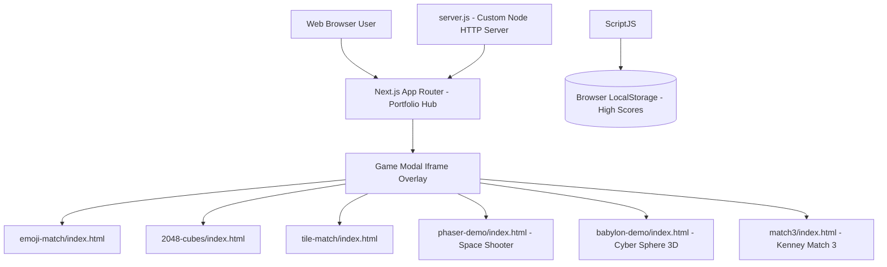

# HTML5 Game Portfolio — Game Concept & Architecture

**Version:** 1.0.0 | **Last Updated:** 2026-07-26 | **Owner:** Noppon / Dev Team

---

## 1. Introduction

### Elevator Pitch
เว็บไซต์ Game Portfolio รวบรวมและนำเสนอเกม HTML5 / Web Browser ที่เล่นได้ทันทีแบบไม่ต้องติดตั้ง โดดเด่นด้วยดีไซน์ Glassmorphism โทนสี Cyan/Turquoise ทันสมัย พร้อมระบบค้นหา จัดหมวดหมู่ และแสดงเกมผ่าน Modal Iframe เล่นเกมได้ลื่นไหลแบบไร้รอยต่อ

### Target Audience
- ผู้ที่ชอบเล่นเกมแนว Casual / Puzzle บนเว็บเบราว์เซอร์
- นักพัฒนาและผู้เยี่ยมชมผลงานที่ต้องการดูโชว์เคส HTML5 Games

---

## 2. Technical Stack

| Layer | Technology | Notes |
|-------|-----------|-------|
| Frontend Core | HTML5, CSS3, Vanilla JS | ไร้ External Frameworks หนักๆ โหลดเร็ว |
| UI Style | CSS Custom Properties, Glassmorphism, CSS Grid/Flexbox | ธีม Cyan-Blue Gradient |
| Game Engine / Rendering | HTML5 Canvas API, Three.js (สำหรับ 3D) | รองรับทั้ง 2D และ 3D physics |
| Dev Server | Node.js Native HTTP Server (`server.js`) | ไม่ต้องลง npm dependencies |
| Deployment | Vercel (`vercel.json`) | Static PWA hosting ready |

---

## 3. Game Collection

1. **Emoji Match** (`emoji-match/`) — เกมจับคู่ Emoji ทดสอบความจำและความไว
2. **2048 Cubes** (`2048-cubes/`) — เกมยิงลูกบาศก์รวมตัวเลข 2048 แบบฟิสิกส์
3. **Tile Match** (`tile-match/`) — เกมจับคู่ไพ่ 3 ใบ (Mahjong Triple Match)
4. **Space Shooter** (`phaser-demo/`) — เกมยิงยานอวกาศ 2D แบบ Wave-based Action (Phaser 3)
5. **Cyber Sphere 3D** (`babylon-demo/`) — เกมทรงกลมไซเบอร์ 3D (Babylon.js)
6. **Kenney Match 3** (`match3/`) — เกมจับคู่เพชรอัญมณี 3 ในแถวสไตล์คลาสสิก (Phaser 3)

---

## 4. System Architecture

---

## Related Documents
- Mechanics: [Core Mechanics](./01-mechanics.md)
- Art Direction: [Art & UI/UX Guidelines](./03-art-direction.md)
- Software Design: [System Design](../software/01-system-design.md)
- Backlog: [Product Backlog](../agile/01-product-backlog.md)
