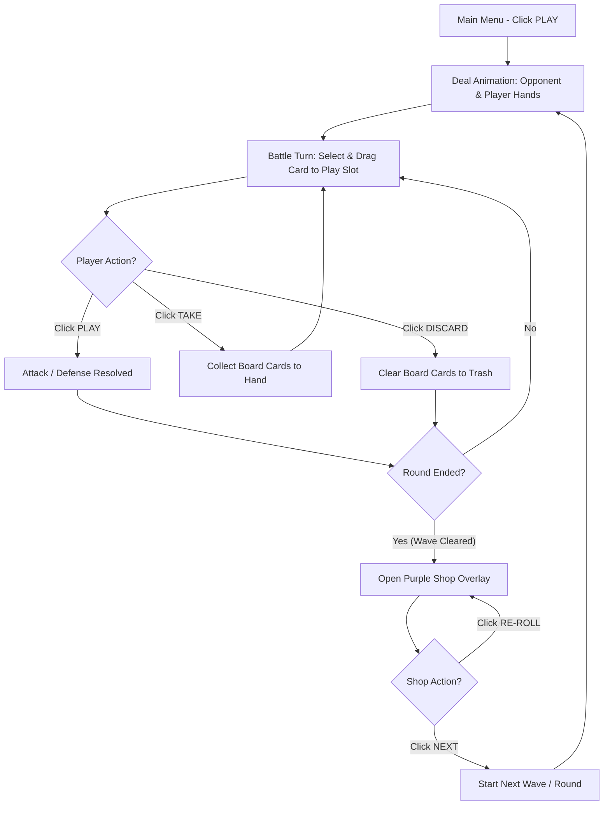
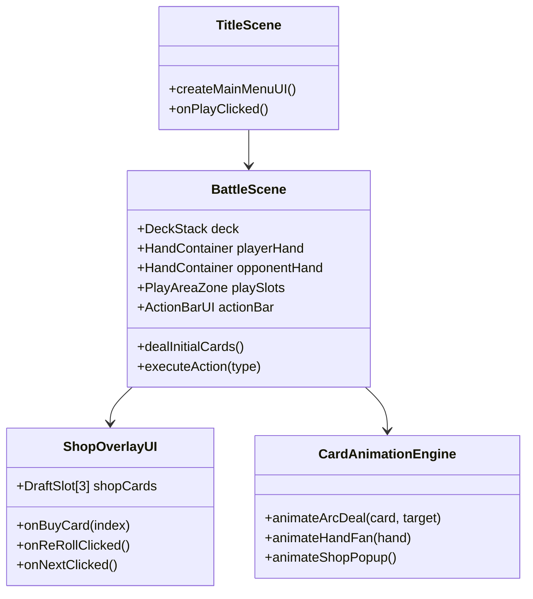

# 🃏 FOOL THE GAME — Game Design & UI Layout Document (GDD)

**Version:** 1.1.0 | **Last Updated:** 2026-08-12  
**Game Title:** FOOL THE GAME (Royal Cascade Edition)  
**Author / Lead Designer:** AI Game Architecture Team  
**Reference Visuals:** User UI Wireframe Specification & [@Bo80337023 Card Deal Animation Showcase](https://x.com/Bo80337023/status/2087435483613962588)  
**Target Platform:** Mobile Portrait Web / Responsive Desktop (Phaser 3 / HTML5 WebGL Engine)  

---

## 📑 Table of Contents (สารบัญ)
1. [Executive Summary & Game Concept](#1-executive-summary--game-concept)
2. [UI Layout & Screen Wireframes (การวางเลย์เอาต์หน้าจอตามภาพออกแบบ)](#2-ui-layout--screen-wireframes)
   - 2.1 Screen 1: Title Screen / Main Menu (หน้าแรก)
   - 2.2 Screen 2: Dealing & Initial Hand Distribution (หน้าสับ/แจกไพ่)
   - 2.3 Screen 3 & 4: In-Game Battle & Action Bar (หน้าต่อสู้และวางไพ่)
   - 2.4 Screen 5 & 7: Comprehensive Battle UI Composite (โครงสร้างหน้าต่อสู้เต็มรูปแบบ)
   - 2.5 Screen 6 & 8: Shop & Draft Upgrade Overlay (โครงสร้างหน้าร้านค้าสะสมการ์ด)
3. [Card Dealing & Dynamic Arc Mechanics (ฟิสิกส์การแจกและจัดไพ่)](#3-card-dealing--dynamic-arc-mechanics)
4. [Juicy Interactions, Haptics & Audio (ระบบตอบสนองและเอฟเฟกต์)](#4-juicy-interactions-haptics--audio)
5. [In-Game Economy & Card Draft Shop System (ระบบร้านค้าและเหรียญ)](#5-in-game-economy--card-draft-shop-system)
6. [Core Gameplay Loop & Rules (กติกาการเล่นแบบ FOOL)](#6-core-gameplay-loop--rules)
7. [Software Architecture & Component Specs (โครงสร้างระบบและคลาส)](#7-software-architecture--component-specs)
8. [Product Backlog & Implementation Roadmap (แผนงานพัฒนา Agile)](#8-product-backlog--implementation-roadmap)

---

## 1. Executive Summary & Game Concept

### 1.1 Elevator Pitch
**FOOL THE GAME** เป็นเกมไพ่วางกลยุทธ์สไตล์ **Durak / Tactical Card Battler** แบบ Mobile Portrait ที่ผสานความตื่นเต้นของการวางไพ่ต่อสู้ เข้ากับ **Juicy Card Dealing Animations**, **Arc Fan Hand Layout**, **Haptic Feedback**, และระบบ **Roguelike Card Draft Shop** ระหว่างรอบการเล่น เพื่อเพิ่มความสนุกและความท้าทายในการปรับแต่งแผนการเล่นอย่างไม่รู้จบ

---

## 2. UI Layout & Screen Wireframes

ระบบ Layout ทั้งหมดออกแบบตามสัดส่วน Mobile Portrait (9:16) แบ่งโครงสร้างหน้าจอเป็น 8 สถานะหลัก:

```
+-----------------------------------------------------------------------------------+
|                                 FOOL THE GAME UI MAP                              |
|                                                                                   |
|  [Screen 1]        [Screen 2]        [Screen 3/4]       [Screen 7]      [Screen 8]   |
| Main Menu          Deal Phase         Battle Phase      Full Battle     Shop Overlay |
+-----------------------------------------------------------------------------------+
```

---

### 2.1 Screen 1: Title Screen / Main Menu (หน้าเมนูหลัก)

หน้าแรกสำหรับเข้าสู่เกม นำเสนอด้วยตัวอักษรเรียบหรูพร้อมแสดงตัวอย่างสำรับไพ่คลี่เป็นพัดกลางหน้าจอ

```
+-----------------------------------+
|                                   |
|             FOOL                  |
|           THE GAME                |
|                                   |
|           / | | | \               |
|          /  | | |  \              |
|         [Card Fan Art]            |
|                                   |
|          +---------+              |
|          |  PLAY   |  (Blue)      |
|          +---------+              |
|          +---------+              |
|          |  QUIT   |  (Red)       |
|          +---------+              |
|                                   |
+-----------------------------------+
```

- **Title Logo**: ตัวอักษร "FOOL THE GAME" ตรงกลางส่วนบน
- **Center Graphic**: การ์ด 5 ใบคลี่เป็นรูปพัดโค้ง (Arc Fan) ลอยสง่านิ่งพร้อมแอนิเมชันหายใจ (Breathing scale `1.0x -> 1.03x`)
- **Action Buttons**:
  - `PLAY` Button: ปุ่มสีฟ้าทรงโค้งมนมน (Pill Shape) เพื่อเริ่มเล่นเกม
  - `QUIT` Button: ปุ่มสีแดงสำหรับออกจากเกม / ปิดหน้าต่าง

---

### 2.2 Screen 2: Dealing & Initial Hand Distribution (หน้าแจกไพ่เริ่มต้น)

เมื่อเริ่มเกม ไพ่จะถูกแจกออกจากสำรับไปยังฝั่ง Opponent และฝั่ง Player ด้วยวิถีโค้ง

```
+-----------------------------------+
|        ( ( Opponent Hand ) )      |
|         /  |   |   |  \           |
|        [ ][ ] [ ] [ ][ ]          |
|                                   |
|                                   |
|         [ Play Area Void ]        |
|                                   |
|                                   |
|        ( (  Player Hand  ) )      |
|         /  |   |   |  \           |
|        [ ][ ] [ ] [ ][ ]          |
+-----------------------------------+
```

- **Opponent Hand (Top)**: พัดไพ่ฝั่งคู่แข่งคว่ำหน้าหันออกจากผู้เล่น
- **Player Hand (Bottom)**: พัดไพ่ฝั่งผู้เล่นหงายหน้าจัดเรียงตามลำดับค่าไพ่
- **Middle Void**: พื้นที่ว่างกลางโต๊ะสำหรับเตรียมรับไพ่ต่อสู้

---

### 2.3 Screen 3 & 4: In-Game Battle & Action Bar (หน้าต่อสู้และแถบคำสั่ง)

การเล่นในแต่ละตา โดยมีกองสำรับไพ่ (Deck Stack) ตั้งอยู่มุมซ้ายบน และปุ่มคำสั่งหลัก 3 ปุ่มด้านล่าง

```
+-----------------------------------+
|  [Deck]  ( Opponent Hand )        |
|  |===|    /  |   |   |  \         |
|                                   |
|       +---+   +---+   +---+       |
|       |   |   |   |   |   |       |
|       +---+   +---+   +---+       |
|         [ 3 Active Play Slots ]   |
|                                   |
|        ( (  Player Hand  ) )      |
|         /  |   |   |  \           |
|                                   |
|  +-------+  +-------+  +-------+  |
|  | PLAY  |  | TAKE  |  |DISCARD|  |
|  +-------+  +-------+  +-------+  |
|   (Blue)     (Red)     (Yellow)   |
+-----------------------------------+
```

- **Deck Stack (Top-Left)**: กองไพ่สำรับที่เหลือ พร้อมแสดงไพ่ขาบอด/ไพ่ข่ม (Trump Card) วางขวางใต้อ่างกองไพ่
- **Active Play Area (Center)**: สล็อตวางไพ่ 3 ช่องตรงกลาง สำหรับวางไพ่โจมตีและไพ่แก้ทาง (Attack / Defense pairs)
- **Player Action Bar (Bottom Controls)**:
  - `PLAY` (Blue): ยืนยันการวางไพ่ลงบนโต๊ะ
  - `TAKE` (Red): ยอมรับไพ่ทั้งหมดบนโต๊ะเข้ามือ (เมื่อไม่สามารถแก้ทางไพ่ได้)
  - `DISCARD` (Yellow): ทิ้งไพ่บนโต๊ะลงกองทิ้ง (เมื่อจบการต่อสู้ในตานั้น)

---

### 2.4 Screen 5 & 7: Comprehensive Battle UI Composite (หน้าต่อสู้เต็มรูปแบบ)

โครงสร้างหน้าจอหลักเมื่อรวมกับแถบสถานะผู้เล่นด้านบน (Header Stats)

```
+-----------------------------------+
| +-------+ +---------------------+ |
| | Avatar| | Coins: 150  Wave: 3 | |  <-- Top Header Bar
| +-------+ +---------------------+ |
|                                   |
| [Deck]   ( ( Opponent Hand ) )    |
| |===|     /  |   |   |  \         |
|                                   |
|       +---+   +---+   +---+       |
|       | ♠ |   | ♥ |   | ♦ |       |  <-- Play Slots (3 Cards)
|       +---+   +---+   +---+       |
|                                   |
|        ( (  Player Hand  ) )      |
|         /  |   |   |  \           |
|        [ ][ ] [ ] [ ][ ]          |
|                                   |
| +--------+  +--------+ +--------+ |
| |  PLAY  |  |  TAKE  | |DISCARD | |  <-- Action Bar
| +--------+  +--------+ +--------+ |
+-----------------------------------+
```

---

### 2.5 Screen 6 & 8: Shop & Draft Upgrade Overlay (หน้าร้านค้าและอัปเกรดการ์ด)

เมื่อจบแต่ละ Wave/Round หน้าต่าง Shop Overlay สีกราฟิกม่วง (Purple Panel) จะเลื่อนเด้งขึ้นมาจากด้านล่าง เพื่อให้ผู้เล่นเลือกซื้อการ์ดความสามารถพิเศษหรือการ์ดเสริมพลัง

```
+-----------------------------------+
| +-------+ +---------------------+ |
| | Avatar| | Coins: 450  Wave: 3 | |  <-- Top Header Bar
| +-------+ +---------------------+ |
|                                   |
|       [ Sub-Header Status ]       |
|                                   |
| +-------------------------------+ |
| |          SHOP PANEL           | |  <-- Purple Bottom Panel Overlay
| |                               | |
| |   +-----+   +-----+   +-----+ | |
| |   |Card1|   |Card2|   |Card3| | |  <-- 3 Draft Offerings
| |   +-----+   +-----+   +-----+ | |
| |     $1        $2        $3    | |  <-- Price Badges
| |                               | |
| |   +----------+  +-----------+ | |
| |   |   NEXT   |  |  RE-ROLL  | | |  <-- Shop Action Buttons
| |   +----------+  +-----------+ | |
| |      (Red)         (Green)    | |
| +-------------------------------+ |
+-----------------------------------+
```

- **Purple Shop Container**: พาเนลลอยสีม่วงสไตล์สปอร์ต ปรากฏด้านล่างทับหน้าจอการเล่น
- **Draft Slots (3 Cards)**: การ์ด 3 ใบสุ่มขึ้นมาให้ซื้อ พร้อมป้ายราคา `$1`, `$2`, `$3` ใต้การ์ด
- **Shop Action Buttons**:
  - `NEXT` (Red Button): ข้ามหน้าร้านค้าและเริ่มเล่น Wave ถัดไป
  - `RE-ROLL` (Green Button): จ่ายเหรียญสุ่มการ์ดในร้านค้าใหม่

---

## 3. Card Dealing & Dynamic Arc Mechanics

### 3.1 Physics Bézier Arc Formula
ไพ่ถูกแจกออกจากกอง `[Deck]` มุมซ้ายบนพุ่งโค้งลงสุ่มมือผู้เล่น:

```math
P(t) = (1-t)^2 P_0 + 2(1-t)t P_{\text{ctrl}} + t^2 P_1 \quad (0 \le t \le 1)
```
- $P_0$: พิกัดมุมซ้ายบนกองสำรับ `(DeckX, DeckY)`
- $P_{\text{ctrl}}$: จุดดัดโค้งตรงกลาง `(CenterX, TargetY - 150px)`
- $P_1$: ตำแหน่งไพ่บนมือผู้เล่น `(TargetX, TargetY)`

### 3.2 Dynamic Arc Fan Layout Formula
คำนวณตำแหน่งไพ่ $N$ ใบในพัดมือถือ:
```math
\theta_i = (i - \frac{N-1}{2}) \times 5^\circ
```
```math
X_i = X_{\text{center}} + (i - \frac{N-1}{2}) \times 42\,\text{px}
```
```math
Y_i = Y_{\text{center}} + |i - \frac{N-1}{2}|^1.8 \times 3.5\,\text{px}
```

---

## 4. Juicy Interactions, Haptics & Audio

| Interaction State | Visual Response | Audio SFX | Haptic Pattern |
| :--- | :--- | :--- | :--- |
| **Hover Card** | ยกขึ้น `+30px`, เอียงตรง `0deg`, ย่อขยาย `1.1x` | `swish_light.wav` | `5ms Light` |
| **Drag Card** | ลอยตามนิ้ว, เอียงตามแรงลาก (Inertia) | `card_grab.wav` | `10ms Medium` |
| **Play Card to Slot** | Snap เข้าสล็อตกลาง, เด้ง Scale `1.2x -> 1.0x` | `card_drop_heavy.wav` | `20ms Heavy` |
| **Click TAKE** | ไพ่ทั้งหมดบนโต๊ะปลิวบินกลับเข้ามือผู้เล่น | `cards_collect.wav` | `Double Buzz` |
| **Click DISCARD** | ไพ่บนโต๊ะหมุนบินสลายออกนอกหน้าจอ | `whoosh_discard.wav` | `15ms Medium` |
| **Buy Card in Shop** | การ์ดขยายสว่างวาบแล้วบินเข้าสะสม | `coin_buy_jingle.wav` | `Success Pulse` |

---

## 5. In-Game Economy & Card Draft Shop System

### 5.1 Currency Mechanics
- **Coins**: ได้รับจากการชนะแต่ละรอบ, การทิ้งไพ่ได้อย่างสมบูรณ์แบบ (Clean Discard Bonus), และการทำคอมโบ
- **Interest System**: ได้รับดอกเบี้ยเพิ่มเติมตามจำนวนเงินคงเหลือเมื่อจบ Wave (เช่น ทุกๆ 5 เหรียญ รับดอกเบี้ย 1 เหรียญ)

### 5.2 Shop Draft Rules
- แต่ละรอบเมื่อเข้าสู่ **Purple Shop Panel** ระบบจะสุ่มการ์ด 3 ใบมาให้เลือก
- **Re-Roll Cost**: ครั้งแรก $1 เหรียญ, ครั้งถัดไป $2, $3 เหรียญ
- **Card Tiers & Prices**:
  - Common Card: `$1`
  - Rare Card: `$2`
  - Epic Card: `$3`

---

## 6. Core Gameplay Loop & Rules



---

## 7. Software Architecture & Component Specs



---

## 8. Product Backlog & Implementation Roadmap

- [ ] **US-LAYOUT-01**: สร้างหน้าต่าง Title Menu (Screen 1) พร้อมปุ่ม `PLAY` / `QUIT`
- [ ] **US-LAYOUT-02**: สร้างโครงสร้างสัดส่วนหน้าจอ Battle Layout (Screen 3, 4, 7) พร้อมสล็อตวางไพ่ 3 ช่อง
- [ ] **US-LAYOUT-03**: พัฒนาปุ่มควบคุม Action Bar ด้านล่าง (`PLAY` Blue, `TAKE` Red, `DISCARD` Yellow)
- [ ] **US-LAYOUT-04**: พัฒนาพาเนลหน้าร้านค้าม่วง (Purple Shop Overlay - Screen 6, 8) พร้อมปุ่ม `NEXT` Red และ `RE-ROLL` Green
- [ ] **US-ANIM-01**: เชื่อมต่อระบบแจกไพ่ Arc Deal และการจัดพัดมือถือไพ่ (Adaptive Fan Layout)

---

## Related Documents
- **Project Index**: [docs/index.md](../../index.md)
- **Product Backlog**: [docs/agile/01-product-backlog.md](../../agile/01-product-backlog.md)
