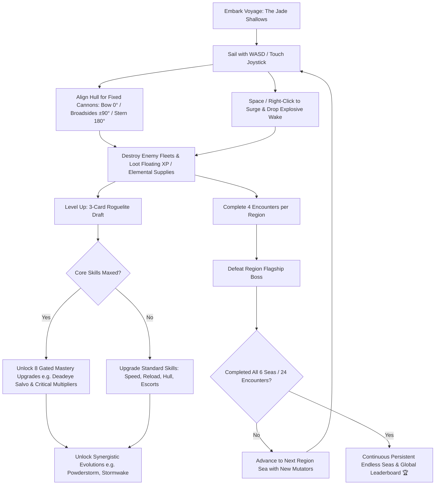
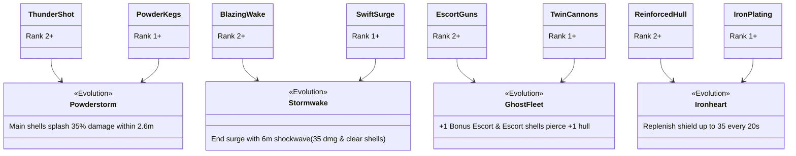

# ⛵ Boat Roguelite: Driftwake (3D Naval Combat & Endless Seas) — Game Design Document & Dev Specs

**Code Name:** `boat-roguelite-driftwake`  
**Game ID:** `G037`  
**Creator:** [nilni](https://www.aigameshare.com/profile/nil)  
**Version:** `2.5.0` (Mastery & Critical Salvo Edition)  
**Age Rating:** 13+  
**Target Playtime:** 1–5 Minutes per Run (Fast-Paced Session)  
**Supported Platforms:** Desktop & Mobile (Touch, Mouse, Keyboard)  
**Engine & Tech Stack:** OpenAI GPT-6 + Codex, Three.js 0.180.0 (WebGL), Blender 5.2.1, Original WebAudio Procedural Synthesis  
**Original Live Source:** [AIGameShare Driftwake](https://www.aigameshare.com/games/boat-roguelite-driftwake?play=1&mode=fullscreen)  
**Tagline:** *"Sail six cursed seas and continuous Endless Seas. Master fixed naval batteries, unlock eight gated mastery upgrades, land critical salvos, and survive endless fleets."*  

---

## 1. Executive Summary & Concept

### 1.1 Elevator Pitch
**Boat Roguelite: Driftwake** เป็นเกม 3D Naval Action Roguelite บนผืนมหาสมุทรแบบ Real-time ที่สร้างสรรค์ด้วย AI-Assisted Tooling (OpenAI GPT-6 + Codex, Three.js 0.180.0, Blender 5.2.1, และ WebAudio Engine) 

ผู้เล่นจะสวมบทกัปตันเรือรบโบราณที่ติดตั้งปืนใหญ่ประจำตำแหน่งรอบลำเรือ (Fixed Directional Naval Batteries: หัวเรือ Bow 0°, ข้างกราบ Port/Starboard Broadsides ±90°, และท้ายเรือ Stern 180°) บังคับเรือฝ่าคลื่นลมและสู้รบกับกองเรือปีศาจข้าม 6 มหาสมุทร (The Six Seas / 24 Encounters) จนทะลวงเข้าสู่โหมด **Endless Seas**

ในเวอร์ชัน **2.5.0** ได้รับการยกเครื่องระบบ Roguelite Upgrade Card ครั้งใหญ่: ถอดการ์ด Extra-Score เดิมออก แล้วแทนที่ด้วยระบบ **Eight Mastery Upgrades** ที่ต้องปลดล็อกด้วย Max Core Skills เสริมระบบ Critical Strike Salvo พร้อมตัวคูณความเสียหาย 2x Hit และเอฟเฟกต์แสงเสียงสีทอง-ขาวสะกดสายตา

### 1.2 Core Pillars
1. **Strict Fixed-Battery Naval Ballistics:** ปืนใหญ่ยึดติดกับมุมเรือถาวร (ไม่มีการหมุนอิสระตามเป้าหมาย) บังคับให้ผู้เล่นต้องใช้ทักษะการบังคับเรือ (Maneuvering & Drift) ในการเล็งยิง
2. **Dynamic Surge & Explosive Wake:** ใช้แรงขับเคลื่อน Surge เพื่อหลบหลีกและทิ้งแนวคลื่นฟองน้ำระเบิด (Explosive Wake Traps) ล่อให้ศัตรูแล่นตามมาเหยียบ
3. **Deep Gated Mastery & Synergistic Evolutions:** ต้นไม้อัปเกรดแบบมีเงื่อนไข (Prerequisites) เช่น Max *Thunder Shot 5* + *Hullbreaker 3* เพื่อปลดล็อก *Deadeye Salvo* (เพิ่ม Critical Chance สูงสุด 40% และ 2x Damage)
4. **100% Standalone & Procedural Generation:** ตัวเกมไม่มีการโหลดไฟล์เสียงภายนอก ทุกเสียงสังเคราะห์ผ่าน Web Audio API, ทะเลและโขดหินเรนเดอร์ด้วย Custom GLSL Shader และ Three.js

### 1.3 Creator Versions & Release Changelog (v2.5.0 Top Pick)

> [!NOTE]
> **AIGameShare Creator Top Pick:** [nilni](https://www.aigameshare.com/profile/nil)  
> **Community Metrics:** 10 Votes / 661 Plays / 21h 55m Total Played  
> **Categories & Tags:** `Boat Roguelite` `Naval Combat` `Endless Mode` `Sailing` `3D` `Roguelite` `Action` `Ship Upgrades` `Boss Battle` `Mobile` `Desktop` `HTML5` `GPT-6` `Blender` `Three.js` `GPT`

#### 📜 Official Version 2.5.0 Release Notes
> *"Driftwake 2.5.0 replaces extra-score reward cards with eight mastery upgrades gated by maxed core skills. Improve main sailing speed, reload time and cannon damage, or escort turn speed, damage and actual shell range.*
> 
> *Thunder Shot 5 and Hullbreaker 3 unlock Deadeye Salvo, granting 8% main-ship critical chance per rank up to 40%, with 2x hits. Max Deadeye Salvo and Dreadnought Bow to unlock repeated critical-damage upgrades. Main damage, escort damage and critical damage keep stacking; capped mobility, reload, range and critical-chance cards leave the pool.*
> 
> *Gold-white shot accents, short critical impact bursts and distinct audio make real criticals readable. The pictured three-card draft and bilingual captain log show prerequisites. Repair and shield supplies remain; score cards are removed.*
> 
> *Battle XP, same-field upgrades, full-clear campaign progression, continuous persistent Endless Seas, elemental broadsides, fixed guns, bounded projectiles, carrier bosses, Blender ship, Three.js sea, WebAudio, keyboard/touch, safe saves and both leaderboards remain supported."*

---

## 2. Technical Stack & AI Pipeline

| Component | Tool / Technology | Details & Implementation |
|---|---|---|
| **AI Generation Pipeline** | OpenAI GPT-6 + Codex | สังเคราะห์และประกอบ Code Logic, Sim Loop, และ Event Listeners |
| **3D Engine** | Three.js 0.180.0 (WebGL) | Orthographic Isometric Camera, Custom Shaders, PCF Soft Shadows, ACESFilmic Tone Mapping |
| **3D Modeling & Mesh** | Blender 5.2.1 + JSON Format | โมเดลเรือหลัก (`assets/hero-ship.json`) และ Procedural Low-Poly Mesh Generators |
| **Audio Engine** | Web Audio API Synthesizer | Procedural Oscillator & Noise synthesis (เสียงปืน, คลื่นทะเล, ลม, บูสต์ Surge, เสียง Critical Hit) ไม่พึ่งพาไฟล์ MP3 |
| **Simulation Loop** | Deterministic Naval Sim (`sim.js`) | คำนวณ Inertia, Angular Momentum, Projectile Ballistics, AI Flocking, Boss Launch Gates |
| **UI & Texture System** | Vanilla CSS + WebP Atlas | Responsive HUD, Touch Joystick, Chapter Banners, `upgrades-atlas.webp` สำหรับ Card Icons |
| **Persistence** | LocalStorage Persistence | บันทึกสถิติ High Score, Captain's Log, ภาษา (En/Zh), และเสียง |

---

## 3. Core Gameplay Loop



---

## 4. Controls & Navigation Mechanics

| Control Action | Keyboard / Mouse | Touch / Mobile | Mechanics Detail |
|---|---|---|---|
| **Steer & Thrust** | `W` `A` `S` `D` / Arrow Keys | Virtual Joystick / Drag | ขับเคลื่อนลำเรือตามฟิสิกส์แรงต้านและแรงเฉื่อยน้ำ |
| **Surge Dash** | `Spacebar` / Right-Click | Tap `SURGE` Button | พุ่งตัวความเร็วสูง พร้อมทิ้งคลื่นฟองน้ำระเบิด (Explosive Wake) |
| **Fixed Auto-Fire** | Automatic on Alignment | Automatic on Alignment | ปืนใหญ่ลั่นไกอัตโนมัติเมื่อศัตรูอยู่ในกรอบและมุมยิงของปืนกระบอกนั้นๆ |
| **Upgrade Selection** | `1` `2` `3` or Click / Enter | Tap Card | เลือกการ์ดอัปเกรดจาก 3 ตัวเลือกเมื่อเลเวลอัป |
| **Captain’s Log** | `P` / `Escape` | Tap `Contracts` Button | เปิดดูบันทึกการเดินทาง, อัปเกรดที่ครอบครอง, และเงื่อนไข Mastery |
| **Mute / Language** | `M` (Audio), `L` (Lang) | Tap `♪` / `中/EN` | สลับเปิด-ปิดเสียง และสลับภาษาระหว่าง อังกฤษ / จีน |
| **Restart Run** | `R` | Tap Restart Button | เริ่มการเดินทางใหม่ทันทีเมื่อจบการเล่น |

> [!TIP]
> **Fixed Battery Rule:** ปืนใหญ่ทุกลำ (ทั้งผู้เล่นและศัตรู) ยิงตรงตามแกนเรือเท่านั้น:
> - **Bow (หัวเรือ):** 0° (ยิงตรงด้านหน้า)
> - **Port / Starboard Broadsides (กราบซ้าย-ขวา):** ±90° (ระดมยิงด้านข้าง)
> - **Stern (ท้ายเรือ):** 180° (ยิงสกัดด้านหลัง)
> ศัตรูคลาส Sniper จะมีเส้นเตือนสีแดง (Warning Lanes) ก่อนลั่นกระสุนความเร็วสูง ให้ผู้เล่นหักหลบออกจากแนวยิงทันที

---

## 5. Upgrade System, Mastery & Evolutions (v2.5.0)

### 5.1 Core Upgrade Deck
- **Thunder Shot (Max 5):** ดาเมจปืนหลัก +30% ต่อ Rank
- **Quick Fuse (Max 5):** อัตราการยิง (Fire Rate) +22% ต่อ Rank
- **Twin Broadside (Max 3):** เพิ่มกระสุนกราบเรือข้างละ 1 นัด (ดาเมจ 65%)
- **Dreadnought Bow (Max 3):** ดาเมจปืนหัวเรือ +25% ต่อ Rank และเพิ่มการเจาะทะลุ (Pierce) ใน Rank 1 และ 3
- **Pursuit Breaker (Max 3):** ดาเมจปืนท้ายเรือ +25% และความเร็วการยิง +18% ต่อ Rank
- **Blazing Wake (Max 3):** คลื่น Surge ทิ้งรอยไฟเผาศัตรู
- **Escort Flotilla (Max 3):** เพิ่มเรือคุ้มกันและประสิทธิภาพการยิง

### 5.2 Eight Gated Mastery Upgrades (v2.5.0 Signature)
เมื่ออัปเกรด Core Skills ถึงระดับสูงสุด จะปลดล็อกการ์ดระดับปรมาจารย์ (Mastery):
1. **Deadeye Salvo (เงื่อนไข: Thunder Shot 5 + Hullbreaker 3):**
   - เพิ่มอัตรา Critical Chance ปืนเรือหลัก +8% ต่อ Rank (สูงสุด 40%)
   - สร้างความเสียหายคริติคอล **2x Hits** พร้อมเอฟเฟกต์ประกายแสงสีทอง-ขาว (Gold-White Accents)
2. **Critical Mastery (เงื่อนไข: Max Deadeye Salvo + Dreadnought Bow):**
   - เพิ่มตัวคูณความเสียหาย Critical Damage ซ้อนทับได้เรื่อยๆ (Infinite Stacking)
3. **Escort Mastery:** เพิ่มความเร็วการเลี้ยว (Turn Speed), ดาเมจ, และระยะกระสุนจริงของเรือคุ้มกัน
4. **Fleet Mobility Mastery:** ขยายขีดจำกัดความเร็วการเดินเรือสูงสุด
5. **Rapid Reload Mastery:** เร่งความเร็วการบรรจุกระสุนปืนทุกตำแหน่ง
6. **Main Hull Fortress Mastery:** เสริมความทนทานโครงสร้างเรือและเกราะเหล็ก
7. **Elemental Overcharge Mastery:** เพิ่มดาเมจสถานะ Fire, Frost, และ Storm
8. **Endless Barrage Mastery:** ปลดล็อกการสแต็กดาเมจปืนหลักอย่างต่อเนื่อง

### 5.3 Synergistic Evolutions (วิวัฒนาการขั้นสูง)


---

## 6. The Six Seas & Boss Encounters

| Region # | Sea Name | Subtitle | Boss Flagship | Boss Special Ability |
|:---:|---|---|---|---|
| **1** | **The Jade Shallows** | Break the blockade | **Ironjaw** | หัวเรือเหล็กกล้าพุ่งชนแรงสูง (Ramming Attack) |
| **2** | **The Amber Reach** | Hunt the Red Admiral | **The Red Carrier** | เปิดประตูด้านหลังปล่อยฝูงเรือ Skiff ลอบโจมตี |
| **3** | **The Tempest Crown** | Bring the dawn home | **The Tempest** | ระดมยิงปืนใหญ่สายฟ้าลูกโซ่ (Chain Lightning) |
| **4** | **Frostglass Expanse** | Break the frozen fortress | **Frost Bastion** | เสาปราการน้ำแข็งและกระสุนเยือกแข็งชะลอความเร็วเรือ |
| **5** | **The Ember Strait** | Outsail the ghost fleet | **The Ember Wraith** | เรือสไนเปอร์ผีดิบ ปล่อยไฟนรกและหายตัวสลับฝั่งยิง |
| **6** | **The Dawn Gate** | Dethrone the Sovereign | **The Dawn Sovereign** | บอสเรือหลวงสุริยะ รัศมีพลังงานรอบลำเรือและกระสุนรอบทิศ |
| **∞** | **Endless Seas** | Infinite High-Score Run | **Random Boss Fleets** | ความยากเพิ่มขึ้นต่อเนื่อง สะสมคะแนนไต่อันดับกระดานผู้นำ |

---

## 7. Sound & Visual Design Specs

### 7.1 Visual Presentation & Polish
- **Blender 5.2.1 Hero Mesh:** ลำเรือผู้เล่นมีดีเทลใบเรือพริ้วไหวตามแรงลม และปืนใหญ่ที่สะท้อนแสงตามมุมกล้อง
- **Dynamic Water & Atmosphere:** สีน้ำทะเลปรับเปลี่ยนตาม 6 ทวีป (Jade $\rightarrow$ Amber $\rightarrow$ Tempest $\rightarrow$ Frost $\rightarrow$ Ember $\rightarrow$ Dawn)
- **Critical Feedback:** เมื่อเกิด Critical Strike กระสุนจะเปล่งแสงประกายสีทอง-ขาว มีคลื่นช็อกเวฟขนาดเล็ก และแสดงตัวเลขความเสียหายชัดเจน

### 7.2 Web Audio Synthesis Specs
- **Cannon Volley:** Low-sine transient punch ผสม Bandpass noise
- **Critical Salvo:** High resonant bell ping ผสม Heavy boom
- **Wake & Sea Foam:** Modulated pink noise ตามความเร็วเรือ
- **No Asset Latency:** การันตี 0ms audio loading time เพราะสร้างจากโค้ดทั้งหมด

---

## 8. Directory & File Inventory

```
public/games/boat-roguelite-driftwake/
├── index.html                  # Standalone Game Entrypoint (Cleaned & Sandbox-safe)
├── styles.css                  # HUD, Upgrade Cards & Chapter CSS
├── main.js                     # Game State, Input Controller & UI Lifecycle
├── sim.js                      # Deterministic Naval Simulation, Upgrades & Fleet AI
├── render.js                   # Three.js 3D Ocean, Models, Particles & PostFX
├── audio.js                    # Web Audio API Sound Synthesizer
├── armament.js                 # Ship Scaling, Battery Mount Coordinates & Ballistics
├── thumbnail.webp              # Cover Thumbnail Asset
├── assets/
│   ├── hero-ship.json          # 3D Mesh Data for Player Flagship (Blender 5.2.1)
│   └── upgrades-atlas.webp     # Sprite Sheet Atlas for Upgrade Cards
└── vendor/
    ├── three.module.min.js     # Three.js Engine Module
    └── three.core.min.js       # Core Dependency Module
```

---

## 9. Related Documents & Cross-References
- **Project Index:** [Project Index](../../index.md)
- **Web Portal Registration:** [src/app/page.js](../../../src/app/page.js)
- **Documentation Changelog:** [changelog.md](../../changelog.md)
