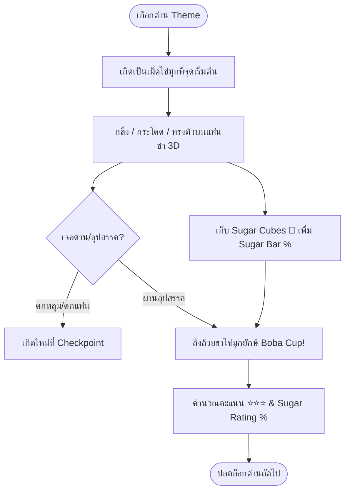

# 🧋 BOBA PEARL DROP: 100% SUGAR — Concept & Vision

**Version:** 1.0.0 | **Last Updated:** 2026-08-12  
**Owner:** Game Design Team  

---

## 1. Introduction & Vision

### Elevator Pitch
**BOBA PEARL DROP: 100% SUGAR** เป็นเกม 3D Arcade Roller ที่นำความสนุกระดับคลาสสิกสไตล์ *Super Monkey Ball* มาผสมผสานกับธีมชาไข่มุก (Boba Milk Tea) ยอดนิยม! ผู้เล่นจะควบคุม "เม็ดไข่มุกผิวมันวาวหนึบหนับ" กลิ้งฝ่าแท่นลอยฟ้า 3 มิติ สะสมก้อนน้ำตาลบริสุทธิ์เพื่อเร่งระดับความหวานให้เต็ม 100% Sugar แล้วกระโดดลงถ้วยชาไข่มุกยักษ์เพื่อชนะด่าน!

### Unique Selling Points (USP)
1. **Aesthetic ที่น่าดึงดูดใจ:** งานภาพโทนพาสเทลมินิมอล น่ารัก สดใส (ชานมสด, เผือกหอม, ชาเขียวมัทฉะ)
2. **Physics & Control ที่ลื่นไหล:** ฟิสิกส์การกลิ้งแบบทรงกลม ยืดหยุ่น มีน้ำหนักและแรงเหวี่ยงที่สนุกสนาน ควบคุมง่ายด้วย WASD / Arrow Keys หรือ สัมผัสบนมือถือ
3. **Level Mechanics สนุกตื่นเต้น:** หลอดดูดชาไข่มุก (Straw Tunnels), ไม้คนชาหมุนได้ (Tea Stirrer Spinners), และแท่นเด้งชาไข่มุก (Boba Bounce Pads)
4. **ความหวาน 100% (Sugar Rating System):** เก็บก้อนน้ำตาล 🧊 สะสมแต้มและระดับความหวาน พร้อมระบบเวลาแข่งทำสถิติ Speedrun

---

## 2. Target Audience & Platform

- **กลุ่มเป้าหมาย:** ผู้เล่นสาย Casual, Hyper-Casual, ชื่นชอบเกม 3D น่ารักสดใส, คอชาไข่มุก, และแฟนเกม Marble Roller / Super Monkey Ball
- **แพลตฟอร์ม:** Web Browsers (PC, Mac, Mobile Web)
- **โหมดการเล่น:** Single Player Level Progression & Time Attack

---

## 3. High-Level Core Gameplay Loop

---

## 4. Technical Architecture Overview

- **Visual Engine:** BabylonJS 7.x พร้อม PBR Materials และ Custom Glow Lighting
- **Audio System:** Web Audio API เล่น SFX สัมผัสผิวมัน, เสียงเก็บน้ำตาล และเพลงธีมชิลๆ Lo-Fi Tea Beats
- **UI Framework:** Responsive Web Canvas Overlay (HTML5/CSS Glassmorphism UI)

---

## 🔗 Related Documents
- [Core Mechanics](./01-mechanics.md)
- [Level Design](./02-level-design.md)
- [Art Direction](./03-art-direction.md)
- [Software System Design](../../software/games/boba-pearl-drop/01-system-design.md)
