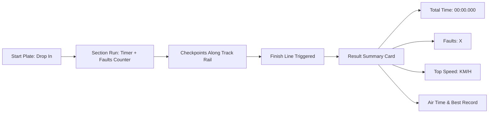

# 🏍️ DIRT LINE (Trials Dirt Bike 3D) — Game Design Document & Dev Specs

**Code Name:** `dirtline`  
**Game ID:** `G030`  
**Engine:** Three.js / Custom 2.5D Spring-Mass Physics  
**Original Live Source:** [https://dirtline.pages.dev/](https://dirtline.pages.dev/)  
**Tagline:** *"Weight is the whole game. The rider is a separate 72 kg mass on a spring."*  

---

## 1. Executive Summary & Concept

### 1.1 Elevator Pitch
**DIRT LINE** เป็นเกม Trials Dirt Bike จำลองฟิสิกส์มอเตอร์ไซค์วิบากระดับสูง (High-Fidelity 2.5D/3D Physics) ผู้เล่นต้องขับขี่รถมอเตอร์ไซค์ไต่ผ่านอุปสรรคหินผา เนินชัน และหุบเขาลึกใน **Canyon Works (Section 01)** โดยจุดเด่นสำคัญที่สุดของเกมคือ **"น้ำหนักของนักขับเป็นมวล 72 kg แยกอิสระที่ยึดโยงด้วยสปริง"** ผู้เล่นต้องถ่ายเทน้ำหนักตัวหน้า-หลัง (Lean Weight) คุมคันเร่ง และเบรกหน้า-หลังอย่างแม่นยำเพื่อไม่ให้รถคว่ำหรือเกิดข้อผิดพลาด (Faults)

### 1.2 Core Pillars
1. **Inverted Pendulum & Spring-Mass Dynamics:** ฟิสิกส์การถ่ายน้ำหนักสมจริง ขับเคลื่อนด้วยแรงเฉื่อยและสปริง
2. **Precision Trials Control:** การคุมบาลานซ์ล้อหน้า-หลัง (Wheelie & Nose-dive management)
3. **Telemetry & Millisecond Time Attack:** แผงจับเวลาละเอียดระดับมิลลิวินาที, ตรวจจับ Faults, และระบบบันทึก Ghost Replay

---

## 2. Technical Stack & Architecture

| Layer | Technology | Usage & Details |
|---|---|---|
| **Core 3D Engine** | Three.js (r128 / GLTFLoader) | Canyon 3D Mesh, Bike Assembly, Rider Skeleton, Track Rail |
| **Physics Solver** | Custom Dual-wheel Raycast + Mass Spring | คำนวณแรงสปริงโช้คหน้า-หลัง, มวลนักขับ 72 kg, แรงยึดเกาะหน้ายาง (Tire Friction) |
| **Telemetry System** | Time-Series Vector Recorder | บันทึก Position, Velocity, RPM, Pitch Angle สำหรับ Ghost Replay |
| **HUD & Styling** | CSS Custom Props + Monospace Tabular Fonts | แผงจับเวลา Millisecond, Faults Counter, Dynamic Speedometer, Rev Meter |
| **Audio Engine** | Web Audio API Engine Synthesizer | เสียงคำรามเครื่องยนต์ 2 จังหวะตามรอบ RPM, เสียงเอี๊ยดของเบรก, เสียงกระแทก Suspension |

---

## 3. Controls & Physics Mechanics

| Key | Action | Physics & Behavioral Effect |
|---|---|---|
| **`W`** | **Throttle (คันเร่ง)** | ส่งแรงบิดไปยังล้อหลัง รถพุ่งไปข้างหน้าพร้อมเพิ่มรอบเครื่องยนต์ (Rev Meter) |
| **`S`** | **Brakes (เบรก)** | เบรกล้อหน้าจับแรงกว่าล้อหลัง ทำให้หน้ารถทิ่มไปข้างหน้า (Pitches Forward) |
| **`A`** | **Weight Back (เอนหลัง)** | ถ่ายมวล 72kg ไปด้านหลัง ยกหน้ารถขึ้น (Wheelie) เพื่อปีนขึ้นโขดหิน |
| **`D`** | **Weight Forward (ก้มตัว)** | ถ่ายมวลไปข้างหน้า กดหน้ารถลง ป้องกันไม่ให้รถหงายหลังตีลังกา |
| **`R`** | **Reset Checkpoint** | ย้อนกลับไปยัง Checkpoint ล่าสุดทันที พร้อมบันทึกแต้มความผิดพลาด (`Fault +1`) |
| **`T`** | **Toggle Telemetry** | เปิด/ปิด แถบแสดงข้อมูลตัวเลขฟิสิกส์แบบละเอียด |
| **`G`** | **Ghost Replay** | เปิด/ปิด เงารถ Ghost ของรอบสถิติที่ดีที่สุด (Best Run) |

---

## 4. UI/UX & Result Screen

- **HUD Top-Left (`.plate`):** เวลาเดินเรียลไทม์ `00:00.000` + จำนวน Faults `X`
- **HUD Top-Right (`#track`):** แถบราง Track แสดงตำแหน่งของตัวผู้เล่นเทียบกับ Checkpoints
- **HUD Bottom-Right (`#speed`):** ตัวเลขความเร็ว `KM/H` และแถบวัดรอบ `REV`
- **Finish Card:** แสดงสรุปผลรอบการวิ่ง (Time, Faults, Top Speed, Air Time, Best Record)

---

## 5. Porting & Scrape Plan

1. **Asset Scraper:** สกัด Three.js bundle, โมเดล Canyon Track, ชิ้นส่วน Dirt Bike 3D และ SFX
2. **Physics Modularization:** แยกโค้ดฟิสิกส์ (~13,000 lines) ออกเป็นโมดูลสะอาด (`physics.js`, `bike.js`, `track.js`)
3. **Ghost & Telemetry Engine:** พอร์ตระบบบันทึก Time-series และ LocalStorage Best Time
4. **Hub Integration:** ฝังลง `public/games/dirtline/` พร้อม Card ในหน้าหลัก webJS
