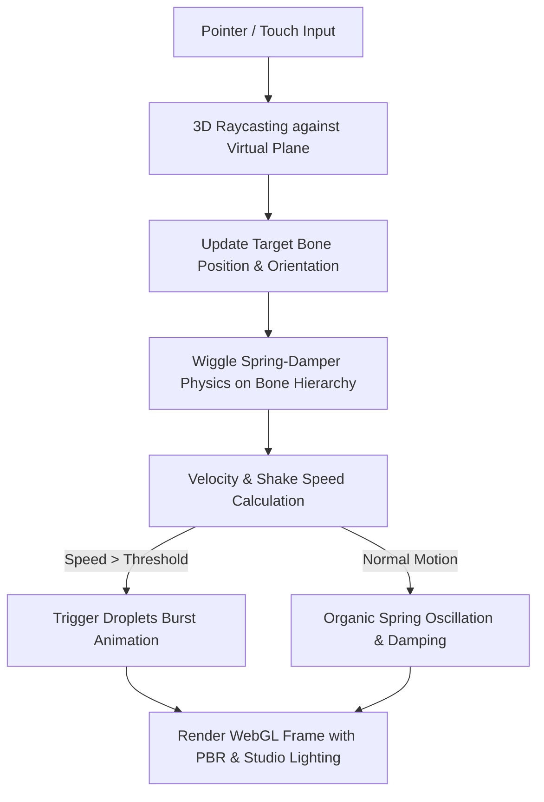

# 🍆 Wiggle Eggplant 3D (Three.js & Wiggle Physics) — Game Design Document & Dev Specs

**Code Name:** `eggplant-wiggle`  
**Game ID:** `eggplant-wiggle`  
**Engine:** Three.js (WebGL2 / PBR Pipeline)  
**Physics Extension:** Wiggle Bone Spring-Damper Dynamics  
**Live Source Reference:** [https://xn--gi8h42h.ws/](https://xn--gi8h42h.ws/)  
**Credits & Authors:** 
- Interactive Experience & Physics Integration by [Max van Leeuwen](https://maxvanleeuwen.com)
- 3D Eggplant Model by [animatezach](https://animatezach.com/) ([Sketchfab Model](https://sketchfab.com/3d-models/eggplant-emoji-531e2c549ae54b9189b460c2ff7e0e44))
- Wiggle for Three.js by [Xavier / Jack](https://wiggle.three.tools/)

---

## 1. Executive Summary & Concept

### 1.1 Elevator Pitch
**🍆 Wiggle Eggplant 3D** เป็น Interactive 3D Physics Web Toy ที่จำลองโมเดลมะเขือยาว 3 มิติที่มีโครงสร้างกระดูกแบบ Skinned Mesh เสริมด้วยระบบฟิสิกส์สปริงลดแรงสั่นสะเทือน (Spring-Damper Wiggle Dynamics) แบบเรียลไทม์ ผู้ใช้สามารถใช้นิ้วสัมผัสหรือลากเมาส์เพื่อดึง ยืด โยก และสะบัดมะเขือยาวได้อย่างเป็นธรรมชาติ เมื่อเกิดการสะบัดหรือขยับด้วยความเร็วสูงถึงจุด Trigger ระบบจะปล่อยเอฟเฟกต์ละอองหยดน้ำ 3 มิติ (Water Droplets) พุ่งกระจายออกมาอย่างสมจริง

### 1.2 Target Audience
ผู้ใช้ทุกเพศทุกวัยบนเบราว์เซอร์ทั้ง Desktop และ Mobile ที่ชื่นชอบเว็บแอเรียลไทม์ 3D Interactive, Micro-interactions, WebGL Demos และการทดลองฟิสิกส์ 3D บนเว็บ

---

## 2. Technical Stack & Architecture

| Layer | Technology | Usage & Details |
|---|---|---|
| **Core 3D Engine** | Three.js (WebGL) | Scene, PerspectiveCamera, WebGLRenderer, Mesh, Group |
| **Asset Loaders** | GLTFLoader, OBJLoader, RGBELoader | โหลดโมเดล GLB, โมเดลหยดน้ำ OBJ, และแผนที่แสง HDR |
| **Physics Solver** | Wiggle Bone Spring-Damper | คำนวณความเฉื่อย, แรงดึงกลับ (Stiffness) และแรงหน่วง (Damping) บนกระดูก |
| **Shaders** | Custom GLSL Fragment Shader | แรเงาพื้นหลัง Radial Gradient ที่ปรับอัตราส่วนตามขนาดหน้าจอ (Aspect-ratio responsive) |
| **Lighting** | Multi-point Studio Light + HDRI EnvMap | Cyan Key Light, Magenta Fill Light, White Rim Light, HDRI Environment Map |
| **Interactions** | Pointer Events & Raycasting | รองรับทั้ง Pointer, Mouse, Touch พร้อมระนาบรับพิกัด 3D Raycasting |

---

## 3. Asset Breakdown & Catalog

| Asset | Filename | Format | Description |
|---|---|---|---|
| 🍆 **Eggplant Model** | `model.46a6ff3e.glb` | GLTF/GLB (Binary) | โมเดลมะเขือยาว 3D พร้อม Skeleton Hierarchy (`Bone`, `Bone001` - `Bone004`) |
| 🎨 **Albedo Texture** | `texture.46a18860.jpg` | JPEG | พื้นผิวลวดลายและสีสันของโมเดลมะเขือยาว |
| 💧 **Droplet Model** | `droplet.25fdcda7.obj` | Wavefront OBJ | โมเดล 3D หยดน้ำ สำหรับทำเอฟเฟกต์กระจายตัว |
| 🌅 **HDRI Map** | `hdr.a3d7329c.hdr` | Radiance HDR | แสงสะท้อนและ Environment Map สไตล์ Studio เพื่อความมันวาวระดับ PBR |
| 🎨 **UI Styling** | `index.8d3caf2c.css` | CSS | ดีไซน์ Glassmorphism Popup และปุ่มข้อมูลเครดิต |
| ⚙️ **Game Logic** | `index.385528f4.js` | ES Module JS | ตัวประมวลผลลูปฟิสิกส์, แสงเงา, Raycaster, และ Tween Animations |

---

## 4. Core Systems & Gameplay Mechanics



### 4.1 Bone Hierarchy & Spring-Damper Physics
โครงกระดูกของโมเดลประกอบด้วยกระดูกหลัก 5 ส่วน:
1. `Bone` (Root / Base Bone) — รับพิกัดเป้าหมายจากตำแหน่ง Pointer โดยตรง พร้อมคำนวณการหมุน Lerp เข้าหากล้อง
2. `Bone001` — ส่วนโคน (`Stiffness = 700`, `Damping = 25`) ยืดหยุ่นระดับปานกลาง
3. `Bone002` — ส่วนลำตัว (`Stiffness = 700`, `Damping = 25`) ส่งต่อโมเมนตัมการแกว่ง
4. `Bone003` — ส่วนปลายมะเขือ (`Stiffness = 6000`, `Damping = 1600`) ควบคุมความตึงให้คงรูป
5. `Bone004` — จุดยอดปลายสุด (`Stiffness = 6000`, `Damping = 1600`) เป็นจุดอ้างอิงตำแหน่งสำหรับปล่อยละอองหยดน้ำ

### 4.2 Pointer Tracking & Drag Mechanics
- สร้างระนาบจำลอง `PlaneGeometry(50, 50)` ในระยะห่าง `10` หน่วยจากกล้อง
- เมื่อมี Event `pointermove` หรือ `pointerdown`:
  - คำนวณพิกัด Normalized Device Coordinates (NDC)
  - ยิง `Raycaster` ชนระนาบจำลองเพื่อแปลงพิกัดหน้าจอเป็นพิกัด 3D World Coordinates
  - นำตำแหน่งพิกัดแปลงเข้าสู่ Local Space ของ Root Bone ด้วย `parent.worldToLocal()`
  - อัปเดตตำแหน่งด้วยการ Lerp แบบ Smooth Interpolation: `i.position.lerp(target, Math.min(20 * dt, 1))`

### 4.3 Shake Velocity & Droplet Burst Trigger
- ระบบวัดความเร็วการเคลื่อนที่ (Pointer Velocity):
  $$\text{Velocity} = \frac{\text{Distance}(\text{Pointer}_{t}, \text{Pointer}_{t-1})}{\Delta t \times 20000}$$
- สะสมและกรองค่าความเร็วเข้าสู่ตัวแปรเฉลี่ย `C`
- **Trigger Condition**:
  - หาก `C` เกินค่า Threshold `w` (Desktop: `0.27`, Mobile Touch: `0.18`) ระบบจะเข้าสู่สถานะ `Trigger Ready`
  - เมื่อความเร็วตกลงต่ำกว่าเกณฑ์ `A` (`0.85 * w`) ระบบจะทำการ Burst ละอองหยดน้ำ 3 ชิ้นออกมา
- **Droplet Pop Tween Animation**:
  - ละอองหยดน้ำ 3 ชิ้นจะ Scale ขยายขนาดขึ้นแบบ Cascading Delay (0ms, 50ms, 100ms)
  - คงรูปและสั่นไหวเล็กน้อยด้วย Sine Wave Modulator
  - หดตัว Scale กลับเป็น 0 และซ่อนการแสดงผลหลังจากผ่านไป 1.4 - 1.5 วินาที

### 4.4 Dynamic Lighting & Material System
- **PBR Material on Eggplant**:
  - Metalness: `0.92`, Roughness: `0.5`, Reflectivity: `1.0`
  - ผสานแสงสะท้อนจาก HDR Environment Map ด้วยค่า `envMapIntensity = 0.1`
- **Droplet Material**:
  - สีฟ้าเรืองแสง (`Color(0, 0.3, 1)`), Metalness: `0.8`, Roughness: `0.7`
  - Sheen Effect สีขาว พร้อม Emissive Glow (`Color(0, 0.2, 1)`, Intensity: `0.25`)
- **3-Point Studio Lights**:
  - Cyan Point Light (`#00fff2`, Intensity: `6.5`) ตำแหน่ง `(-1, 0, -1.5)`
  - Magenta Point Light (`#ff00f7`, Intensity: `4.5`) ตำแหน่ง `(1, 0, -2.5)`
  - White Ambient Light (`#ffffff`, Intensity: `3.4`) ส่องสว่างทั่วถึงทั้งฉาก

---

## 5. UI/UX & Responsive Layout

1. **Aspect-Ratio Adaptive Radial Background**:
   - ควบคุมการเกลี่ยสีพื้นหลังด้วย Custom Fragment Shader:
   - ผสมสีระหว่างโทนม่วงเข้ม `#610085` และม่วงสว่าง `#9000c4`
   - ปรับ Scale วงรัศมีตาม Aspect Ratio ของหน้าจออัตโนมัติ (Landscape: `1.4`, Portrait: `0.9`)
2. **More Info & Credits Popup**:
   - ปุ่ม `???` ด้านล่างของหน้าจอ พร้อมเอฟเฟกต์เฟดหายไปอัตโนมัติใน 4 วินาทีหากไม่มีการกด
   - เมื่อคลิกจะเปิด Glassmorphism Modal แสดงเครดิตผู้สร้าง พร้อมลิงก์ไปยังต้นฉบับ
   - ปิด Modal อัตโนมัติเมื่อแตะบริเวณ Canvas ของฉาก 3D

---

## 6. File Structure & Delivery

```
public/games/eggplant-wiggle/
├── index.html            ← โครงสร้างเว็บ HTML5, Meta viewport, ลิงก์ CSS & Module Script
├── index.8d3caf2c.css    ← สไตล์ Glassmorphism UI และ Responsive Animations
├── index.385528f4.js     ← ลอจิก Three.js, Wiggle Physics, Raycaster, Shaders, Interaction Loop
├── model.46a6ff3e.glb    ← โมเดล 3D มะเขือยาวพร้อม Rigging Bones
├── texture.46a18860.jpg  ← พื้นผิว Albedo ของโมเดล
├── droplet.25fdcda7.obj  ← โมเดล 3D หยดน้ำ
├── hdr.a3d7329c.hdr      ← ข้อมูลแสงสะท้อนรอบทิศทาง HDRI
└── favicon.ae4ad28e.ico  ← ไอคอนหน้าเว็บ
```

---

## Related Documents
- [Documentation Inventory](../../index.md)
- [GDD Collection Hub](../00-concept.md)
- [Main Application Page](file:///c:/Users/noppon/source/06-WEB/webJS/src/app/page.js)
