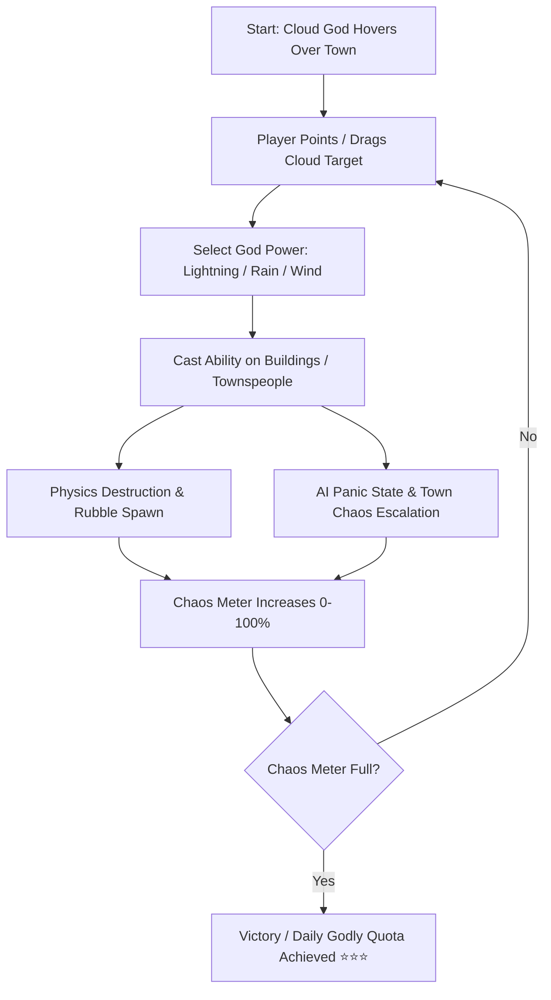

# ⚡ GODAWFUL (Cute Town God Sim) — Game Design Document & Dev Specs

**Code Name:** `godawful`  
**Game ID:** `G028`  
**Engine:** Three.js / WebGL2 / PostFX Pipeline  
**Original Live Source:** [https://godawful.vercel.app/](https://godawful.vercel.app/)  
**Tagline:** *"A cute little town, and the petty almighty god who ruins its day."*  

---

## 1. Executive Summary & Concept

### 1.1 Elevator Pitch
**GODAWFUL** เป็นเกม 3D God Simulator / Sandbox Chaos สไตล์ Low-poly Isometric ผู้เล่นจะสวมบทบาทเป็น **"เทพเจ้าก้อนเมฆผู้เย่อหยิ่ง (Smug Storm-Cloud God)"** ที่มีรัศมีฮาโลเหนือหัว ลอยอยู่เหนือเมืองชนบทอันแสนสงบสุข ผู้เล่นสามารถชี้นิ้ว/เมาส์สั่งการให้ก้อนเมฆเคลื่อนที่ และปลดปล่อยพลังฟ้าผ่า (Lightning Strike), พายุฝนกระหน่ำ (Rainstorm), หรือพายุหมุน (Tornado) เพื่อพังทลายบ้านเรือน ต้นไม้ และทำให้ชาวเมืองวิ่งหนีอย่างโกลาหล

### 1.2 Target Audience & Platform
- ผู้เล่นที่ชอบเกมแนว Sandbox, God Sim (เช่น Black & White, Pocket God) และ Physics Destruction
- เบราว์เซอร์ Desktop และ Mobile (รองรับ Touch Raycasting & Responsive Canvas)

---

## 2. Technical Stack & Architecture

| Layer | Technology | Usage & Details |
|---|---|---|
| **Core 3D Engine** | Three.js (WebGL2) | Scene, Perspective Camera, Shadow Maps, Instanced Mesh |
| **Post-Processing** | Three.js PostFX Pipeline | Bloom (แสงฟ้าผ่าสว่างจ้า), Vignette, Color Grading |
| **Physics & Destruction** | Custom Rigid-Body / Mesh Swap | เมื่อบ้านโดนฟ้าผ่า สลับเป็นเศษซากหักพัง (Rubble Mesh) พร้อมแรงกระเด็น |
| **AI System** | State Machine AI | พฤติกรรมชาวเมือง: `Idle`, `Wandering`, `Working`, `Panic / Fleeing` |
| **Audio Engine** | Web Audio API SFX Synthesizer | เสียงฟ้าร้องแบบ Low-frequency, เสียงฝนซ่า, เสียงชาวเมืองอุทาน |
| **UI Framework** | HTML5 Canvas Overlay + Glassmorphism | `#overlay-2d`, `#ui-root` แสดง Chaos Bar และคะแนนความเสียหาย |

---

## 3. Core Gameplay Loop & Mechanics

### 3.1 God Powers
1. **⚡ Lightning Bolt (สายฟ้าฟาด):** คลิก/แตะเพื่อผ่าลงจุดเป้าหมาย สร้างความเสียหายแก่สิ่งปลูกสร้างในทันที ก่อให้เกิดไฟไหม้และควันดำ
2. **🌧️ Downpour / Torrent (พายุฝน):** ปล่อยฝนตกหนัก น้ำท่วมถนน ดับไฟ หรือพัดพาชาวเมืองให้ลื่นล้ม
3. **🌪️ Whirlwind (พายุหมุนขนาดเล็ก):** ดูดเศษซากวัตถุและชาวเมืองให้ลอยขึ้นกลางอากาศ

### 3.2 Town Ecosystem & Reaction
- **Buildings (บ้านเรือน & ร้านค้า):** มีแถบความทนทาน (Durability) เมื่อพลังทำลายถึงจุดกำหนด จะยุบตัวกลายเป็นเศษอิฐไม้ 3D
- **Townspeople (ชาวบ้านตัวจิ๋ว):** เดินไปมาตามถนน มีปฏิกิริยากลัวเมฆดำ หากก้อนเมฆลอยมาใกล้จะเริ่มกางร่ม หรือวิ่งหนีเข้าบ้าน

---

## 4. UI/UX & Audio Specifications

- **HUD Overlay:**
  - `Chaos Meter`: แถบสะสมระดับความโกลาหลของเมือง (0 - 100%)
  - `Power Selector`: สลับสกิลพลังเทพ (Lightning, Rain, Tornado)
  - `Town Census`: แสดงจำนวนชาวเมืองที่เหลือและบ้านที่ยังสมบูรณ์
- **Audio Direction:**
  - BGM: ดนตรีสไตล์ Acapella / Cheerful Whistling สบายๆ ที่ตัดกับเสียงฟ้าร้องฟ้าผ่าอย่างตลกร้าย
  - SFX: เสียงฟ้าผ่าแบบ Synth Zap, เสียงระเบิดปุ๊บปั๊บแบบการ์ตูน, เสียงกรีดร้องแบบ Mini Peeps

---

## 5. Porting & Scrape Plan

1. **Asset Extraction:** ดึงโมเดล 3D GLTF เมืองและก้อนเมฆจาก Vite Assets
2. **Core Loop Implementation:** พอร์ต Cloud Controller และ Particle FX ฟ้าผ่า
3. **Deconstruction Physics:** จำลองระบบพังทลายของสิ่งปลูกสร้าง
4. **Hub Integration:** ฝังลงใน `public/games/godawful/` และเชื่อม iFrame Modal บนหน้าหลัก webJS
