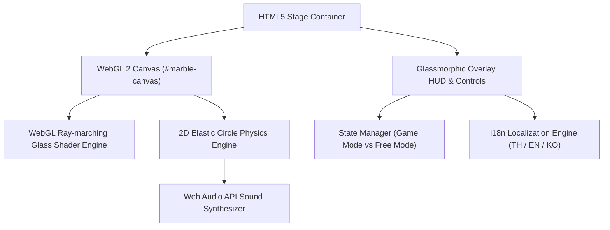

# 🔮 Goosl Glass Marbles (구슬치기) — Game Design Document & Dev Specs

**Code Name:** `goosl-marbles` (G016)  
**Game ID:** `goosl-marbles`  
**Engine:** WebGL 2 (Custom 2D/3D Glass Shader & Physics)  
**Audio:** Web Audio API (Procedural Synthesized Sound Design)  
**Version:** 1.0.0 | **Last Updated:** 2026-07-28  
**Status:** Released | **Priority:** High  

---

## 1. Game Overview

### Elevator Pitch
เกมยิงลูกแก้วเกาหลีแบบเว็บ (Korean-Style Glass Marble Flicking Game) ที่จำลองฟิสิกส์และการสะท้อนแสงแก้วสามมิติ (WebGL Glass Refraction Shaders) ที่สมจริง ผู้เล่นสามารถลากและยิงลูกแก้วยิง (Shooter Marble) เพื่อเคาะลูกแก้วเป้าหมาย 7 ลูกให้ออกจากวงกลมภายใน 6 ครั้ง พร้อมโหมดเล่นอิสระ (Free Play Mode) และระบบเอียงอุปกรณ์บนมือถือ (Tilt Sensor)

### Target Audience
- ผู้เล่นที่ชื่นชอบเกมแนว Physics-based Puzzle / Skill Shots
- ผู้เล่นที่ชอบเกม Casual เล่นง่าย มีกราฟิกแก้วใสระดับพรีเมียม
- ผู้เล่นทุกวัยที่ต้องการเกมเพลย์คลายเครียดบนเว็บบราวเซอร์

---

## 2. Gameplay Mechanics

### Core Game Mode (ยิงลูกแก้ว / Marbles Mode)
1. **การเล็งและยิง (Aim & Launch)**:
   - ผู้เล่นลากลูกแก้วยิง (Shooter Marble) ไปในทิศทางที่ต้องการ
   - ความยาวของเส้นแรงยิง (Aim Vector) จะคำนวณเข้าสู่ Power Meter (0% – 100%)
   - เมื่อปล่อยมือ ลูกแก้วจะถูกส่งออกไปด้วยแรงส่งตามเวกเตอร์
2. **เป้าหมาย (Objective)**:
   - ยิงเคาะลูกแก้วเป้าหมาย 7 ลูกในวงกลมให้ออกนอกวงกลมทั้งหมด
   - มีจำนวนโอกาสยิงสูงสุด 6 ครั้ง (6 Shots)
3. **เงื่อนไขชนะ/แพ้ (Win & Lose Conditions)**:
   - **ชนะ (Clear & Continue)**: เคาะลูกแก้วออกนอกวงหมดทั้ง 7 ลูก โดยลูกแก้วยิงหยุดอยู่นอกวงกลม → สามารถผ่านรอบและเล่นรอบถัดไปเพื่อสะสมคะแนนต่อเนื่อง
   - **แพ้ (Fail - Stopped Inside)**: ลูกแก้วยิงหยุดอยู่ *ภายใน* วงกลมก่อนที่ลูกแก้วเป้าหมายจะถูกเคาะออกหมด
   - **แพ้ (Fail - Out of Shots)**: โอกาสยิงหมด 6 ครั้งแต่เคาะลูกแก้วออกไม่ครบ

### Free Play Mode (โหมดเล่นอิสระ)
- ผู้เล่นสามารถลากและขว้างลูกแก้วจำนวนเท่าใดก็ได้บนหน้าจออย่างอิสระ
- ปรับจำนวนลูกแก้วด้วยสไลเดอร์ (6 ถึง 72 ลูก)
- สลับดีไซน์พื้นหลัง (สีขาวใส / ตาราง Grid)
- เปิดใช้งานระบบเอียงเครื่อง (Tilt Motion Sensor) บนอุปกรณ์เคลื่อนที่
- ปุ่มกระจายลูกแก้วใหม่ (Scatter) และปุ่มหยุด/เล่นต่อการเคลื่อนที่ (Pause/Resume Physics)

---

## 3. Technical Architecture & Subsystems

### 1. WebGL 2 Glass Renderer
- ใช้ Ray-marching 3D Sphere Shaders สำหรับวาดลูกแก้วแก้วทรงกลม
- คำนวณแสงสะท้อนภายใน (Internal Refraction), แสงกระทบผิว (Specular Highlight), Caustics และเงาตกกระทบ (Shadow Mapping)
- สุ่มสีลวดลายแถบแก้วริบบิ้น (Ribbon Pattern) ด้านในลูกแก้วแต่ละลูก

### 2. Physics & Motion Engine
- การชนแบบยืดหยุ่น 2 มิติ (2D Circle-Circle Elastic Collision)
- ระบบส่งแรงกระแทก (Impulse-based Velocity Integration)
- แรงเสียดทานหนืด (Friction Deceleration) เพื่อให้ลูกแก้วค่อยๆ ชะลอความเร็วลงอย่างเป็นธรรมชาติ

### 3. Web Audio API Synthesizer
- สังเคราะห์เสียงกระทบแก้ว (Glass Clinking SFX) อัตโนมัติโดยใช้ OscillatorNode และ GainNode
- ความถี่และระดับเสียงเปลี่ยนแปรผันตามความเร็วและพลังงานแรงชนของลูกแก้ว

### 4. Multi-language Localization (i18n)
- รองรับ 3 ภาษา: **ไทย (TH)**, **อังกฤษ (EN)**, **เกาหลี (KO)**
- ระบบตรวจจับภาษาบราวเซอร์อัตโนมัติ และสลับคำบรรยาย UI / คำอธิบายป๊อปอัปความช่วยเหลือทันที

---

## 4. File Structure & Assets

- **Game Directory:** `public/games/goosl-marbles/`
  - [index.html](file:///c:/Users/noppon/source/06-WEB/webJS/public/games/goosl-marbles/index.html) — โครงสร้าง WebGL Canvas, HUD, Power Meter, Aim Layer, Help Modal
  - [styles.css](file:///c:/Users/noppon/source/06-WEB/webJS/public/games/goosl-marbles/styles.css) — Glassmorphic UI Layout, Responsive Overlay Controls, Target Ring Styling
  - [app.js](file:///c:/Users/noppon/source/06-WEB/webJS/public/games/goosl-marbles/app.js) — เอนจิน WebGL Raymarching Shader, Physics System, Audio Synth, Control Flow
  - [i18n.js](file:///c:/Users/noppon/source/06-WEB/webJS/public/games/goosl-marbles/i18n.js) — ระบบแปลภาษา (TH, EN, KO)
  - [thumbnail.png](file:///c:/Users/noppon/source/06-WEB/webJS/public/games/goosl-marbles/thumbnail.png) — รูปหน้าปกเกมสำหรับ Game Hub

---

## 5. Related Links

- GDD Concept: [docs/gdd/00-concept.md](../../00-concept.md)
- GDD Mechanics: [docs/gdd/01-mechanics.md](../../01-mechanics.md)
- Product Index: [docs/index.md](../../../index.md)
