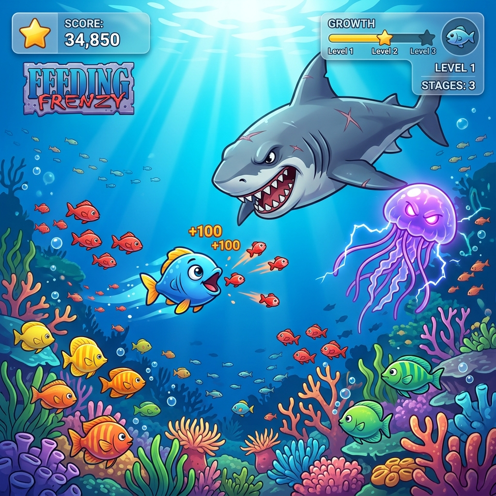
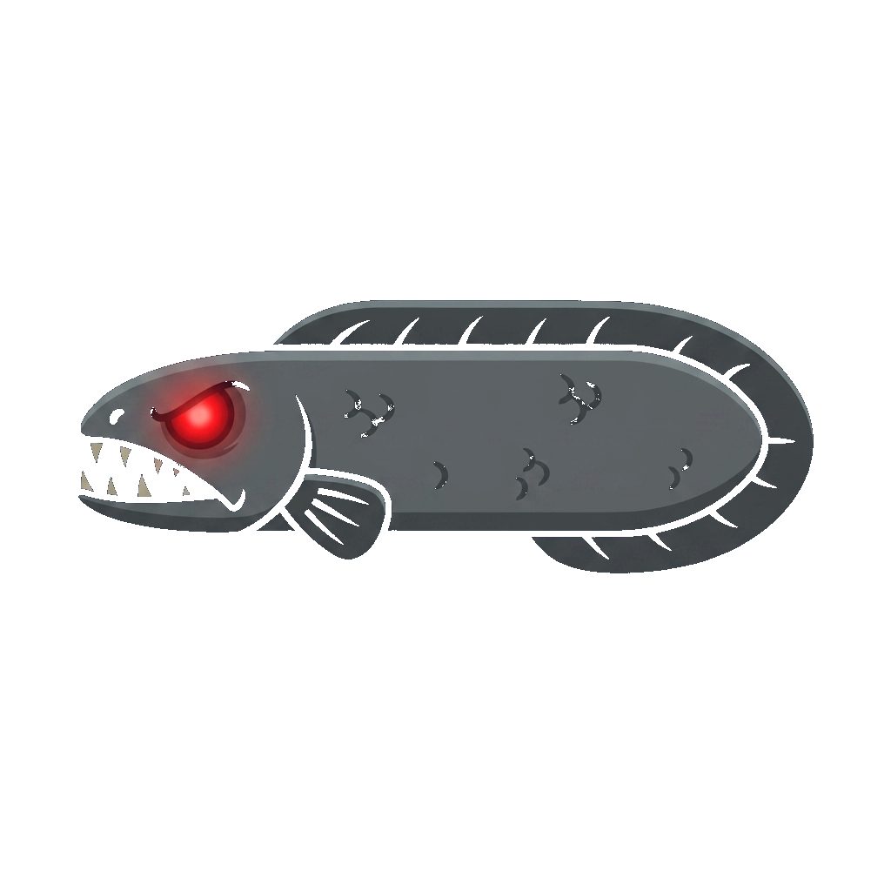

# 🐠 Ocean Frenzy — Game Design Document & Dev Specs

**Code Name:** `ocean-frenzy` (G009)
**Game ID:** `ocean-frenzy`
**Engine / Tech:** Phaser 3 (2D Arcade Physics)
**Asset Pack:** Kenney Fish Pack 2 (`public/assets/kenney_fish-pack_2/`)
**Version:** 1.1.0 | **Last Updated:** 2026-08-01
**Status:** 🟢 Released / Active | **Priority:** Completed

---

## 1. Game Overview

### Gameplay Preview

### Elevator Pitch

เกมปลาใหญ่กินปลาเล็กสุดมัน (Feeding Frenzy Style) ในสไตล์กราฟิกมาร์ตูนน่ารัก ผู้เล่นจะรับบทเป็นปลาตัวเล็กในท้องทะเล ต้องคอยไล่กินปลาที่มีขนาดเล็กกว่าเพื่อสะสมคะแนนขยายขนาดร่างกาย (Growth Level) พร้อมกับต้องคอยหลบหลีกสัตว์ทะเลดุร้ายที่มีขนาดใหญ่กว่า รวมถึงแมงกะพรุนพิษในระดับความลึกต่างๆ

### Target Audience

ผู้เล่นทุกเพศทุกวัยที่ชื่นชอบเกมแนว Casual / Arcade 2D ที่เข้าใจง่าย มีการเติบโตของตัวละครแบบเรียลไทม์ และได้ความตื่นเต้นท้าทาย

---

## 2. Gameplay Mechanics & Systems

### Core Gameplay Loop

1. **Swim & Control**: ผู้เล่นควบคุมทิศทางการว่ายน้ำของปลาด้วย Mouse Pointer หรือ Touch Control บนมือถือ
2. **Feed & Grow**: ว่ายน้ำไล่จับกินปลาที่มีขนาดเล็กกว่าเพื่อเพิ่มคะแนน (Score Points) และสะสมหลอดเติบโต (Growth Bar)
3. **Evolution Level**: เมื่อหลอดเติบโตเต็ม ปลาผู้เล่นจะขยายขนาดร่างกายใหญ่ขึ้น 1 ระดับ (Level 1 ➔ Level 9 KING) ทำให้กินปลาประเภทใหญ่ขึ้นได้
4. **Avoid Hazards & Stings**: หลบหลีกปลาใหญ่ที่มีขนาดโตกว่าตัวผู้เล่น และหลบแมงกะพรุนพิษ (ทำให้เคลื่อนที่ช้าลง 3 วินาที)
5. **Collect Speed Boosts**: เก็บฟองอากาศเร่งความเร็ว (Speed Boost +50% นาน 5 วินาที)
6. **Victory & Record Condition**: สะสมคะแนนได้สูงสุด และเติบโตจนกลายเป็นปลาเจ้าแห่งท้องทะเล (KING) บันทึก High Score ลง LocalStorage
7. **Game Over Condition**: โดนปลาใหญ่กว่างับกิน หรือพลังชีวิต (3 Lives) หมดลง

---

## 3. Asset Catalog & Visual Breakdown

- **Asset Path:** `public/games/ocean-frenzy/assets/kenney_fish-pack_2/PNG/Default/`
- **Doc Assets:** `./assets/`

| Category               |                                      Sprite Preview                                      | Asset Key         | File Name                                               | Score / Effect | Description                                                                               |
| ---------------------- | :---------------------------------------------------------------------------------------: | ----------------- | ------------------------------------------------------- | -------------- | ----------------------------------------------------------------------------------------- |
| **Player Fish**  |                                                            | `player_fish`   | `fish_blue.png`                                       | Main Character | ปลาผู้เล่นหลัก ขยายขนาดตาม Evolution Level                       |
| **Small Prey**   |    | `fish_small`    | `fish_red.png`, `fish_green.png`, `fish_pink.png` | +10 - +15 pts  | ปลาขนาดเล็ก เหยื่อระดับแรก                                       |
| **Medium Prey**  |                           | `fish_med`      | `fish_orange.png`, `fish_brown.png`                 | +20 - +25 pts  | ปลาขนาดกลาง กินได้เมื่อผู้เล่นอยู่ Level 2+              |
| **Big Prey**     |                                                              | `fish_large`    | `fish_grey.png`                                       | +40 pts        | ปลาใหญ่ ได้แต้มสูงเมื่อผู้เล่นมีขนาดใหญ่พอ       |
| **Big Predator** |  | `fish_predator` | `fish_shark_scary.png` | -1 Life | ฉลามยักษ์สุดน่ากลัว สัตว์ดุร้ายที่ต้องหลบหลีก |
| **Hazard**       |                                                        | `jellyfish`     | `fish_pink.png` (Purple Tint)                         | Slow Down 3s   | แมงกะพรุนพิษ ทำให้ผู้เล่นช้าลง                               |
| **Power-up**     |                                                            | `bubble_item`   | `bubble_c.png` (Gold Tint)                            | Speed Boost 5s | ทุ่นฟองอากาศเพิ่มความเร็ว 5 วินาที                         |

---

## 4. Controls & Input Mapping

| Device       | Action                                 | Mapping                                                |
| ------------ | -------------------------------------- | ------------------------------------------------------ |
| Mouse        | เคลื่อนที่ว่ายน้ำ     | เคลื่อนที่ตามตำแหน่ง Mouse Pointer |
| Touch Screen | เคลื่อนที่ว่ายน้ำ     | ลากนิ้วบนหน้าจอ (Touch Drag Pointer)    |
| Keyboard     | เร่งความเร็ว (Speed Boost) | Press `Space` / Click Button                         |

---

## 5. Audio Specs (Web Audio API Synthesizer)

| Event                     | Synth Wave      | Frequency Range         | Duration | Description                                                              |
| ------------------------- | --------------- | ----------------------- | -------- | ------------------------------------------------------------------------ |
| **Eat Fish**        | Sine Wave       | 300Hz ➔ 600Hz Pitch Up | 0.08s    | เสียงงับกินเหยื่อจ๊อบๆ                             |
| **Level Up**        | Triangle Chords | C4-E4-G4-C5 Arpeggio    | 0.35s    | เสียงดนตรีฉลองเมื่อปลาเติบโตขึ้น         |
| **Jellyfish Sting** | Sawtooth Wave   | 150Hz Vibration         | 0.20s    | เสียงกระแสไฟฟ้าซ็อตเมื่อโดนแมงกะพรุน |

---

## 6. Technical Directory Structure

- **Game Path:** `public/games/ocean-frenzy/`
  - `index.html` — Layout & Container
  - `game.js` — Phaser 3 Scene & Growth Logic
  - `styles.css` — Modern Glassmorphism Styling

---

## 🔗 Related Links

- GDD Concept: [docs/gdd/00-concept.md](../../00-concept.md)
- Asset Expansion Proposals: [docs/gdd/05-asset-game-proposals.md](../../05-asset-game-proposals.md)
- Product Backlog: [docs/agile/01-product-backlog.md](../../../agile/01-product-backlog.md)
