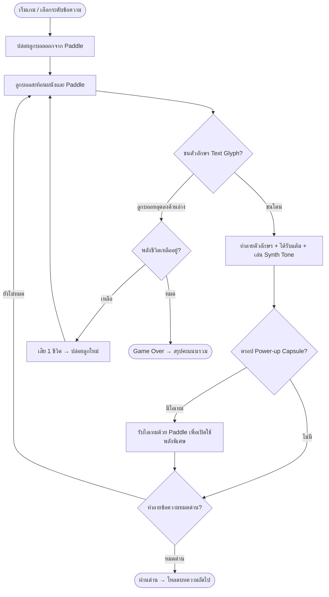

# 🧱 Pretext Breaker — Concept & Vision

---

## 1. Introduction & Vision

### Elevator Pitch
**Pretext Breaker** เป็นเกมแนว **Block Breaker / Arkanoid** สไตล์ Typography Modern Retro ที่สร้างมิติใหม่ให้กับเกมทำลายบล็อกคลาสสิก โดยแปลงประโยคและตัวอักษรแบบโมโนสเปซ (Monospace Glyphs) ให้กลายเป็นบล็อกในสนามแข่งขัน ผู้เล่นจะควบคุมแป้นพาย (Paddle) เพื่อตีลูกบอลสะท้อนไปกะเทาะทำลายตัวอักษรทีละตัว ปลดปล่อยพลัง Power-ups หลากหลายรูปแบบ พร้อมเอฟเฟกต์เสียงสังเคราะห์ 8-bit Procedural Web Audio Synthesizer ที่ปรับเปลี่ยนโทนเสียงตามระดับแถวของตัวอักษรอย่างไพเราะ

### Unique Selling Points (USP)
1. **Typography-as-Gameplay:** ไม่ใช่บล็อกสี่เหลี่ยมธรรมดา แต่เป็นตัวอักษรและประโยคที่มีความหมาย (Code snippets, Poetry, Quotes, Tech logs)
2. **Procedural Web Audio Synth:** ไร้ไฟล์เสียงภายนอก (.mp3/.wav) ทำงานด้วย `AudioContext` สังเคราะห์เสียง Melodic Hits แบบเรียลไทม์ตามระดับตัวโน้ต
3. **Organic Dynamic Physics:** คำนวณมุมสะท้อนตามจุดกระทบของแป้นพาย (Paddle Edge Spin & Velocity)
4. **Juicy Power-ups Suite:** ระบบไอเทมเสริมพลังสุดเร้าใจ เช่น Multi-Ball แตกตัว 3 ลูก, Laser Cannon ยิงเลเซอร์ทำลายข้อความ, และ Paddle Expansion
5. **Modern Minimalist Glassmorphism UI:** กรอบกระจกมน อัตราส่วน 4:3 พร้อมพื้นหลัง Dark Space และแสงสะท้อน Neon Glow

---

## 2. Target Audience & Platform

- **กลุ่มเป้าหมาย:** แฟนเกม Arcade Retro ยุค 80-90s, ผู้ที่ชื่นชอบเกม Arkanoid / Breakout, สาย Minimalist & Typography, นักพัฒนาเว็บและโปรแกรมเมอร์
- **แพลตฟอร์ม:** Web Browser (Desktop, Tablet, Mobile) รองรับ Mouse, Touch, และ Keyboard
- **โหมดการเล่น:** Single Player Arcade Progression & High Score Challenge

---

## 3. High-Level Core Gameplay Loop

---

## 4. Technical Architecture Overview

- **Rendering Engine:** HTML5 Canvas 2D Context พร้อมคำนวณ Text Metrics และ Sub-pixel Rendering
- **Typography Layout:** Custom Pretext Monospace Text-to-Brick Engine + Google Font `IBM Plex Mono`
- **Audio System:** Web Audio API (`OscillatorNode`, `GainNode`) สร้างเสียง Sine, Triangle, Square, Sawtooth
- **Input System:** Unified Pointer Events (Pointer Move / Touch Drag / Keyboard Arrow & AD keys)

---

## 🔗 Related Documents
- [Core Mechanics](./01-mechanics.md)
- [Level Design & Typography Patterns](./02-level-design.md)
- [Art & Audio Direction](./03-art-direction.md)
- [Dev Specs & Overview](./spec.md)
