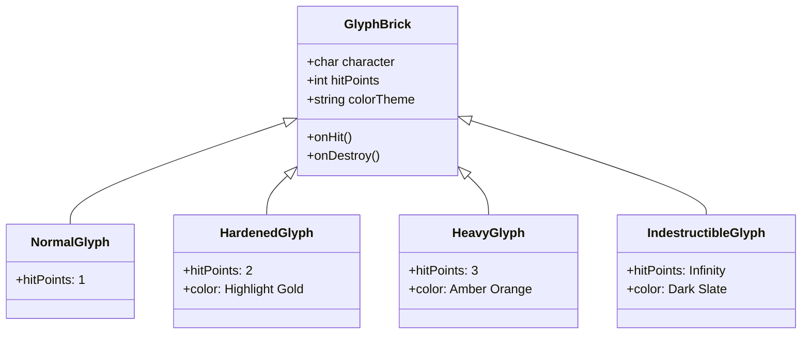

# 🧱 Pretext Breaker — Core Mechanics

---

## 1. Paddle Controls & Input System

| Action | Input Device | Result | Sensitivity / Curve |
|---|---|---|---|
| **Move Left / Right** | Mouse Move / Pointer Drag | แป้นพายเลื่อนตามแกน X ของเมาส์แบบ 1:1 | Direct Mapping |
| **Touch Drag** | Touchscreen Drag | แป้นพายเลื่อนตามนิ้วสัมผัส | 1:1 with Viewport Ratio Scaling |
| **Keyboard Move** | [A] [D] หรือ [←] [→] | แป้นพายเลื่อนซ้าย-ขวาด้วยความเร็วคงที่ | Constant Velocity + Edge Clamping |
| **Launch Ball / Fire Laser** | [Space] / Left Click / Tap | ปล่อยลูกบอลเริ่มเกม หรือยิงเลเซอร์ปืนใหญ่ | Instant Trigger |

---

## 2. Ball Physics & Collision Dynamics

### 2.1 Velocity & Speed Scaling
- **Initial Velocity:** ลูกบอลเริ่มต้นด้วยความเร็วมาตรฐาน `v_base = 450 px/s`
- **Speed Acceleration:** ทุกๆ การตีโดนบล็อกครบ 8 ครั้ง หรือเมื่อทำลายแถวบนสุด ความเร็วลูกจะเพิ่มขึ้น 3% จนถึงจุดสูงสุด `v_max = 750 px/s`

### 2.2 Paddle Angle Reflection Formula
เมื่อลูกบอลกระทบแป้นพาย มุมการสะท้อนจะแปรผันตามจุดกระทบจากกึ่งกลางแป้น:

$$\text{Offset} = \frac{\text{Ball.X} - \text{Paddle.CenterX}}{\text{Paddle.Width} / 2}$$

$$\theta_{\text{reflect}} = \text{Offset} \times 60^\circ$$

$$\vec{V}_{\text{new}} = |\vec{V}| \times \begin{bmatrix} \sin(\theta_{\text{reflect}}) \\ -\cos(\theta_{\text{reflect}}) \end{bmatrix}$$

- **Center Hit (Offset ≈ 0):** ลูกบอลสะท้อนตรงขึ้นด้านบน
- **Edge Hit (Offset ≈ ±1):** ลูกบอลสะท้อนเฉียงทำมุมกว้างถึง 60 องศา

---

## 3. Typography Block Types & Hit Points

| Brick Class | HP | Visual Indicator | Points Awarded | Notes |
|---|:---:|---|:---:|---|
| **Normal Glyph** | 1 | ตัวอักษรสีขาวนวล `#F6F2DF` | 100 PTS | แตกกระจายในนัดเดียว |
| **Hardened Glyph** | 2 | ตัวอักษรสีฟ้านีออน `#5FD3E0` | 250 PTS | ชนครั้งแรกจะเปลี่ยนสี ชนครั้งที่สองแตก |
| **Heavy Glyph** | 3 | ตัวอักษรสีส้มประกาย `#FFA04B` | 500 PTS | โครงสร้างแข็งแกร่ง |
| **Indestructible** | ∞ | ตัวอักษรสีเทาเข้มขอบเรืองแสง | 0 PTS | ไม่พัง ทำหน้าที่เป็นกำแพงสะท้อน |

---

## 4. Power-Up Capsules Suite

เมื่อทำลายบล็อกสำเร็จ มีโอกาสสุ่มดรอป Capsule (Drop Rate: 18%):

| Power-Up | Icon | Color Code | Effect & Duration |
|---|:---:|:---:|---|
| **Multi-Ball** | 🔵 | `#38BDF8` | แตกตัวลูกบอลเพิ่มอีก 2 ลูก (หากเหลือลูกเดียวเกมยังไม่จบ) |
| **Laser Cannon** | 🔴 | `#F43F5E` | แป้นพายติดปืนคู่ ยิงแสงเลเซอร์ด้วย Spacebar / Click (12 วินาที) |
| **Expand Paddle** | 🟢 | `#34D399` | แป้นพายขยายความกว้างขึ้น 40% (15 วินาที) |
| **Slow Ball** | 🟡 | `#FBBF24` | ลดความเร็วลูกบอลลง 30% ช่วยให้ควบคุมง่ายขึ้น (10 วินาที) |
| **Extra Life** | ❤️ | `#EC4899` | เพิ่มพลังชีวิตทันที +1 Life |

---

## 5. Scoring, Combos & Win/Lose Conditions

- **Base Score:** 100 – 500 แต้มตามชนิดของ Glyph
- **Combo Multiplier:** การตีโดนบล็อกต่อเนื่องโดยไม่ตกกระทบแป้นพายจะได้รับตัวคูณคะแนน:
  - Combo 2–4 Hits: `1.5x`
  - Combo 5–9 Hits: `2.0x`
  - Combo 10+ Hits: `3.0x (MAX COMBO)`
- **Win Condition:** ทำลายตัวอักษรทั้งหมดในข้อความจนครบ
- **Lose Condition:** ลูกบอลทุกลูกตกลงใต้จอภาพจนจำนวนพลังชีวิต (Lives) ลดลงเหลือ 0

---

## 🔗 Related Documents
- [Concept & Vision](./00-concept.md)
- [Level Design & Typography Patterns](./02-level-design.md)
- [Art & Audio Direction](./03-art-direction.md)
