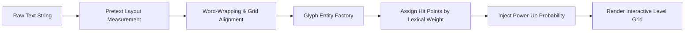

# 🧱 Pretext Breaker — Level Design & Typography Patterns

---

## 1. Text-to-Brick Layout Generation System

Pretext Breaker นำเข้าประโยคและข้อความ (Text Corpus) มาผ่านกระบวนการ Parsing เพื่อสร้างด่านโดยอัตโนมัติ:

1. **Character Dimension Matching:** ทุกตัวอักษรของฟอนต์ `IBM Plex Mono` มีอัตราส่วนความกว้างต่อความสูงที่คงที่ (Fixed Monospace Aspect Ratio)
2. **Padding & Spacing:** เว้นช่องไฟระหว่างตัวอักษร 2px และระหว่างบรรทัด 8px เพื่อให้มีร่องที่ลูกบอลสามารถแทรกตัวขึ้นไปทำลายด้านในได้
3. **Lexical Weight HP Assignment:**
   - สัญลักษณ์และเครื่องหมายวรรคตอน (`!`, `?`, `#`, `{}`): บล็อก 1-Hit นุ่มนวล
   - พยัญชนะและสระทั่วไป: บล็อก 1-Hit ถึง 2-Hit
   - คำหลักหรือ Keyword สำคัญ: บล็อก 3-Hit พร้อมสีกรอบนีออน

---

## 2. Standard Level Progression Tiers

| Level / Chapter | Theme & Source Material | Brick Density | Special Hazard / Layout |
|---|---|:---:|---|
| **Level 1: Hello World** | Basic Programming Syntax & Greeting | เบาบาง (3 แถว) | เน้นสอนมุมสะท้อนและการเล็งลูกบอล |
| **Level 2: The Manifesto** | Agile & Open Source Principles | ปานกลาง (5 แถว) | เริ่มมีบล็อก Hardened 2-Hit สีฟ้า |
| **Level 3: Algorithm Core** | Sorting & Graph Traversal Pseudocode | หนาแน่น (7 แถว) | มีบล็อก Indestructible วางเป็นกำแพงทางแยก |
| **Level 4: Cyber Poetry** | Cyberpunk Poetry & Tech Quotes | สูงมาก (9 แถว) | บล็อก Heavy 3-Hit ผสมกับกล่อง Power-up ถี่ขึ้น |
| **Level 5: The Source** | Minified Machine Bytecode Dump | เขาวงกต (11 แถว) | ด่านระดับ Master ท้าทายด้วยลูกบอลความเร็วสูง |

---

## 3. Dynamic Word Wall Formation

- **Floating Quote Banners:** ข้อความลอยอยู่กึ่งกลางด้านบน เพื่อเปิดพื้นที่ว่างด้านล่าง 40% ให้ผู้เล่นมีระยะเวลาคำนวณทิศทางการตกของลูกบอล
- **Cascade Falling Letters:** เมื่อทำลายคำศัพท์จนครบคำ อักษรที่เหลือในแถวจะเกิดการสั่นไหวเล็กน้อย (Word Clear Pulse) พร้อมโบนัสคะแนนพิเศษ

---

## 🔗 Related Documents
- [Concept & Vision](./00-concept.md)
- [Core Mechanics](./01-mechanics.md)
- [Art & Audio Direction](./03-art-direction.md)
