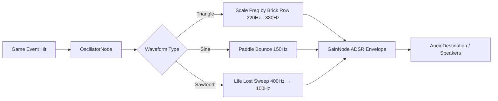

# 🧱 Pretext Breaker — Art & Audio Direction

---

## 1. Visual Style & Aesthetics

### 1.1 Color Palette & Theme Tokens

| Element | Hex Code | Visual Impression & Role |
|---|---|---|
| **Space Backdrop Top** | `#5FD3E0` (27% Opacity) | แสงฟุ้งสีฟ้า Cyan ด้านบนของฉาก |
| **Space Backdrop Bottom** | `#FFA04B` (25% Opacity) | แสงฟุ้งสีส้ม Amber อบอุ่นด้านล่างของฉาก |
| **Deep Void Canvas** | `#02060D` → `#0B1520` | พื้นหลังดำควันบุหรี่ช่วยขับตัวอักษรให้เด่นชัด |
| **Text Brick (Primary)** | `#F6F2DF` | ตัวอักษรสีครีมขาวนวล คมชัด สบายตา |
| **Text Brick (Cyan Glow)** | `#5FD3E0` | สีฟ้าเรืองแสงสำหรับบล็อกระดับ 2 |
| **Text Brick (Amber Flame)** | `#FFA04B` | สีส้มประกายสำหรับบล็อกระดับ 3 |
| **Paddle & Ball** | `#FFFFFF` with `#ADD8FF` Glow | แป้นและลูกบอลสีขาวบริสุทธิ์พร้อมขอบเรืองแสงสีฟ้าอ่อน |

### 1.2 Typography Guidelines
- **Primary Typeface:** `IBM Plex Mono` (Weights: 400, 500, 600, 700)
- **Canvas Rendering Optimization:** ใช้คำสั่ง `image-rendering: crisp-edges` เพื่อป้องกันอาการเบลอเมื่อ Canvas ถูกย่อขยายบนหน้าจอที่มี Device Pixel Ratio สูง

### 1.3 Glassmorphism Stage Frame
- **Aspect Ratio:** `4:3` ล็อคอัตราส่วนมุมมองมาตรฐานเกมอาร์เคด
- **Frame Styling:**
  - `backdrop-filter: blur(12px)`
  - `border-radius: 28px`
  - `box-shadow: 0 28px 80px rgba(0,0,0,0.4), inset 0 0 0 1px rgba(173, 216, 255, 0.09)`

---

## 2. Procedural Web Audio Synthesizer

เกมใช้ Web Audio API โดยไม่ต้องดาวน์โหลดไฟล์เสียงภายนอก ช่วยให้โหลดเกมได้ทันทีและลื่นไหล:

### 2.1 Sound Effects Specification

| SFX Key | Oscillator Type | Base Frequency | Envelope (Attack / Decay) | Usage |
|---|---|---|---|---|
| `hit-paddle` | `sine` | 160 Hz | Attack: 0.01s, Decay: 0.08s | ลูกบอลกระทบแป้นพาย |
| `hit-wall` | `sine` | 220 Hz | Attack: 0.01s, Decay: 0.05s | ลูกบอลกระทบขอบผนัง |
| `hit-brick` | `triangle` | 260 Hz – 880 Hz (ตามแถว) | Attack: 0.005s, Decay: 0.12s | ทำลายตัวอักษร (เสียงตัวโน้ตดนตรี) |
| `powerup-drop` | `square` | 520 Hz → 660 Hz | Attack: 0.02s, Decay: 0.15s | ไอเทมตก |
| `powerup-collect` | `triangle` | 440 Hz → 554 Hz → 659 Hz (Arpeggio) | Attack: 0.01s, Decay: 0.25s | ผู้เล่นรับไอเทม |
| `laser-fire` | `sawtooth` | 880 Hz → 330 Hz | Attack: 0.005s, Decay: 0.08s | ยิงเลเซอร์ |
| `ball-lost` | `sawtooth` | 350 Hz → 80 Hz | Attack: 0.02s, Decay: 0.40s | ลูกบอลตกพื้นเสียชีวิต |

---

## 🔗 Related Documents
- [Concept & Vision](./00-concept.md)
- [Core Mechanics](./01-mechanics.md)
- [Level Design](./02-level-design.md)
- [Dev Specs & Overview](./spec.md)
