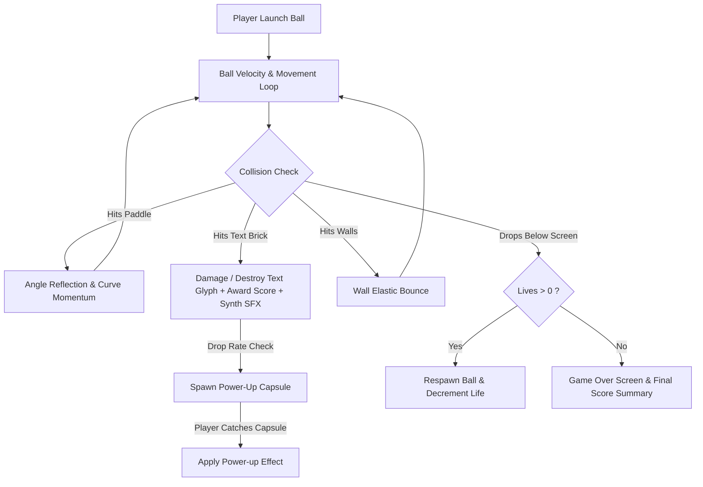

# 🧱 Pretext Breaker (Typography Block Breaker) — Game Design Document & Dev Specs

**Code Name:** `pretext-breaker` (G025)  
**Game ID:** `pretext-breaker`  
**Engine / Tech:** HTML5 Canvas 2D / Pretext Typography Layout Engine / Web Audio Synth  
**Live Source Reference:** [https://pretext-breaker.netlify.app/](https://pretext-breaker.netlify.app/)  
**Visual Style:** Dark Studio Backdrop, Glassmorphism Stage Frame, IBM Plex Mono Crisp Font  

---

## 1. Executive Summary & Concept

### 1.1 Elevator Pitch
**Pretext Breaker** เป็นเกมแนว **Block Breaker / Arkanoid** สไตล์ Typography Modern Retro ที่สร้างบล็อกและองค์ประกอบทั้งหมดในสนามจากข้อความและตัวอักษรแบบโมโนสเปซ (Monospace Text Layout) ผู้เล่นบังคับแป้นพาย (Paddle) ด้านล่างเพื่อสะท้อนลูกบอลทำลายข้อความบนหน้าจอ เก็บคะแนนและไอเทม Power-up พิเศษ เช่น Multi-ball, Laser Cannon, Paddle Expansion, และ Extra Lives พร้อมเสียงสังเคราะห์ 8-bit Synthesizer ผ่าน Web Audio API แบบไร้ไฟล์เสียงภายนอก

### 1.2 Target Audience
ผู้เล่นทุกวัยที่ชื่นชอบเกมอาร์เคดย้อนยุค Arkanoid / Breakout, ผู้ที่สนใจงานออกแบบด้าน Typography, Text Rendering และ Creative Coding บน Canvas 2D

---

## 2. Technical Stack & Architecture

| Layer | Technology | Usage & Description |
|---|---|---|
| **Rendering** | HTML5 Canvas 2D Context | วาดบล็อกตัวอักษร, แป้นพาย, ลูกบอล, ละออง Particle และ HUD |
| **Typography Engine** | Pretext Layout Engine + IBM Plex Mono | วัดขนาดตัวอักษรและจัดวางกล่องข้อความ (Text-to-Brick Parsing) |
| **Audio Engine** | Web Audio API OscillatorNode | สังเคราะห์เสียงยิง, เสียงชนบล็อก, เสียงเก็บ Power-up แบบ Dynamic Synth |
| **Input Handling** | Pointer Events, Touch, Keyboard | รองรับ Mouse Drag, Pointer Move, Touch Swipe, และแป้นพิมพ์ [A][D]/[Left][Right] |
| **Styling & UI** | Vanilla CSS + Glassmorphism Container | กล่องครอบ Stage แบบ Aspect Ratio 4:3 พร้อม Backdrop Blur และเงาแบบ Neon Glow |

---

## 3. Gameplay Mechanics & Systems



### 3.1 Paddle & Ball Physics
- **Paddle Control**:
  - ติดตามตำแหน่งเคอร์เซอร์เมาส์หรือการทัชบนจออย่างแม่นยำ ด้วยการแปลงพิกัดเข้าสู่ View Coordinate Matrix
  - บังคับผ่านคีย์บอร์ดด้วยปุ่ม [←] [→] หรือ [A] [D]
- **Reflection Angle**:
  - ทิศทางการกระดอนของลูกบอลคำนวณจากจุดกระทบบนแป้นพาย:
    $$\theta = \left( \frac{\text{Ball.X} - \text{Paddle.CenterX}}{\text{Paddle.Width} / 2} \right) \times 60^\circ$$
  - การตีโดนบริเวณขอบซ้ายหรือขวาจะส่งผลให้ลูกบอลพุ่งเฉียงออกไปในมุมกว้างขึ้น เพิ่มความท้าทายและการควบคุมเชิงกลยุทธ์

### 3.2 Typography Text Bricks
- แต่ละประโยคหรือคำศัพท์จะถูกคำนวณขนาดและแบ่งออกเป็น Glyph Bricks
- **Brick Types & Durability**:
  - **Normal Text (1-Hit)**: ทำลายทันทีที่โดนชน พร้อมเอฟเฟกต์ละอองตัวอักษรแตกกระจาย
  - **Hardened / Highlighted Text (2-3 Hits)**: ตัวอักษรหนาหรือมีสีกรอบ ต้องการการชนซ้ำเพื่อทำลาย
  - **Indestructible / Wall Text**: ทำหน้าที่เป็นสิ่งกีดขวางนำทางลูกบอล

### 3.3 Power-ups & Special Abilities
เมื่อทำลายบล็อกจะมีโอกาสสุ่มดรอปไอเทมแคปซูล:
- 🔵 **Multi-Ball**: แตกตัวลูกบอลเพิ่มอีก 2-3 ลูกในสนาม
- 🟢 **Expand Paddle**: ขยายความกว้างของแป้นพายให้รับลูกได้ง่ายขึ้น
- 🔴 **Laser Cannon**: ติดตั้งปืนเลเซอร์บนแป้นพาย ยิงทำลายบล็อกได้โดยตรง
- 🟡 **Slow Ball**: ชะลอความเร็วลูกบอลชั่วคราว
- ❤️ **Extra Life**: เพิ่มพลังชีวิตของผู้เล่น

### 3.4 Web Audio Procedural Synth
- ใช้ `AudioContext` สังเคราะห์เสียงความถี่ต่างๆ:
  - **Paddle Hit**: Sine wave สั้น ความถี่กลาง-ต่ำ
  - **Brick Hit**: Triangle wave เสียงใสไล่ระดับโทนตามแถวของบล็อก (Melodic Brick Hits)
  - **Power-up Collect**: Arpeggio 3 โน้ต
  - **Ball Lost**: Sawtooth sweep down

---

## 4. UI/UX & Responsive Presentation

1. **Crisp Text Rendering**:
   - บังคับใช้ `image-rendering: crisp-edges` บน `<canvas>` เพื่อให้ฟอนต์คมชัดแม้บนจอความละเอียดสูง
2. **Glassmorphism Frame**:
   - ล้อมรอบ Stage ด้วย Backdrop Blur และเส้นขอบเรืองแสงสีฟ้าอ่อนบนพื้นหลัง Dark Space
3. **Adaptive Scaling**:
   - ควบคุม Aspect Ratio คงที่ `4:3` รองรับการย่อขยายขนาดได้ตั้งแต่หน้าจอมือถือจนถึงหน้าจอ 4K

---

## 5. File Structure & Delivery

```
public/games/pretext-breaker/
├── index.html                       ← โครงสร้างเว็บ HTML5, โหลดฟอนต์ IBM Plex Mono, ลิงก์ CSS & Module Script
└── assets/
    ├── index-DDTCgmpT.js            ← แกนหลักเกมเพลย์ Canvas 2D, Text Engine, Synth Audio, Input Manager
    └── index-C-C5ydg1.css           ← สไตล์ Glassmorphism Container, Responsive Grid, Canvas Shadow
```

---

## Related Documents
- [Documentation Inventory](../../index.md)
- [GDD Collection Hub](../00-concept.md)
- [Main Application Page](file:///c:/Users/noppon/source/06-WEB/webJS/src/app/page.js)
