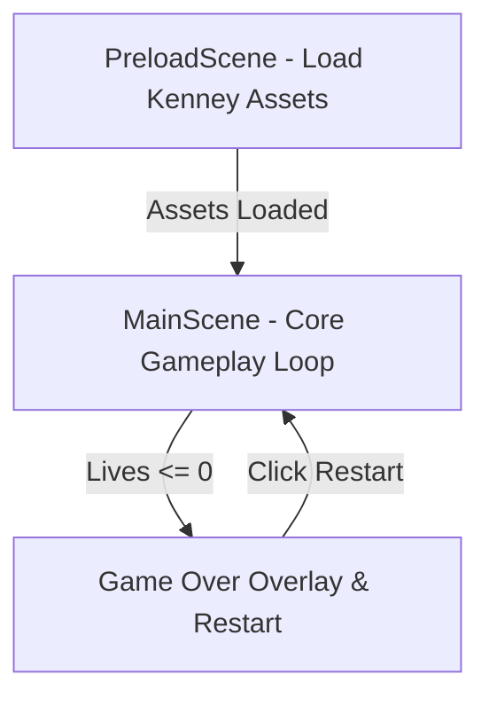

# 🚀 Space Shooter (Phaser 2D) — Game Design Document & Dev Specs

**Game ID:** `space-shooter` (`phaser-demo`)  
**Engine:** Phaser 3 (v3.80.1) — Arcade Physics  
**Assets Pack:** Kenney Simple Space (CC0 Public Domain)  
**Version:** 1.0.0 | **Last Updated:** 2026-07-26  
**Status:** Released / Active  

---

## 1. Game Overview

### Elevator Pitch
เกมยิงยานอวกาศ 2D แบบคลาสสิก (Vertical Shmup / Space Invaders style) ผู้เล่นจะรับบทเป็นนักบินยานอวกาศที่ต้องคอยต่อสู้ยิงทำลายฝูงยานเอเลี่ยนที่บุกจู่โจมลงมาเป็นระลอก (Wave System) พร้อมหลบหลีกอุกกาบาต และทำคะแนนสูงสุด

### Target Audience
ผู้เล่นที่ชื่นชอบเกมแนว Retro Arcade / Action 2D ที่เน้นความไว การฝึกปฏิกิริยาตอบสนอง และเล่นได้จบในระยะเวลาสั้นๆ (Casual Play)

---

## 2. Gameplay Mechanics & Systems

### Core Loop
1. **Spawn**: ยานศัตรูและอุกกาบาตสุ่มปรากฏตัวจากขอบบนของหน้าจอ
2. **Move & Fire**: ผู้เล่นเคลื่อนที่ยานหลบหลีกและยิงกระสุนทำลายศัตรู
3. **Score & Wave**: สะสมคะแนนเมื่อทำลายศัตรูสำเร็จ เมื่อคะแนนถึงเกณฑ์จะปลดล็อก Wave ใหม่ที่ยากขึ้น (ศัตรูสปอว์นไวขึ้น เคลื่อนที่เร็วขึ้น)
4. **Game Over & Restart**: หากพลังชีวิต (Lives) หมดลง จะเข้าสู่หน้า Game Over แสดงคะแนนสุทธิและกดเริ่มใหม่ได้ทันที

### System Rules
- **Player Health (Lives)**: ผู้เล่นมีพลังชีวิตเริ่มต้น 3 ชีวิต
- **Damage**: ยานชนกับศัตรู หรือศัตรูหลุดรอดขอบล่างของหน้าจอ จะเสียพลังชีวิต 1 ชีวิต
- **Fire Rate**: ยิงกระสุนอัตโนมัติเมื่อกดปุ่มยิง โดยมี Cooldown 200ms
- **Wave Speed Scaling**: ทุกๆ 100 คะแนน ระดับ Wave จะเพิ่มขึ้น และความเร็วศัตรูจะเพิ่มขึ้น +20px/s

---

## 3. Controls & Input Mapping

| Input Device | Action | Mapping |
|--------------|--------|---------|
| Keyboard | เคลื่อนที่ซ้าย | Arrow Left (`←`) หรือ Key `A` |
| Keyboard | เคลื่อนที่ขวา | Arrow Right (`→`) หรือ Key `D` |
| Keyboard | ยิงกระสุน | Key `Space` |
| Mouse / Touch | เคลื่อนที่ & ยิง | Click & Drag Pointer ซ้าย-ขวา |

---

## 4. Technical Architecture & File Structure

### Directory Location
- **Game Files:** `public/games/phaser-demo/`
  - `index.html` — HTML Container & Phaser Script Loader
  - `game.js` — Game Config, Preload Scene, and Main Gameplay Logic
- **Asset Location:** `public/assets/kenney_simple-space/PNG/Default/`

### Phaser Scenes

### Key Assets Used
- **Player Ship:** `ship_A.png`
- **Enemies:** `enemy_A.png`, `enemy_B.png`, `enemy_C.png`, `enemy_D.png`, `enemy_E.png`
- **Effects:** `effect_purple.png`, `effect_yellow.png`, `icon_exclamationLarge.png`
- **Stars (Parallax BG):** `star_tiny.png`, `star_small.png`, `star_medium.png`, `star_large.png`

---

## 5. Related Links
- GDD Concept: [docs/gdd/00-concept.md](../../00-concept.md)
- GDD Mechanics: [docs/gdd/01-mechanics.md](../../01-mechanics.md)
- Project Index: [docs/index.md](../../index.md)
