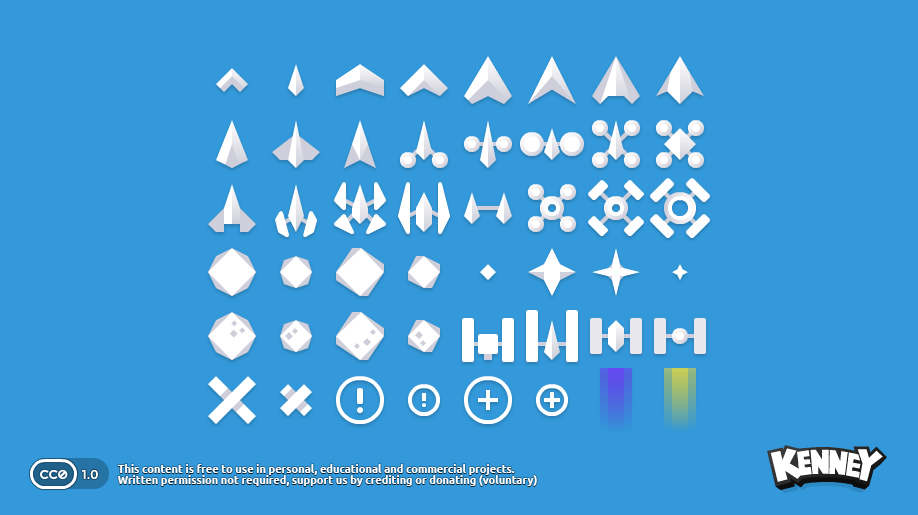
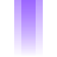

# 🚀 Space Shooter (Phaser 2D) — Game Design Document & Asset Specs

**Code Name:** `space-shooter` (G004)
**Game ID:** `space-shooter` (`phaser-demo`)  
**Engine:** Phaser 3 (v3.80.1) — Arcade Physics  
**Assets Pack:** Kenney Simple Space (CC0 Public Domain License)  

---

## 1. Game Overview

### Elevator Pitch
เกมยิงยานอวกาศ 2D แบบคลาสสิก (Vertical Shmup / Space Invaders style) ผู้เล่นจะรับบทเป็นนักบินยานอวกาศที่ต้องคอยต่อสู้ยิงทำลายฝูงยานเอเลี่ยนที่บุกจู่โจมลงมาเป็นระลอก (Wave System) พร้อมหลบหลีกอุกกาบาต และทำคะแนนสูงสุด

### Target Audience
ผู้เล่นที่ชื่นชอบเกมแนว Retro Arcade / Action 2D ที่เน้นความไว การฝึกปฏิกิริยาตอบสนอง และเล่นได้จบในระยะเวลาสั้นๆ (Casual Play)

---

## 2. Asset Pack Overview & Visual Preview

สินทรัพย์กราฟิกทั้งหมดนำมาจากชุด **Kenney Simple Space** ซึ่งเป็น Pixel/Vector Art ใต้สัญญาอนุญาต CC0 (Public Domain)

---

## 3. Game Assets Catalog & Visual Breakdown

### 🚀 3.1 Player Assets (ยานผู้เล่น & อุปกรณ์)

| Visual | Phaser Key | File Name | Description & Usage |
|:---:|---|---|---|
|  | `ship_player` | `ship_A.png` | ยานผู้เล่นหลัก (Player Space Ship) บังคับยิงและเคลื่อนที่ |
|  | `bullet` | `ship_B.png` | กระสุนพลังงาน/ยานยิงเสริมที่ยานผู้เล่นยิงออกไป |
|  | `life_icon` | `icon_plusSmall.png` | ไอคอนแสดงจำนวนพลังชีวิต (Lives Display UI) |

---

### 👾 3.2 Enemy Ships & Obstacles (ยานศัตรู & อุกกาบาต)

| Visual | Phaser Key | File Name | HP / Score | Description |
|:---:|---|---|:---:|---|
|  | `enemy_red` | `enemy_A.png` | 1 HP / 10 pts | ยานศัตรูประเภทเอเลี่ยนสีแดง (Speed: Standard) |
|  | `enemy_green` | `enemy_B.png` | 1 HP / 15 pts | ยานศัตรูประเภทเอเลี่ยนสีเขียว |
|  | `enemy_blue` | `enemy_C.png` | 2 HP / 25 pts | ยานศัตรูสีน้ำเงิน ทนทานยิง 2 นัด |
|  | `enemy_purple` | `enemy_D.png` | 2 HP / 30 pts | ยานศัตรูสีม่วง เลือด 2 นัด |
|  | `enemy_yellow` | `enemy_E.png` | 3 HP / 50 pts | ยานบอสเอเลี่ยนสีเหลือง ทนทานพิเศษ (Heavy Enemy) |
|  | `meteor1` | `meteor_small.png` | 1 HP / 5 pts | อุกกาบาตขนาดเล็ก ตกลงมาจากด้านบน |
|  | `meteor2` | `meteor_large.png` | 3 HP / 20 pts | อุกกาบาตขนาดใหญ่ กั้นเส้นทางยิง |

---

### 💥 3.3 VFX & UI Effects (เอฟเฟกต์ & ไอคอน)

| Visual | Phaser Key | File Name | Usage |
|:---:|---|---|---|
|  | `explosion_big` | `icon_exclamationLarge.png` | เอฟเฟกต์การระเบิดใหญ่เมื่อศัตรูถูกทำลาย |
|  | `effect1` | `effect_purple.png` | เอฟเฟกต์ไอพ่น / ละอองระเบิดสีม่วง |
|  | `effect2` | `effect_yellow.png` | เอฟเฟกต์ประกายไฟสีเหลือง |

---

### ✨ 3.4 Background Stars (ฉากหลังดาวแบบเคลื่อนที่ Parallax Scrolling - ลดจำนวนดาวลงเหลือ 30 ดวง)

| Visual | Phaser Key | File Name | Speed (Scroll) | Count | Description |
|:---:|---|---|:---:|:---:|---|
|  | `star_bg1` | `star_small.png` | 40 px/s | 15 ดวง | ดาวขนาดเล็ก ชั้นหลังสุด (Alpha 0.3) เคลื่อนที่ช้า |
|  | `star_bg2` | `star_medium.png` | 80 px/s | 10 ดวง | ดาวขนาดกลาง ชั้นกลาง (Alpha 0.5) เคลื่อนที่ปานกลาง |
|  | `star_bg3` | `star_large.png` | 120 px/s | 5 ดวง | ดาวขนาดใหญ่ ชั้นหน้าสุด (Alpha 0.7) เคลื่อนที่เร็ว |

---

## 4. Gameplay Mechanics & Systems

### Core Loop & Detailed Mechanics
1. **Touch / Click Bullet Firing (การยิงกระสุนพุ่งขึ้นด้านบน)**:
   - เมื่อผู้เล่นแตะ/คลิกบนหน้าจอ (Pointer Down/Active Pointer) หรือกดปุ่ม `Space` ยานผู้เล่นจะสร้างกระสุน (`ship_B.png` ขนาดสเกล 0.6)
   - กระสุนจะพุ่งขึ้นตรงสู่ขอบบนของหน้าจอด้วยความเร็ว **-500px/s (Upward Velocity)** โดยมีอัตราการยิงหน่วง Cooldown 200ms
2. **Random Meteor Spawning (การสุ่มสปอว์นอุกกาบาตจากขอบบน)**:
   - ระบบจะสร้างอุกกาบาตสุ่มสปอว์นออกมาจากบริเวณขอบบนหน้าจอ (`y = -50px`) ทุกๆ 2.2 วินาที (สุ่มตำแหน่ง X ตั้งแต่ `50px` ถึง `750px`)
   - **ชนิดอุกกาบาต:** สุ่มผสมระหว่างอุกกาบาตขนาดเล็ก (`meteor_small.png` / เลือด 1 / คะแนน 10) และขนาดใหญ่ (`meteor_large.png` / เลือด 3 / คะแนน 20)
   - **เอฟเฟกต์:** อุกกาบาตจะเคลื่อนที่ตกลงมาด้านล่างพร้อมเอฟเฟกต์หมุนเคว้งกลางอากาศ (**Angular Velocity** หมุนสุ่มระหว่าง `-80` ถึง `80 deg/s`)
3. **Score & Wave Scaling**: สะสมคะแนนเมื่อยิงทำลายยานศัตรูและอุกกาบาตสำเร็จ เมื่อคะแนนเพิ่มขึ้น ระดับ Wave และความเร็วศัตรูจะปรับเพิ่มขึ้นตามลำดับ
4. **Game Over & Restart**: หากถูกศัตรู/อุกกาบาตชน หรือศัตรูหลุดรอดผ่านขอบล่าง พลังชีวิต (Lives) จะลดลง เมื่อเหลือ 0 จะเข้าสู่หน้า Game Over

### System Rules
- **Player Health (Lives)**: ผู้เล่นมีพลังชีวิตเริ่มต้น 3 ชีวิต
- **Damage**: ยานชนกับศัตรู/อุกกาบาต หรือศัตรูหลุดรอดขอบล่างของหน้าจอ เสียพลังชีวิต 1 ชีวิต
- **Fire Rate**: ยิงกระสุนอัตโนมัติเมื่อกด/แตะค้าง โดยมี Cooldown 200ms
- **Wave Speed Scaling**: ทุกๆ 100 คะแนน ระดับ Wave จะเพิ่มขึ้น และความเร็วศัตรูเพิ่มขึ้น +20px/s

---

## 5. Controls & Input Mapping

| Input Device | Action | Mapping |
|--------------|--------|---------|
| Keyboard | เคลื่อนที่ซ้าย | Arrow Left (`←`) หรือ Key `A` |
| Keyboard | เคลื่อนที่ขวา | Arrow Right (`→`) หรือ Key `D` |
| Keyboard | ยิงกระสุน | Key `Space` |
| Mouse / Touch | เคลื่อนที่ & ยิง | Click & Drag Pointer ซ้าย-ขวา |

---

## 6. Audio & Sound Effects Specs (Web Audio API Synthesizer)

เนื่องจากชุดสินทรัพย์ตั้งต้นไม่มีไฟล์เสียงพ่วงมาด้วย ระบบจึงใช้ **Web Audio API Sound Synthesizer** ในการสังเคราะห์เสียงเอฟเฟกต์ (SFX) สไตล์ Arcade 8-bit แบบ Zero-latency โหลดเร็ว ไร้ไฟล์ภายนอก:

| SFX Event | Wave Type | Frequency Range | Duration | Description |
|-----------|-----------|-----------------|----------|-------------|
| **Background Music** (`playBackgroundMusic`) | Triangle Pulse | 130Hz → 261Hz (C Minor Arpeggio) | Loop (220ms beat) | ดนตรีประกอบฉากอวกาศธีม Sci-Fi Synthwave บรรยากาศนุ่มนวล |
| **Laser Fire** (`playLaserSFX`) | Sawtooth Wave | 800Hz → 150Hz | 0.10s | เสียงยิงเลเซอร์ปิ้วๆ เมื่อกด/แตะยิงกระสุน |
| **Explosion** (`playExplosionSFX`) | Square Wave | 160Hz → 30Hz | 0.25s | เสียงระเบิดตูมเมื่อทำลายยานศัตรู/อุกกาบาต |
| **Hit / Damage** (`playHitSFX`) | Triangle Wave | 320Hz → 80Hz | 0.08s | เสียงกระแทกเมื่อยานผู้เล่นเสียชีวิตหรือศัตรูโดนยิง |
| **Game Over** (`playGameOverSFX`) | Sawtooth Arpeggio | 440Hz → 349Hz → 293Hz → 220Hz | 0.48s | เสียงโน้ตดนตรีไล่ลงเมื่อเข้าสู่หน้า Game Over |

---

## 7. Technical Architecture & File Structure

### Directory Location
- **Game Files:** `public/games/phaser-demo/`
  - `index.html` — HTML Container & Phaser Script Loader
  - `game.js` — Game Config, Preload Scene, Audio Synthesizer, and Main Gameplay Logic
- **Asset Location:** `public/assets/kenney_simple-space/PNG/Default/`

---

## 8. Related Links
- GDD Concept: [docs/gdd/00-concept.md](../../00-concept.md)
- GDD Mechanics: [docs/gdd/01-mechanics.md](../../01-mechanics.md)
- Project Index: [docs/index.md](../../index.md)
