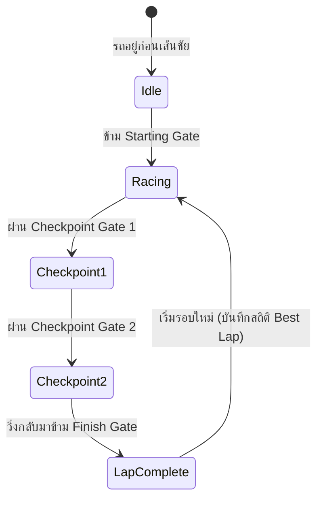

# 🏎️ Starter Kit Racing 3D — Core Mechanics & Vehicle Dynamics

---

## 1. Input Mapping & Controls

| Action | Keyboard | Touchscreen | Gamepad (Controller) |
|---|---|---|---|
| **Accelerate** | [W] หรือ [↑] | Virtual Gas Pedal (Right) | [R2] / Trigger |
| **Brake / Reverse** | [S] หรือ [↓] | Virtual Brake Pedal (Left) | [L2] / Trigger |
| **Steer Left / Right** | [A] [D] หรือ [←] [→] | On-Screen Steering Slider / Drag | Left Stick / D-Pad |
| **Reset Car Position** | [R] | Reset Button | [Y] / [Triangle] |
| **Switch Camera View** | [C] | Camera Toggle | [X] / [Square] |

---

## 2. Vehicle Dynamics & Suspension Physics

### 2.1 Acceleration & Top Speed
- **Drive Force:** ส่งกำลังไปยังล้อหลังด้วยสมการแรงเร่ง:
  $$F_{\text{drive}} = \text{Throttle} \times \text{MaxEngineTorque} \times \left(1 - \frac{v}{v_{\text{max}}}\right)$$
- **Max Forward Speed:** ~28 m/s (100 km/h ในสเกลเกม)
- **Reverse Speed:** ~8 m/s

### 2.2 Steering & Slip Angle (Drifting)
- **Steering Interpolation:** พวงมาลัยใช้การ Lerp อย่างนุ่มนวลเพื่อป้องกันการกระตุก (`SteerAngle = lerp(current, target, dt * 10)`)
- **Lateral Grip & Drift Factor:**
  - เมื่อเลี้ยวด้วยความเร็วสูง แรงเหวี่ยงหนีศูนย์กลางจะชนะแรงยึดเกาะของยาง (Tire Friction Limit)
  - เกิดอาการสไลด์ท้ายปัด (Oversteer) ทำให้รถเข้าสู่สถานะ **Drifting**
  - ระบบจะคำนวณ Slip Velocity เพื่อกระตุ้นระบบควันยาง (`Particles.js`) และรอยยาง (`DriftMarks.js`)

### 2.3 Follow Camera System
- กล้องไล่ตามหลังรถแบบ Dynamic Damping:
  - **Position Target:** อยู่ด้านหลังรถระยะ 4.5 หน่วย สูง 2.2 หน่วย
  - **LookAt Target:** เล็งไปที่หน้ารถระยะ 2.0 หน่วย
  - **Dynamic FOV:** ขยายมุมมองตามความเร็ว (Speed FOV Shift: `60° → 75°`) เพิ่มความรู้สึกเร้าใจ

---

## 3. Crashcat Collision Physics

- **Vehicle Body:** ทรงกลมฟิสิกส์จำลองขนาดกะทัดรัด (Sphere Collider) ช่วยให้รถเคลื่อนที่ข้ามรอยต่อของถนนได้อย่างราบรื่น
- **Track Wall Colliders:** กล่องฟิสิกส์จำลอง (Cuboid Colliders) ตามแนวขอบทาง:
  - Friction: `0.0` (ไม่ดูดติดกำแพง ช่วยให้รูดไปตามขอบได้)
  - Restitution (แรงเด้งสะท้อน): `0.1` (เด้งเบาๆ อย่างสมจริง)
- **Impact Detection:** เมื่อความเร็วในการชนเกินเกณฑ์ จะเรียกใช้งาน `ImpactSound.js` สังเคราะห์เสียงตัวถังกระทบ

---

## 4. Lap Timing & Checkpoints

- **Checkpoint Anti-Cheat:** ป้องกันการขับย้อนศรเพื่อโกงรอบ ด้วยระบบ Checkpoint Sector
- **Lap Stats Display:**
  - `Current Lap Time` (นับเวลาแบบ มิลลิวินาที 00:00.000)
  - `Best Lap Time` (บันทึกสถิติรอบที่ดีที่สุด)
  - `Lap Count` (รอบที่ 1/3 หรือแบบไม่จำกัดรอบ)

---

## 🔗 Related Documents
- [Concept & Vision](./00-concept.md)
- [Track Editor & Layout System](./02-track-editor.md)
- [Audio Synth & Visual FX](./03-audio-physics.md)
- [Dev Specs & Overview](./spec.md)
