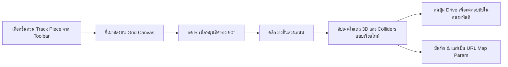

# 🏎️ Starter Kit Racing 3D — Track Editor & Layout Engine

---

## 1. GridMap Coordinates & Cell Dimensions

การจัดวางสนามแข่งถูกสร้างขึ้นบนระบบตารางกริด 3 มิติ (GridMap System) ที่ถอดแบบมาจาก Godot Engine:

- **Raw Cell Size:** `9.99` ยูนิต
- **Grid Scale:** `0.75` (ขนาดจริงต่อ 1 ช่อง = ~7.5 ยูนิต)
- **Track Y-Offset:** `-0.5`
- **Orientation Angles:**
  - `Index 0` → 0° (ทิศเหนือ)
  - `Index 16` → 90° (ทิศตะวันออก)
  - `Index 10` → 180° (ทิศใต้)
  - `Index 22` → 270° (ทิศตะวันตก)

---

## 2. In-Browser Track Editor (`editor.html`)

ระบบ Editor แบบ Interactive มอบเครื่องมือให้ผู้ใช้สร้างและปรับแต่งสนามแข่งได้อย่างอิสระ:

### 2.1 Available Track Pieces

| Tool Icon | Piece Name | Model File | Description |
|:---:|---|---|---|
| ➖ | **Straight** | `models/track-straight.glb` | ถนนทางตรงมาตรฐาน |
| ↩️ | **Corner Standard** | `models/track-corner.glb` | โค้งหักศอก 90 องศา |
| 🔀 | **Chicane / S-Bend** | `models/track-bend.glb` | ทางคดเคี้ยวซ้าย-ขวา |
| 🏁 | **Gate / Start** | `models/gate.glb` | ซุ้มประตูปล่อยตัวและจับเวลารอบ |
| ⛰️ | **Ramp Up / Down** | `models/track-ramp.glb` | เนินกระโดดและทางลาดชัน |
| 🌳 | **Tree / Scenery** | `models/tree-*.glb` | องค์ประกอบตกแต่งข้างสนาม |

### 2.2 Map Sharing & URL Encoding
- โครงสร้างสนามทั้งหมดจะถูกแปลงเป็น Compact String และเก็บไว้ใน `?map=` query parameter
- ผู้เล่นสามารถคัดลอก URL เพื่อส่งให้เพื่อนเข้ามาร่วมทดสอบขับในสนามที่สร้างขึ้นได้โดยไม่ต้องพึ่งพาเซิร์ฟเวอร์ฐานข้อมูล

---

## 🔗 Related Documents
- [Concept & Vision](./00-concept.md)
- [Core Mechanics & Vehicle Physics](./01-mechanics.md)
- [Audio Synth & Visual FX](./03-audio-physics.md)
- [Dev Specs & Overview](./spec.md)
