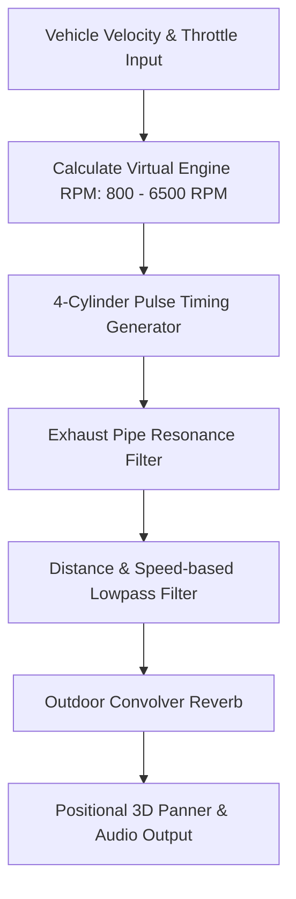

# 🏎️ Starter Kit Racing 3D — Audio Synthesis & Visual Effects

---

## 1. Procedural Audio Engine (`EngineWorklet.js`)

ระบบเสียงเครื่องยนต์ใช้เทคโนโลยี **AudioWorklet** ในการประมวลผลสัญญาณดิจิทัล (DSP) แบบเรียลไทม์บน Background Thread ปราศจากอาการกระตุก:

### 1.1 Audio Specifications

| Sound Component | Source Type | DSP / Generation Logic | Details |
|---|---|---|---|
| **Engine Sound** | AudioWorklet Synth | 4-Stroke Pulse Generation + Resonant Lowpass | เปลี่ยนความถี่ตามรอบ RPM และจังหวะยกคันเร่ง |
| **Tire Skid** | Sample (`skid.ogg`) | Dynamic Pitch Shift + Volume Modulator | เล่นเมื่อล้อเกิดแรงเสียดทานด้านข้าง (Lateral Slip) |
| **Crash Impact** | Pre-rendered Synth Buffer | Metallic & Thud Frequency Decay | เสียงโลหะกระทบสิ่งกีดขวางตามแรงกระแทก |
| **Wind / Air Flow** | Noise Generator | White noise band-passed by Speed | เสียงลมปะทะตัวถังเมื่อวิ่งด้วยความเร็วสูง |

---

## 2. Visual Effects System

### 2.1 Smoke Particles (`Particles.js`)
- **Emitter Location:** บริเวณจุดสัมผัสพื้นของล้อหลังทั้งสองข้าง
- **Emission Trigger:** เมื่อ Slip Speed > `3.5 m/s`
- **Particle Dynamics:**
  - ขนาดขยายตัวจาก `0.3` เป็น `1.2` หน่วย
  - ค่อยๆ เฟดความทึบแสง (Opacity) จาก `0.8` เป็น `0.0` ภายในเวลา 0.6 วินาที
  - ลอยตัวขึ้นตามแรงลมและกระจายตัวในแนวแกน Y

### 2.2 Drift Marks (`DriftMarks.js`)
- **Continuous Ribbon Mesh:** สร้างเส้นทางรอยยางสีดำบนพื้นถนนด้วย Triangle Strip Mesh
- **Fade & Cleanup:** รอยยางจะคงอยู่บนสนามแข่งเป็นระยะเวลาหนึ่งเพื่อความสมจริง ก่อนจะค่อยๆ จางหายไปเพื่อประหยัดหน่วยความจำ

---

## 🔗 Related Documents
- [Concept & Vision](./00-concept.md)
- [Core Mechanics & Vehicle Physics](./01-mechanics.md)
- [Track Editor & Layout System](./02-track-editor.md)
- [Dev Specs & Overview](./spec.md)
