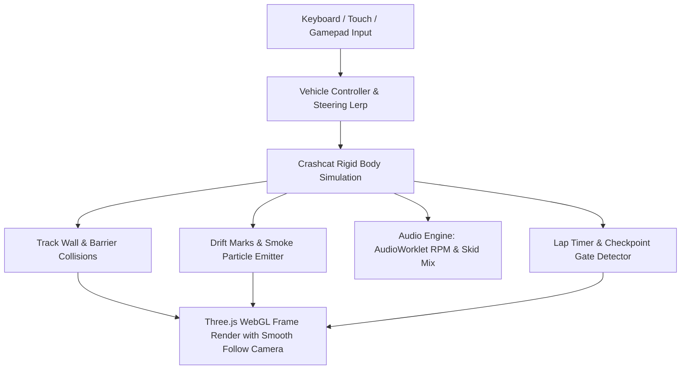

# 🏎️ Starter Kit Racing 3D (Three.js & Crashcat Physics) — Game Design Document & Dev Specs

**Code Name:** `starter-kit-racing` (G026)  
**Game ID:** `starter-kit-racing`  
**Engine:** Three.js (WebGL / WebGPU-ready) + Crashcat Physics Engine  
**Original Authors:** [mrdoob (Ricardo Cabello)](https://github.com/mrdoob)  
**Assets Pack:** Kenney Racing Starter Kit (CC0 Public Domain License)  
**Live Source Reference:** [https://github.com/mrdoob/Starter-Kit-Racing](https://github.com/mrdoob/Starter-Kit-Racing)  

---

## 1. Executive Summary & Concept

### 1.1 Elevator Pitch
**Starter Kit Racing 3D** เป็นเกมแข่งรถ 3 มิติแนว Arcade Time-Trial Racing พัฒนาโดย **mrdoob** (ผู้สร้าง Three.js) ที่พอร์ตระบบมาจาก Kenney Racing Kit (Godot 4.6) สู่เทคโนโลยีเว็บสมัยใหม่ด้วย **Three.js** และ **Crashcat Physics Engine** ผู้เล่นสามารถขับรถแข่งดริฟต์เข้าโค้งบนสนามแข่ง GridMap หลบสิ่งกีดขวาง จับเวลา Lap Timer ต่อรอบ พร้อมด้วยระบบเสียงคำรามของเครื่องยนต์แบบ **Procedural AudioWorklet Synthesizer** และเครื่องมือสร้างสนามแข่ง **Web-based Track Editor** ในตัว

### 1.2 Target Audience
ผู้เล่นที่ชื่นชอบเกมแข่งรถสไตล์ Retro/Arcade (Micro Machines, TrackMania, Mario Kart), นักพัฒนา 3D Web Graphics, และผู้ที่สนใจการประยุกต์ใช้ Three.js กับระบบฟิสิกส์ Crashcat

---

## 2. Technical Stack & Architecture

| Layer | Technology | Usage & Description |
|---|---|---|
| **Core 3D Engine** | Three.js (0.185.1) | Scene Graph, WebGLRenderer, PerspectiveCamera, ShadowMap, InstancedMesh |
| **Physics Solver** | Crashcat (0.0.3) | Rigid body dynamics, Cuboid colliders, Sphere vehicle body, Wall reflections |
| **Audio Engine** | AudioWorklet (`EngineWorklet.js`) + Web Audio API | สังเคราะห์เสียงเครื่องยนต์ 4-stroke RPM-based synth, Positional Audio & Reverb |
| **Track & Grid System** | GridMap Layout Engine (`Track.js`) | คำนวณชิ้นส่วนถนน (Straight, Corner, Ramp, Finish Line) ขนาด 9.99x9.99 ยูนิต |
| **Level Editor** | In-Browser Visual Editor (`editor.html`) | เครื่องมือวางรางถนน 3D, หมุนทิศทาง, บันทึกและแชร์ผ่าน URL Search Params |
| **Visual Effects** | Particle Emitter + Ribbon Drift Mesh | ละอองควันยางไหม้ (Tire Smoke) และรอยยางดริฟต์บนพื้นถนน (Drift Marks) |

---

## 3. Asset Breakdown & Catalog

| Asset | Path | Format | Description |
|---|---|---|---|
| 🏎️ **Sedan Car** | `models/sedan.glb` | GLTF/GLB | โมเดลรถยนต์ซีดานพร้อมล้อแยกชิ้น (`wheel_frontLeft`, etc.) |
| 🛞 **Wheel** | `models/wheel-default.glb` | GLTF/GLB | โมเดลล้อรถยนต์สำหรับหมุนและหักเลี้ยว |
| 🛣️ **Track Pieces** | `models/track-*.glb` | GLTF/GLB | ชิ้นส่วนรางถนน (Straight, Corner, Bend, Ramp, Chicane) |
| 🏁 **Starting Gate** | `models/gate.glb` | GLTF/GLB | ซุ้มประตูจุดปล่อยตัวและเส้นชัย |
| 🌲 **Scenery Models** | `models/tree-*.glb`, `rock-*.glb` | GLTF/GLB | โมเดลต้นไม้ หิน และสิ่งตกแต่งข้างสนาม |
| 💨 **Smoke Sprite** | `sprites/smoke.png` | PNG | สไปรต์ละอองควันสำหรับระบบ Particle |
| 🔊 **Skid Sound** | `audio/skid.ogg` | Ogg Vorbis | แซมเปิลเสียงล้อไถลถนน |

---

## 4. Core Systems Architecture



---

## 5. Granular GDD Documents Suite

- 📄 **[00-concept.md — Concept & Vision](./00-concept.md)** — วิสัยทัศน์ของเกม, จุดเด่น, กลุ่มเป้าหมาย และ Core Loop
- 🕹️ **[01-mechanics.md — Vehicle Dynamics & Physics](./01-mechanics.md)** — แรงขับเคลื่อน, การดริฟต์, ระบบ Collision, และ Lap Timer
- 🛠️ **[02-track-editor.md — Web Track Editor & Layout Engine](./02-track-editor.md)** — ระบบสร้างสนามแข่ง, การวาง Grid, และการแชร์ URL Map
- 🔊 **[03-audio-physics.md — AudioWorklet Synth & Visual FX](./03-audio-physics.md)** — การสังเคราะห์เสียงเครื่องยนต์, ละอองควันยาง, และรอยดริฟต์

---

## 6. File Structure & Delivery

```
public/games/starter-kit-racing/
├── index.html              ← หน้าจอหลักเกมเพลย์ 3D และปุ่มลัดสลับไป Track Editor
├── editor.html             ← เครื่องมือสร้างและแก้ไขสนามแข่งแบบเรียลไทม์
├── screenshot.png          ← ภาพตัวอย่างเกมสำหรับแสดงผลบนการ์ด Hub
├── js/
│   ├── main.js             ← Main Game Loop, Scene Setup, Camera & Renderer
│   ├── Vehicle.js          ← การคำนวณฟิสิกส์รถยนต์, แรงขับ, เลี้ยว และระบบกันสะเทือน
│   ├── Physics.js          ← ตัวจัดการ Crashcat Physics Engine และ Colliders
│   ├── Track.js            ← การโหลดและประกอบโมเดล GridMap Track
│   ├── Controls.js         ← จัดการ Keyboard, Touch Controls, และ Gamepad
│   ├── LapTimer.js         ← ตัวจับเวลาต่อรอบ, สถิติ Best Lap, และ Checkpoint Gates
│   ├── DriftMarks.js       ← วาดรอยล้อดริฟต์แบบ Dynamic Mesh Ribbon
│   ├── Particles.js        ← Particle System ละอองควันยางไหม้
│   ├── Audio.js            ← จัดการ 3D Positional Audio และ Reverb
│   ├── EngineWorklet.js    ← DSP Core สังเคราะห์เสียงเครื่องยนต์ (AudioWorklet)
│   └── ImpactSound.js      ← สังเคราะห์เสียงรถชนสิ่งกีดขวาง
├── models/                 ← โมเดล 3D GLB (รถ, รางถนน, ประตูชัย, ต้นไม้, หิน)
├── audio/                  ← ไฟล์เสียงประกอบ
└── sprites/                ← สไปรต์ละอองควัน
```

---

## Related Documents
- [Documentation Inventory](../../index.md)
- [GDD Collection Hub](../00-concept.md)
- [Main Application Page](file:///c:/Users/noppon/source/06-WEB/webJS/src/app/page.js)
