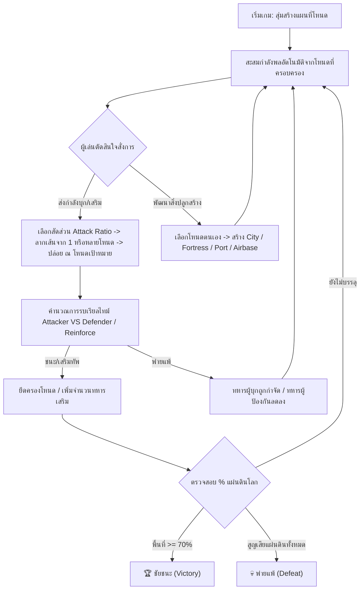

# Game Design Document (GDD) — State.IO
## Real-Time Tactical Territory Domination Game

**ชื่อโครงการ (Project Title):** State.IO  
**ประเภทเกม (Genre):** Real-Time Strategy (RTS) / Territory Control / IO Strategy  
**แพลตฟอร์ม (Platform):** Web Browser (HTML5 Canvas + Vanilla JavaScript)  
**เวอร์ชัน (Version):** 1.3  
**เจ้าของเอกสาร (Document Owner):** Antigravity Gamedev Team  

---

## 1. บทนำและวิสัยทัศน์เกม (Introduction & Vision)

### 1.1 Elevator Pitch
**State.IO** คือเกมวางแผนยึดดินแดนแบบเรียลไทม์ (Fast-Paced RTS) ในรูปแบบเว็บเบราว์เซอร์ ที่ได้รับแรงบันดาลใจจากความสนุกและพลวัตของเกม [state.io](https://state.io/) ผู้เล่นจะสวมบทบาทเป็นผู้บัญชาการทหารของ **สหพันธรัฐบลู (Blue Navy)** ในการทำสงครามช่วงแย่งชิงแผ่นดินกับมหาอำนาจอีก 3 ฝ่ายและแผ่นดินเป็นกลาง โดยต้องวางแผนบริหารสัดส่วนทหาร (Attack Ratio) สั่งเดินทัพ บุกยึดโหนดพื้นที่ (Provinces) และเสริมกำลังพลข้ามยุทธบริเวณเพื่อครอบครองพื้นที่โลกให้เกิน **70%**

### 1.2 จุดเด่นของเกม (Key Unique Selling Points)
1. **Fast-Paced Real-Time Combat:** การสู้รบและผลิตกำลังพลแบบรวดเร็ว จบเกมได้ภายใน 3-5 นาที
2. **Multi-Node Drag & Dispatch:** สามารถลากเส้นผ่านหลายๆ โหนดของตนเองเพื่อรวมทัพ และส่งไปบุกหรือเสริมกำลังพลยังโหนดเป้าหมายได้อย่างอิสระ
3. **Rear Node Reinforcement:** ยูนิตจากแนวหลังสามารถเดินทางไปเติมกำลังพลยังโหนดแนวหน้าหรือโหนดอื่นๆ ได้แบบไร้ข้อจำกัด
4. **Tactical Attack Ratio Selector:** ระบบปรับสัดส่วนการส่งทหาร (25%, 50%, 75%, 100%) เพื่อให้วางแผนรุก-รับได้อย่างมีกลยุทธ์
5. **Balanced AI Pacing:** AI มีการคำนวณจังหวะลำเลียงยูนิตและการบุกอย่างเป็นธรรมชาติ ไม่ส่งยูนิตถี่เกินไป
6. **Non-Blocking Tactical UI:** หน้าจอควบคุมที่ออกแบบตามหลัก Ergonomics แถบสัดส่วนยึดครอง 100% ด้านบน ทำให้พื้นที่แผนที่ Canvas โล่ง 100%
7. **Zero-Asset Web Audio Synthesizer:** เอฟเฟกต์เสียงรบ สร้างเมือง และเอฟเฟกต์ชัยชนะสังเคราะห์ผ่าน Web Audio API โดยไม่ต้องดาวน์โหลดไฟล์เสียงภายนอก

---

## 2. ระบบการเล่นหลัก (Core Gameplay Loop)



---

## 3. ฝ่ายสงครามและสถิติดินแดน (Factions & Alignment)

ในสมรภูมิ State.IO จะมีฝ่ายเข้าร่วมทั้งหมด 5 ฝ่าย ได้แก่:

| ฝ่าย (Faction) | สีกราฟิก | ประเภทควบคุม | คำอธิบายและบุคลิกยุทธศาสตร์ |
|:---|:---|:---|:---|
| **สหพันธรัฐบลู (Player)** | `#3b82f6` (Blue) | ผู้เล่นมนุษย์ | ฝ่ายหลักของผู้เล่น มุ่งเน้นการขยายดินแดนและสร้างยุทธบริเวณอย่างสมดุล |
| **จักรวรรดิเรด (Red Empire)** | `#ef4444` (Red) | AI Bot | ดุดัน ขยายดินแดนรวดเร็ว ชอบบุกเป้าหมายที่ทหารน้อย |
| **สาธารณรัฐกรีน (Green Republic)** | `#10b981` (Green) | AI Bot | เน้นการตั้งรับ มักสร้าง Fortress ป้องกันเมืองหลวงและบุกเมื่อได้เปรียบ |
| **พันธมิตรเยลโลว์ (Yellow Alliance)** | `#f59e0b` (Yellow) | AI Bot | มุ่งเน้นเศรษฐกิจ ชอบสร้าง City เพื่อเพิ่มกำลังพลมหาศาล |
| **ดินแดนเป็นกลาง (Neutral)** | `#4b5563` (Gray) | ไม่มี AI | แผ่นดินอิสระ มีทหารเฝ้าระวังเริ่มต้น (5-25 ทหาร) ไม่มีการสร้างทหารเพิ่ม |

---

## 4. ระบบแผนที่และภูมิประเทศ (Map Topology & Terrain)

### 4.1 กราฟเครือข่ายโหนด (Node Graph Structure)
- แผนที่สร้างจากโหนดยุทธบริเวณ (Province Nodes) ในรูปแบบโครงข่ายรังผึ้ง (Hexagonal Jittered Network)
- โหนดทุกโหนดใน State.IO สามารถส่งยูนิตไปบุกหรือเสริมกำลังพลข้ามกันได้ทั้งแบบติดกันและข้ามยุทธบริเวณ

### 4.2 ประเภทภูมิประเทศ (Terrain Types)
1. **ที่ราบ (Plains):**
   - ภูมิประเทศทั่วไป เคลื่อนทัพปกติ ไม่มีโบนัสป้องกัน
2. **ภูเขาสูง (Mountain):**
   - ภูมิประเทศทุรกันดาร มอบ **Defense Multiplier 1.4x** แก่ผู้ตั้งรับ
3. **สมุทร / ทางน้ำ (Water):**
   - เส้นทางน้ำข้ามเกาะ การส่งทหารผ่านทางน้ำมีผลกับเส้นทางคมนาคม

---

## 5. ระบบการรบและการเดินทัพ (Combat & Movement Engine)

### 5.1 อัตราการบุก (Attack Ratio Selector)
ผู้เล่นสามารถปรับสัดส่วนจำนวนทหารที่จะส่งออกจากโหนดต้นทางได้ตลอดเวลา:
- **25%:** ส่งทหาร 1/4 ของที่มี (เหมาะสำหรับบุกหยั่งเชิง)
- **50%:** ส่งทหารครึ่งหนึ่ง (มาตรฐานการบุกสม่ำเสมอ)
- **75%:** ส่งทหาร 3/4 (สำหรับการรบหักห้ามใจ)
- **100%:** ส่งทหารทั้งหมดที่มีในโหนด (คงเหลือไว้เฝ้าเมือง 1 ทหาร)

### 5.2 การเคลื่อนทัพและการเสริมกำลัง (Troop Marching & Reinforcement)
- ทหารที่ถูกส่งออกจะรวมกลุ่มเป็นก้อนพลังงานเคลื่อนทัพ (Troop Orb) บนนเส้นทาง
- หากเป้าหมายเป็น **ฝ่ายเดียวกัน**: ทหารที่เดินทางไปถึงจะถูกเพิ่มเข้าเป็นทหารเสริม (Reinforce) ทันที
- หากเป้าหมายเป็น **ฝ่ายตรงข้าม/เป็นกลาง**: เกิดการประลองกำลังรบ

### 5.3 สูตรคำนวณการรบ (Battle Formula)
เมื่อกองทัพผู้บุก ($A$) เดินทางถึงโหนดเป้าหมายของผู้ป้องกัน ($D$):

1. **คำนวณพลังป้องกันจริงของผู้ตั้งรับ ($P_D$):**
   $$P_D = \text{Troops}_D \times M_{\text{Defense}}$$
   *โดยที่ $M_{\text{Defense}} = 1.8$ หากมี Fortress หรือ $1.4$ หากเป็นพื้นที่ Mountain (ปกติ = 1.0)*

2. **ผลลัพธ์การรบ:**
   - **หาก $A > P_D$ (ผู้บุกชนะ):**
     - โหนดถูกเปลี่ยนผู้ครอบครองเป็นฝ่ายผู้บุก
     - จำนวนทหารคงเหลือใหม่ในโหนด:
       $$\text{Troops}_{\text{New}} = \max\left(1, \lfloor (A - P_D) \times 0.8 \rfloor\right)$$
     - เล่นเสียงชัยชนะ + เอฟเฟกต์ระเบิดอนุภาค
   - **หาก $A \le P_D$ (ผู้ตั้งรับยันอยู่):**
     - โหนดยังคงเป็นของฝ่ายเดิม
     - จำนวนทหารผู้ป้องกันคงเหลือใหม่:
       $$\text{Troops}_D = \max\left(1, \left\lfloor \frac{P_D - A}{M_{\text{Defense}}} \right\rfloor\right)$$

---

## 6. ระบบสิ่งปลูกสร้างยุทธศาสตร์ (Infrastructure & Buildings)

| สิ่งปลูกสร้าง | ไอคอน | ค่าสร้าง (Troop Cost) | คุณสมบัติทางยุทธศาสตร์ |
|:---|:---:|:---:|:---|
| **City (เมืองใหญ่)** | 🏛️ | 30 ทหาร | เพิ่มอัตราผลิตกำลังพลจาก +1/วินาที เป็น **+4/วินาที** |
| **Fortress (ป้อมปราการ)** | 🛡️ | 40 ทหาร | เพิ่มเกราะป้องกันแผ่นดินเป็น **1.8 เท่า** ยันการบุกได้ดียิ่งขึ้น |
| **Port (ท่าเรือ)** | ⚓ | 35 ทหาร | เปิดเส้นทางคมนาคมสมุทร |
| **Airbase (ฐานบิน)** | ✈️ | 50 ทหาร | ฐานทัพอากาศทางยุทธศาสตร์ |

---

## 7. ปัญญาประดิษฐ์ศัตรู (AI Faction Engine)

AI ของทั้ง 3 ฝ่าย (Red, Green, Yellow) ทำงานผ่านรอบปฏิกิริยา (Loop Tick ทุก 2.8 วินาที):
1. **Staggered Dispatching:** สุ่มโอกาส 50% ต่อโหนดในแต่ละรอบ เพื่อให้การเคลื่อนทัพนุ่มนวล ไม่แย่งกันส่งพร้อมกัน
2. **Min Troop Threshold:** ส่งการบุกเมื่อทหารสะสม > 22 ยูนิต
3. **Rear Logistics:** โหนดแนวหลังที่ปลอดภัยจะส่งทหารไปเสริมกำลังแก่โหนดแนวหน้าที่ติดกับศัตรูโดยอัตโนมัติ

---

## 8. การออกแบบ UI/UX (User Interface Design)

```
+-----------------------------------------------------------------------------------+
|  [<] STATE.IO    [ดินแดน: 42%]  [กองทัพ: 245]  [ผลิต: +12/s]    [1x 2x 4x] [🔊][🔄][⚙] |
+-----------------------------------------------------------------------------------+
|  📊 100% Territory Domination Bar: [======Blue 42%======][==Red 25%==][Green 18%][Yel] |
+---------------------------------------------------+-------------------------------+
|                                                   |  🎯 Attack Ratio              |
|                                                   |  [25%] [50%] [75%] [100%]     |
|                                                   |  ---------------------------- |
|                   GAME CANVAS                     |  🏛️ ศูนย์บัญชาการยุทธบริเวณ   |
|            (Interactive Map Nodes)                |  ยุทธบริเวณ #4 (กองบัญชาการ)  |
|                                                   |  🪖 50 | 🏔️ ราบ | 🚩 สหพันธรัฐ  |
|                                                   |  [City 30🪖] [Fort 40🪖]       |
|                                                   |  ---------------------------- |
|                                                   |  📜 บันทึกเหตุการณ์            |
+---------------------------------------------------+-------------------------------+
```

---

## 9. ระบบเสียงสังเคราะห์ (Web Audio Synthesizer Specs)

เกมใช้ **SoundEngine Class** สังเคราะห์รูปคลื่นเสียงแบบเรียลไทม์:
- **Select Sound:** Sine Wave 520Hz (0.08s)
- **Dispatch Sound:** Triangle Wave 340Hz -> 440Hz (0.1s)
- **Capture Fanfare:** Sine Sequence (440Hz -> 554Hz -> 659Hz -> 880Hz)
- **Loss Alarm:** Sawtooth Sequence (300Hz -> 260Hz -> 220Hz)
- **Build Structure:** Square Wave Arpeggio (600Hz -> 800Hz)

---

## 10. เอกสารอ้างอิงและไฟล์ระบบ (Linked Technical Assets)

- **Source Code:** [game.js](file:///c:/Users/noppon/source/06-WEB/webJS/public/games/stateIO/game.js)
- **Styling Architecture:** [styles.css](file:///c:/Users/noppon/source/06-WEB/webJS/public/games/stateIO/styles.css)
- **HTML Structure:** [index.html](file:///c:/Users/noppon/source/06-WEB/webJS/public/games/stateIO/index.html)
