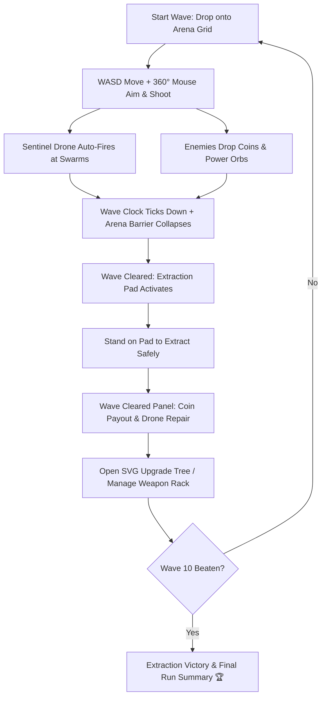

# 🛡️ SURVIVE 10 WAVES (3D Extraction Survival) — Game Design Document & Dev Specs

**Code Name:** `survive-10-waves`  
**Game ID:** `G029`  
**Engine:** Three.js (ES Modules / ImportMap Architecture)  
**Original Live Source:** [https://www.survive10waves.com/](https://www.survive10waves.com/)  
**Tagline:** *"Ten waves. One arena that closes in on you. Hold the ground, spend what you earn, and get out."*  

---

## 1. Executive Summary & Concept

### 1.1 Elevator Pitch
**SURVIVE 10 WAVES** เป็นเกม 3D Top-Down Arena Shooter ผสมผสาน Roguelite Progression และ Extraction Mechanics ผู้เล่นจะสวมบทบาทเป็นทหาร Sentinel หน่วยปฏิบัติการพิเศษที่ถูกส่งลงมายังอารีน่าปิดตายที่กำลังพังทลาย ต้องเผชิญหน้ากับฝูงเอเลี่ยนแมลงอวกาศ 10 ระลอก (10 Waves) โดยมีโดรนอัตโนมัติคอยคุ้มกัน ระหว่างรบผู้เล่นต้องเก็บเหรียญเพื่อนำไปซื้ออาวุธ สลับปืนใน Weapon Rack และอัปเกรด Perk Tree ขนาดใหญ่ เมื่อเคลียร์ Wave ได้ ต้องรีบวิ่งไปยังแท่นสกัดตัว (Extraction Pad) เพื่อถอนกำลังและบันทึกความคืบหน้า

### 1.2 Core Pillars
1. **Intense Survival & Arena Collapse:** วงแหวนอารีน่าบีบแคบลงเรื่อยๆ บีบให้ผู้เล่นต้องตัดสินใจรวดเร็ว
2. **Tactical Weapon Rack Management:** สลับปืนตามสถานการณ์ (Shotgun กระจาย, Rifle ยิงเร็ว, Plasma ทะลวง)
3. **Deep Branching Perk Tree:** ผังอัปเกรดแบบ 2D Interactive SVG Tree สไตล์ต้นไม้ความสามารถ

---

## 2. Technical Stack & Architecture

| Layer | Technology | Usage & Details |
|---|---|---|
| **Core 3D Engine** | Three.js (ESM / ImportMap) | 3D Arena, Soldier Rig, Swarm Entities, Projectiles, Lighting |
| **Upgrade System** | Interactive SVG Tree Graph | `#tree-grid`, `#tree-edges` รองรับ Pan/Zoom และ Node Unlock |
| **HUD & Crosshairs** | SVG Circular Arcs + CSS3 | `#en-arc` (Energy/Shield), `#ch-arc` (Charge), Dynamic Crosshairs |
| **Audio Engine** | HTML5 Audio + Config Playlist | `src/config/tracks.js` แทร็กดนตรี Electro-Synth เปลี่ยนตามสภาวะ Wave |
| **Data & State** | LocalStorage Persistence | บันทึกสถิติ Run, Sector Progress, Coins, Upgrades และ Weapon Rack |

---

## 3. Core Gameplay Loop

---

## 4. Subsystems Breakdown

### 4.1 Weapons & Rack System
- **Weapon Slots:** ผู้เล่นพกพาอาวุธใน Rack ได้หลายกระบอก (เช่น Rifle, Spread Shotgun, Heavy Plasma, Beam Lance)
- **Swap Control:** กด `Q` หรือคลิกขวา เพื่อสลับปืนตามลำดับที่จัดไว้ใน Weapon Rack
- **Crosshair Reticle:** เป้าเล็งเปลี่ยนสัญลักษณ์ตามประเภทปืน (`cross`, `circle`, `spread`, `lance`)

### 4.2 Economy & Repair Loop
- **Coins:** เหรียญที่ดรอปจากศัตรู ใช้ในการซื้อ Perks ใน Upgrade Tree
- **Drone Maintenance:** หากโดรนได้รับความเสียหาย จะมีค่าใช้จ่าย `REPAIR COST` หักลบจากรายได้สุทธิ (`COINS EARNED`) หลังจบ Wave

### 4.3 Wave & Sector Progression
- ด่านแบ่งเป็น **Sectors** แต่ละ Sector มี 10 Waves ที่ความยากและประเภทศัตรูเพิ่มขึ้นอย่างท้าทาย
- มีระบบ **Reset Sector** เพื่อฟาร์มทรัพยากรใหม่ หรือเปลี่ยนสายการอัปเกรด

---

## 5. Porting & Scrape Plan

1. **Asset Scraper:** ดึง Three.js vendor, GLTF Models, CSS Sheets, และ Playlist Audio
2. **Combat Loop:** พอร์ต Player Movement, Weapon Controller, และ Swarm AI
3. **SVG Tree Implementation:** พอร์ต Interactive Tree Graph พร้อม State Manager
4. **Hub Integration:** ฝังลง `public/games/survive-10-waves/` พร้อมบันทึก High Score และ Run Summary
