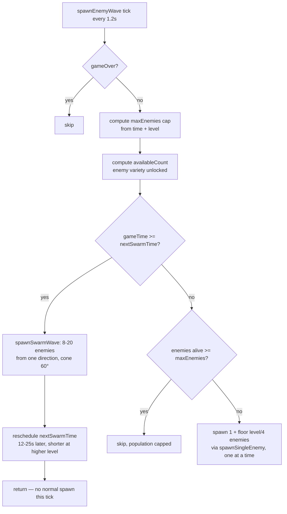

# 👾 Level Design: Monster Spawning & Difficulty Pacing

**Game:** Tiny Dungeon Survivor (`tiny-dungeon-roguelike`)
**File:** [`public/games/tiny-dungeon-roguelike/game.js`](../../../../public/games/tiny-dungeon-roguelike/game.js)
**Functions:** `MainGameScene.spawnEnemyWave()`, `.spawnSingleEnemy()`, `.spawnSwarmWave()`
**Spawn Tick:** every `1200ms` (`this.time.addEvent({ delay: 1200, callback: this.spawnEnemyWave, ... })`)
**Last Updated:** 2026-07-28

---

## 1. Design Goal

Difficulty must **not** be a pure function of survival time. A player who plays skillfully and levels up quickly should feel pressure sooner than a player who is barely surviving and leveling slowly — otherwise the level-up reward loop (more weapons/stats) never meets a matching rise in threat, and the back half of a run feels trivial.

Every scaling knob below is therefore driven by **two independent inputs**, combined so whichever rises faster is the one that pushes difficulty up:

- `this.gameTime` — seconds survived (updated once per second by `updateGameTimer`)
- `this.level` — player level (starts at `1`, increases via XP gem collection)

On top of the steady scaling, a **Swarm Wave** system periodically breaks the steady trickle of spawns with a sudden directional mob rush, so pacing isn't perfectly smooth — the player periodically gets "รุม" (ganged up on) instead of only ever facing a gradually thickening crowd.

---

## 2. Spawn Loop Overview



A swarm tick and a normal spawn tick never happen in the same call — when a swarm fires, that tick's normal spawn is skipped so the burst reads as a distinct event rather than stacking on top of the regular trickle.

---

## 3. Difficulty Drivers

### 3.1 Population Cap (`maxEnemies`)

```js
const timeFactor = Math.floor(this.gameTime / 10);
const levelFactor = this.level - 1;
const maxEnemies = Math.min(15 + timeFactor * 3 + levelFactor * 4, 90);
```

| Input | Weight | Notes |
|---|:---:|---|
| Base | `15` | Floor count present from the first tick |
| Time | `+3` per 10s survived | Slow, steady baseline pressure |
| Level | `+4` per level above 1 | Heavier weight than time — leveling fast raises the cap faster than waiting around |
| Cap | `90` | Hard ceiling regardless of time/level, keeps the arena performant |

### 3.2 Enemy Variety Unlock (`availableCount`)

Variety unlocks whichever condition — elapsed time **or** player level — is met first:

| Phase | Unlock Condition | Enemies Available | New Additions |
|---|---|---|---|
| **Phase 1 — Early** | `gameTime ≤ 20s` and `level < 3` | 3 | Skeleton, Zombie, Goblin |
| **Phase 2 — Human Threats** | `gameTime > 20s` **or** `level ≥ 3` | 5 | + Enemy Mage, Enemy Swordsman |
| **Phase 3 — Heavy Hitters** | `gameTime > 45s` **or** `level ≥ 6` | 8 | + Ogre, Red Demon, Blue Demon |
| **Phase 4 — Bosses** | `gameTime > 75s` **or** `level ≥ 9` | 10 | + Minotaur Boss, Reaper Boss |

Full per-enemy stat reference (HP/speed/XP base values) lives in [`spec.md` §2.2](spec.md#22-monsters--human-enemies-ฝูงมอนสเตอร์--ศัตรูมนุษย์).

### 3.3 Enemy HP Scaling

Applied identically in `spawnSingleEnemy` and `spawnSwarmWave`:

```js
enemy.maxHp = config.hp + Math.floor(this.gameTime / 15) * 5 + (this.level - 1) * 3;
```

- `+5 HP` per 15s survived (time pressure)
- `+3 HP` per level above 1 (level pressure)
- Stacks on top of the enemy type's own base HP (e.g. Skeleton `20`, Reaper Boss `120`)

### 3.4 Spawn Cadence (Normal Waves)

```js
const spawnCount = 1 + Math.floor(this.level / 4);
```

One enemy spawns per tick at level 1-3; a second joins at level 4; a third at level 8; etc. Each spawn tick still respects the `maxEnemies` population cap, breaking out of the loop early if the cap is hit mid-batch.

---

## 4. Swarm Wave (Mob Rush Event)

A deliberate spike layered on top of the steady curve above, meant to be read by the player as "an ambush," not "the usual spawn but bigger."

```js
if (this.gameTime >= this.nextSwarmTime) {
    this.spawnSwarmWave(enemyTypes, availableCount);
    const swarmInterval = Math.max(12, 25 - this.level);
    this.nextSwarmTime = this.gameTime + swarmInterval;
    return;
}
```

- **First swarm** fires at `gameTime = 20s` (`this.nextSwarmTime` initialized in `init()`).
- **Recurrence**: every `25 - level` seconds, floored at a minimum of `12s` — so a level-1 player sees a swarm roughly every 24s, while a level-13+ player sees one every 12s (the floor).
- **Composition**: `Math.min(8 + this.level, 20)` enemies (8 at level 1, capped at 20), drawn only from the **first 5 enemy types** (`Math.min(availableCount, 5)`) regardless of how much variety is unlocked — bosses never appear in a swarm, keeping the rush survivable by volume rather than by raw stopping power.
- **Formation**: all enemies spawn within a **60° cone** (`Math.PI / 3`) around one random `baseAngle`, at `380-460` units from the player — noticeably tighter and closer than the `450`-unit, full-circle spawn used for normal enemies — so the burst visibly converges from one side instead of appearing evenly around the player.
- **Telegraph**: `this.cameras.main.flash(200, 255, 60, 60, false)` — a brief red screen flash cues the player that a rush just landed.

---

## 5. Tuning Reference

Quick lookup for adjusting pacing without re-deriving the formulas above:

| Constant | Location | Current Value | Effect of Increasing |
|---|---|:---:|---|
| `maxEnemies` time weight | `spawnEnemyWave` | `timeFactor * 3` | Slower/faster population growth over a long run |
| `maxEnemies` level weight | `spawnEnemyWave` | `levelFactor * 4` | Slower/faster population growth per level-up |
| `maxEnemies` hard cap | `spawnEnemyWave` | `90` | Raises the ceiling on simultaneous on-screen enemies |
| HP time weight | `spawnSingleEnemy` / `spawnSwarmWave` | `+5 / 15s` | Enemies get tougher faster over a long run |
| HP level weight | `spawnSingleEnemy` / `spawnSwarmWave` | `+3 / level` | Enemies get tougher faster per level-up |
| Normal spawn count | `spawnEnemyWave` | `1 + floor(level/4)` | More enemies land per 1.2s tick at high level |
| Swarm interval floor | `spawnEnemyWave` | `12s` minimum | How relentless swarms become at high level |
| Swarm size | `spawnSwarmWave` | `8 + level`, capped `20` | How large each rush is |
| Swarm cone width | `spawnSwarmWave` | `60°` | Wider = rush reads as "surrounded"; narrower = "flanked" |

---

## Related Documents
- [Game Spec](spec.md)
- [Technical Note: Dungeon Floor Generation](technical-floor-generation.md)
- [Project Index](../../index.md)
