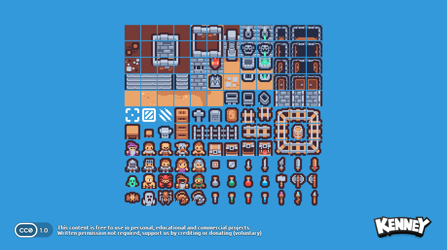
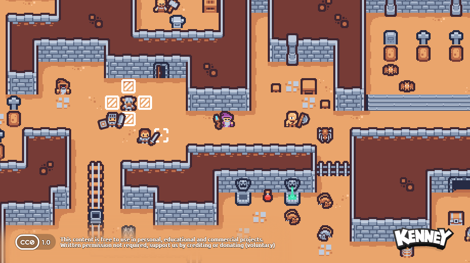
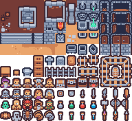
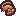
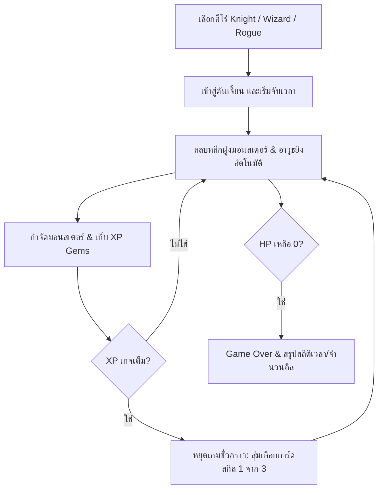

# 🗡️ Tiny Dungeon Survivor (Action Roguelike) — Game Design Document & Asset Specs

**Code Name:** `tiny-dungeon-roguelike` (G017)  
**Game ID:** `tiny-dungeon-roguelike`  
**Engine:** Phaser 3 (v3.80.1) — Arcade Physics  
**Assets Pack:** Kenney Tiny Dungeon (CC0 Public Domain License)  
**Version:** 1.0.0 | **Last Updated:** 2026-07-28  
**Status:** Released / Active  

---

## 1. Game Overview

### Elevator Pitch
**Tiny Dungeon Survivor** เป็นเกมแนว **2D Top-Down Action Roguelike** (สไตล์ Vampire Survivors + Dungeon Crawler) ที่ผู้เล่นสวมบทบาทเป็นฮีโร่ในดันเจี้ยนโบราณ ต้องเดินหลบหลีกฝูงมอนสเตอร์ที่โผล่มาเป็นระลอก (Wave System) พร้อมระบบโจมตีและปล่อยคาถาอัตโนมัติ สะสมเม็ดพลังงาน XP เมื่อเลเวลอัป เกมจะเปิดหน้าต่างสุ่มการ์ดอัปเกรดความสามารถ 3 ใบให้เลือก เพื่อพัฒนาตัวละครให้แข็งแกร่งขึ้นและอยู่รอดให้นานที่สุด

### Target Audience
ผู้เล่นที่ชื่นชอบเกมแนว Action Roguelite / Survivors-like ที่เล่นง่าย เข้าถึงไว ให้ความรู้สึกสะใจในการพัฒนาความสามารถของตัวละคร (Power Scaling) และทำลายฝูงมอนสเตอร์จำนวนมาก

---

## 2. Asset Pack Overview & Visual Breakdown

สินทรัพย์กราฟิกทั้งหมดนำมาจากชุด **Kenney Tiny Dungeon** (Pixel Art ขนาด 16x16 px)

### 🖼️ Pack Visual Preview & Full Spritesheet




#### 🧩 Full Tilemap Sheet (`tilemap_packed.png` — 192x176px / 12x11 Tiles, 16x16px Each, Spacing: 0)


---

### 🛡️ 2.1 Player Characters (ฮีโร่ผู้เล่น)

| Sprite Image | Frame Index | Tile File | Class Name | Base HP | Speed | Starting Weapon | Description |
|:---:|:---:|:---:|---|:---:|:---:|---|---|
|  | Frame 96 | `tile_0096.png` | **Knight (อัศวิน)** | 150 HP | 95 px/s | Melee Slash (30 dmg, 130° cone) | ถึกทนที่สุดในเกม เดินช้าที่สุด โจมตีระยะประชิดฟันเป็นวงกว้าง 130 องศาเข้าหาศัตรูที่ใกล้ที่สุด |
|  | Frame 84 | `tile_0084.png` | **Wizard (จอมเวท)** | 65 HP | 125 px/s | Fireball Spell (65 dmg, ทุก 1.4s) | เลือดน้อยที่สุด เปราะบางที่สุด ยิงช้าแต่ยิงแรงที่สุดในเกม ใส่เป้าหมายเดียวจากระยะไกล |
|  | Frame 86 | `tile_0086.png` | **Rogue (จอมโจร)** | 100 HP | 165 px/s | Poison Darts (10 dmg × 4, ทุก 0.4s) | เคลื่อนที่เร็วที่สุดในเกม โจมตีถี่ที่สุดในเกมแต่ระยะสั้น ต้องเข้าประชิดจึงจะโดน |

---

### 👾 2.2 Monsters & Human Enemies (ฝูงมอนสเตอร์ & ศัตรูมนุษย์)

#### 🧟 Monsters (มอนสเตอร์ทั่วไป & บอส)
| Sprite Image | Frame Index | Tile File | Monster Name | Base HP | Speed | XP Value | Behavior |
|:---:|:---:|:---:|---|:---:|:---:|:---:|---|
|  | Frame 108 | `tile_0108.png` | **Skeleton Warrior** | 20 HP | 75 px/s | 2 XP | มอนสเตอร์โครงกระดูกจู่โจมระลอกแรก |
|  | Frame 109 | `tile_0109.png` | **Zombie Crawler** | 25 HP | 70 px/s | 3 XP | ซอมบี้เดินกดดันพื้นที่ |
|  | Frame 110 | `tile_0110.png` | **Goblin Raider** | 30 HP | 80 px/s | 3 XP | ก็อบลินเคลื่อนที่เร็ว |
|  | Frame 120 | `tile_0120.png` | **Ogre Heavy** | 55 HP | 60 px/s | 6 XP | อสูรกายถึกทน เลือดเยอะ |
|  | Frame 121 | `tile_0121.png` | **Red Demon** | 65 HP | 75 px/s | 7 XP | ปีศาจสีแดงเคลื่อนที่เร็ว |
|  | Frame 122 | `tile_0122.png` | **Blue Demon** | 75 HP | 80 px/s | 8 XP | ปีศาจสีฟ้าพลังโจมตีสูง |
|  | Frame 123 | `tile_0123.png` | **Minotaur Boss** | 90 HP | 65 px/s | 10 XP | บอสมิโนทอร์ เลือดสูง ดันพื้นที่ |
|  | Frame 124 | `tile_0124.png` | **Reaper Boss** | 120 HP | 55 px/s | 15 XP | บอสมัจจุราชขนาดใหญ่ อึดพิเศษ |

#### 👤 Human Enemies (ศัตรูประเภทคน)
| Sprite Image | Frame Index | Tile File | Enemy Class | Base HP | Speed | XP Value | Description |
|:---:|:---:|:---:|---|:---:|:---:|:---:|---|
|  | Frame 111 | `tile_0111.png` | **Enemy Mage (นักเวทศัตรู)** | 35 HP | 85 px/s | 4 XP | จอมเวทศัตรู เคลื่อนที่รวดเร็ว รุมล้อมผู้เล่น |
|  | Frame 112 | `tile_0112.png` | **Enemy Swordsman (นักดาบศัตรู)** | 45 HP | 90 px/s | 5 XP | นักดาบศัตรูถือดาบวิ่งเข้าฟันผู้เล่น |

---

### 💎 2.3 Items, Pickups & Weapons VFX

| Sprite Image | Frame Index | Tile File | Item Key | Usage & Effect |
|:---:|:---:|:---:|---|---|
|  | Frame 115 | `tile_0115.png` | `xp_gem` | เม็ดผลึก XP ดร็อปเมื่อกำจัดมอนสเตอร์/ศัตรู เมื่อเก็บจะเพิ่มเกจเลเวลอัป |
|  | Frame 106 | `tile_0106.png` | `sword_blade` | คมดาบหมุนเวียน (Orbiting Blade) หมุนวนรอบตัวทำความเสียหาย |
|  | Frame 117 | `tile_0117.png` | `fireball` | กระสุนลูกไฟเวทมนตร์ พุ่งใส่ศัตรูที่อยู่ใกล้ที่สุด |
|  | Frame 104 | `tile_0104.png` | `poison_dart` | มีดสั้นพิษ ยิงกระจายรอบตัวผู้เล่น |
| Render Graphics | - | - | `lightning` | เอฟเฟกต์สายฟ้าฟาดผ่าลงมาจากท้องฟ้า |

---

### 🏰 2.4 Dungeon Arena Environment Tiles

| Sprite Image | Frame Index | Tile File | Usage |
|:---:|:---:|:---:|---|
|  | Frame 48 | `tile_0048.png` | พื้นดันเจี้ยนหลัก (Main Dungeon Floor) |
|  | Frame 42 | `tile_0042.png` | พื้นดันเจี้ยนแบบที่ 2 (Carved Pattern Floor) |
|  | Frame 49 | `tile_0049.png` | พื้นดันเจี้ยนแบบที่ 3 (Dark Cobblestone Floor) |
|  | Frame 14 | `tile_0014.png` | กำแพงขอบสนามดันเจี้ยน (Arena Border Wall) |

---

## 3. Core Gameplay Loop & Mechanics



### 3.1 Gameplay Rules
1. **Movement & Auto-Aiming**: ผู้เล่นบังคับทิศทางการเดิน อาวุธจะยิง/สเปรย์ใส่ศัตรูโดยอัตโนมัติ (Auto-Attack)
2. **Wave & Scaling**: จำนวนมอนสเตอร์สูงสุดที่สปอว์น, ความหลากหลายของศัตรู, และค่า HP จะเพิ่มขึ้นตามทั้งเวลาที่รอด **และ** เลเวลของผู้เล่น (ใครเลเวลไวจะโดนกดดันไวตาม) นอกจากนี้ยังมี **Swarm Wave** ที่สุ่มเกิดขึ้นเป็นระยะเพื่อรุมผู้เล่นจากทิศทางเดียวกันเป็นชุดใหญ่ — รายละเอียดสูตรทั้งหมดอยู่ใน [Level Design: Monster Spawning & Difficulty Pacing](level-design-monster-spawning.md)
3. **Roguelike Skill Cards Level-Up System**:
   - เมื่อเกจ XP เต็ม เกมจะหยุดเวลาชั่วคราวและเปิด Modal UI
   - ผู้เล่นเลือกอัปเกรด 1 จาก 3 ความสามารถแบบสุ่ม (เช่น เพิ่มดาบหมุน, เพิ่มลูกไฟ, เพิ่มมีดพิษ, ผ่าสายฟ้า, เพิ่ม Max HP, เพิ่ม Speed, เพิ่มพลังโจมตี, และดูดเลือด)
4. **Vampiric Drain & Health**: สามารถอัปเกรดความสามารถในการฟื้นฟู HP เมื่อฆ่ามอนสเตอร์ได้

---

## 4. Controls & Input Mapping

| Device | Action | Mapping |
|---|---|---|
| Keyboard | Movement | `W`, `A`, `S`, `D` หรือ ปุ่มลูกศร `Up`, `Left`, `Down`, `Right` |
| Mobile Touch | Virtual Joystick | สัมผัสและลากอนาล็อกบนหน้าจอด้านล่างซ้าย |
| UI Interactivity | Select Skill / Restart | คลิกเมาส์ / แตะบนหน้าจอ Touch Screen |

---

## 5. Technical & Scene Architecture

```text
BootScene (Load Spritesheet tilemap_packed.png)
  ↓
MenuScene (Select Hero: Knight / Wizard / Rogue)
  ↓
MainGameScene ─── (Parallel Overlay) ───► UIScene (HUD: HP/XP Bar, Timer, Kills)
  │
  ├─► Level Up Trigger ──► UpgradeModalScene (Pause Game & Pick 1 of 3 Cards)
  │
  └─► Player HP = 0 ─────► GameOverScene (Show Summary & Quick Restart)
```

---

## Related Documents
- [Project Index](../../index.md)
- [Main Concept](../00-concept.md)
- [Core Mechanics](../01-mechanics.md)
- [Technical Note: Dungeon Floor Generation](technical-floor-generation.md)
- [Level Design: Monster Spawning & Difficulty Pacing](level-design-monster-spawning.md)
- [Level Design: Player Character Growth per Class](level-design-character-growth.md)
