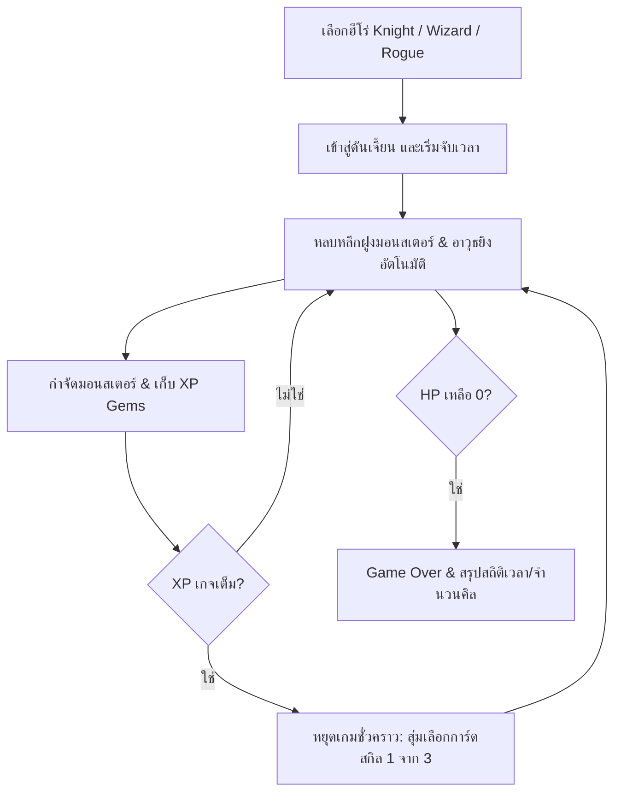

# 🗡️ Tiny Dungeon Survivor (Action Roguelike) — Game Design Document & Asset Specs

**Code Name:** `tiny-dungeon-roguelike` (G017)  
**Game ID:** `tiny-dungeon-roguelike`  
**Engine:** Phaser 3 (v3.80.1) — Arcade Physics  
**Assets Pack:** Kenney Tiny Dungeon (CC0 Public Domain License)  
**Version:** 1.0.0 | **Last Updated:** 2026-07-28  
**Status:** Released / Active  

---

## 1. Game Overview

### Elevator Pitch
**Tiny Dungeon Survivor** เป็นเกมแนว **2D Top-Down Action Roguelike** (สไตล์ Vampire Survivors + Dungeon Crawler) ที่ผู้เล่นสวมบทบาทเป็นฮีโร่ในดันเจี้ยนโบราณ ต้องเดินหลบหลีกฝูงมอนสเตอร์ที่โผล่มาเป็นระลอก (Wave System) พร้อมระบบโจมตีและปล่อยคาถาอัตโนมัติ สะสมเม็ดพลังงาน XP เมื่อเลเวลอัป เกมจะเปิดหน้าต่างสุ่มการ์ดอัปเกรดความสามารถ 3 ใบให้เลือก เพื่อพัฒนาตัวละครให้แข็งแกร่งขึ้นและอยู่รอดให้นานที่สุด

### Target Audience
ผู้เล่นที่ชื่นชอบเกมแนว Action Roguelite / Survivors-like ที่เล่นง่าย เข้าถึงไว ให้ความรู้สึกสะใจในการพัฒนาความสามารถของตัวละคร (Power Scaling) และทำลายฝูงมอนสเตอร์จำนวนมาก

---

## 2. Asset Pack Overview & Visual Breakdown

สินทรัพย์กราฟิกทั้งหมดนำมาจากชุด **Kenney Tiny Dungeon** (Pixel Art ขนาด 16x16 px)

### 🛡️ 2.1 Player Characters (ฮีโร่ผู้เล่น)

| Visual / Frame | Class Name | Base HP | Speed | Starting Weapon | Description |
|:---:|---|:---:|:---:|---|---|
| Frame 84 | **Knight (อัศวิน)** | 120 HP | 110 px/s | Orbiting Blades | เน้นความถึกทน ป้องกันสูง เริ่มเกมด้วยดาบหมุนเวียนรอบตัว |
| Frame 85 | **Wizard (จอมเวท)** | 85 HP | 120 px/s | Fireball Spell | พลังโจมตีระยะไกลสูง ยิงลูกไฟเวทมนตร์พุ่งใส่ศัตรู |
| Frame 86 | **Rogue (จอมโจร)** | 95 HP | 145 px/s | Poison Darts | เคลื่อนที่เร็ว ว่องไว ยิงมีดสั้นกระจายใส่ศัตรูรอบทิศ |

---

### 👾 2.2 Monsters & Enemies (ฝูงมอนสเตอร์)

| Visual / Frame | Monster Type | Base HP | Speed | XP Value | Behavior |
|:---:|---|:---:|:---:|:---:|---|
| Frame 88 | **Skeleton** | 20 HP | 75 px/s | 2 XP | มอนสเตอร์โครงกระดูก เคลื่อนที่เร็วปานกลาง รุมเข้าหาผู้เล่น |
| Frame 99 | **Slime / Goblin** | 35 HP | 60 px/s | 4 XP | มอนสเตอร์สไลม์ เลือดปานกลาง เดินช้าๆ กดดันพื้นที่ |
| Frame 90 | **Demon / Orc** | 60 HP | 85 px/s | 8 XP | มอนสเตอร์ปีศาจ เลือดเยอะและเคลื่อนที่เร็ว กดดันสูง |

---

### 💎 2.3 Items, Pickups & VFX

| Visual / Frame | Item Key | Usage & Effect |
|:---:|---|---|
| Frame 112 | `xp_gem` | เม็ดพลังงาน XP ดร็อปเมื่อกำจัดมอนสเตอร์ เมื่อเก็บจะเพิ่มเกจเลเวลอัป |
| Frame 106 | `sword_blade` | คมดาบหมุนเวียน (Orbiting Blade) หมุนวนรอบตัวทำความเสียหาย |
| Frame 117 | `fireball` | กระสุนลูกไฟเวทมนตร์ พุ่งใส่ศัตรูที่อยู่ใกล้ที่สุด |
| Frame 104 | `poison_dart` | มีดสั้นพิษ ยิงกระจายรอบตัวผู้เล่น |
| Render Graphics | `lightning` | เอฟเฟกต์สายฟ้าฟาดผ่าลงมาจากท้องฟ้า |

---

## 3. Core Gameplay Loop & Mechanics



### 3.1 Gameplay Rules
1. **Movement & Auto-Aiming**: ผู้เล่นบังคับทิศทางการเดิน อาวุธจะยิง/สเปรย์ใส่ศัตรูโดยอัตโนมัติ (Auto-Attack)
2. **Wave & Scaling**: ทุกๆ 10-15 วินาที จำนวนมอนสเตอร์สูงสุดที่จะสปอว์นและค่า HP ของมอนสเตอร์จะเพิ่มขึ้นตามลำดับ
3. **Roguelike Skill Cards Level-Up System**:
   - เมื่อเกจ XP เต็ม เกมจะหยุดเวลาชั่วคราวและเปิด Modal UI
   - ผู้เล่นเลือกอัปเกรด 1 จาก 3 ความสามารถแบบสุ่ม (เช่น เพิ่มดาบหมุน, เพิ่มลูกไฟ, เพิ่มมีดพิษ, ผ่าสายฟ้า, เพิ่ม Max HP, เพิ่ม Speed, เพิ่มพลังโจมตี, และดูดเลือด)
4. **Vampiric Drain & Health**: สามารถอัปเกรดความสามารถในการฟื้นฟู HP เมื่อฆ่ามอนสเตอร์ได้

---

## 4. Controls & Input Mapping

| Device | Action | Mapping |
|---|---|---|
| Keyboard | Movement | `W`, `A`, `S`, `D` หรือ ปุ่มลูกศร `Up`, `Left`, `Down`, `Right` |
| Mobile Touch | Virtual Joystick | สัมผัสและลากอนาล็อกบนหน้าจอด้านล่างซ้าย |
| UI Interactivity | Select Skill / Restart | คลิกเมาส์ / แตะบนหน้าจอ Touch Screen |

---

## 5. Technical & Scene Architecture

```text
BootScene (Load Spritesheet tilemap_packed.png)
  ↓
MenuScene (Select Hero: Knight / Wizard / Rogue)
  ↓
MainGameScene ─── (Parallel Overlay) ───► UIScene (HUD: HP/XP Bar, Timer, Kills)
  │
  ├─► Level Up Trigger ──► UpgradeModalScene (Pause Game & Pick 1 of 3 Cards)
  │
  └─► Player HP = 0 ─────► GameOverScene (Show Summary & Quick Restart)
```

---

## Related Documents
- [Project Index](../../index.md)
- [Main Concept](../00-concept.md)
- [Core Mechanics](../01-mechanics.md)
