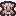
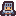
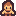

# 🗡️ Tiny Dungeon Squad (SNKRX Edition) — Game Design Document & Asset Specs

**Code Name:** `tiny-dungeon-squad` (G021)  
**Game ID:** `tiny-dungeon-squad`  
**Engine:** Phaser 3 (v3.80.1) — Arcade Physics  
**Assets Pack:** Kenney Tiny Dungeon (CC0 Public Domain License)  
**Version:** 1.0.0 (SNKRX Engine) | **Last Updated:** 2026-08-04  
**Status:** Active  

---

## 1. Game Overview

### Elevator Pitch
**Tiny Dungeon Squad (SNKRX Edition)** เป็นเกมแนว **2D Top-Down Snake Squad Auto-Battler Roguelite** (แรงบันดาลใจจาก SNKRX โดย a327ex) ที่ผู้เล่นบังคับขบวนแถวฮีโร่ (Snake Squad Formation) เคลื่อนที่หลบหลีกมอนสเตอร์ในดันเจี้ยนแบบเป็นรอบ (Wave 1 ถึง 20) ฮีโร่ในแถวจะโจมตีมอนสเตอร์โดยอัตโนมัติ เมื่อจบแต่ละ Wave ผู้เล่นจะเข้าสู่หน้าร้านค้า (**SNKRX Shop Phase**) เพื่อใช้เงิน Gold ที่หาได้จากการผ่านรอบและดอกเบี้ย ซื้อฮีโร่ใหม่, สุ่มร้านค้า (Reroll), ขายฮีโร่, อัปเกรดความจุทีม (Squad Capacity) และเปิดใช้งาน **Auto-Chess Class Synergies** (รวมสายอาชีพครบ 2/4 ตัวรับโบนัสบัฟทั้งทีม) รวมถึงระบบ **3-Unit Auto-Merge** (ผสมฮีโร่ 3 ตัวเป็นระดับ ★★ และ ★★★)

### Target Audience
ผู้เล่นที่ชื่นชอบเกมแนว Auto-Battler / Snake Roguelite / Squad Building ที่เน้นการวางแผนจัดทีม สร้าง synergy การสุ่มร้านค้า และความสะใจในการเห็นขบวนฮีโร่ระดับสูงปล่อยสกิลทำลายฝูงมอนสเตอร์

---

## 2. Asset Pack Overview & Visual Breakdown

สินทรัพย์กราฟิกทั้งหมดนำมาจากชุด **Kenney Tiny Dungeon** (Pixel Art ขนาด 16x16 px)

### 🖼️ Pack Visual Preview & Full Spritesheet


#### 🧩 Full Tilemap Sheet (`tilemap_packed.png` — 192x176px / 12x11 Tiles, 16x16px Each)


---

### 🛡️ 2.1 Hero Roster & Class Tags (ฮีโร่และสายอาชีพ)

ผู้เล่นสามารถสะสมและจัดฮีโร่เข้าร่วมขบวนได้สูงสุด 3 ถึง 7+ ตัว โดยฮีโร่แต่ละตัวมี 2 สายอาชีพ (Primary + Secondary Class):

| Sprite Image | Frame Index | Hero Class Name | Primary Class | Secondary Class | Base HP | Dmg | Attack Behavior |
|:---:|:---:|---|---|---|:---:|:---:|---|
|  | Frame 96 | **Knight (อัศวิน)** | Warrior | Tank | 180 HP | 35 dmg | ฟันดาบวงกว้าง Cleave Slash 130° ใส่ศัตรูประชิด |
|  | Frame 84 | **Wizard (จอมเวท)** | Mage | Sorcerer | 80 HP | 65 dmg | ยิงลูกไฟเวทมนตร์ พุ่งใส่เป้าหมายพร้อมระเบิด AoE |
|  | Frame 86 | **Rogue (จอมโจร)** | Rogue | Assassin | 110 HP | 25 dmg | ขว้างมีดคริติคอล มีโอกาสติด Crit 30% (+200% dmg) |
|  | Frame 87 | **Priest (นักบุญ)** | Healer | Buffer | 100 HP | 15 dmg | ส่งคลื่นแสงฟื้นฟู HP ให้สมาชิกทีมที่มี %HP ต่ำสุด |
|  | Frame 85 | **Ranger (นายพราน)** | Ranger | Ranged | 100 HP | 30 dmg | ยิงศรทะลวง พุ่งผ่านมอนสเตอร์ 2+ ตัว |
|  | Frame 97 | **Paladin (พาลาดิน)** | Tank | Warrior | 220 HP | 20 dmg | ปล่อยโล่ศักดิ์สิทธิ์หมุนรอบตัว สร้างความเสียหายศัตรูโดยรอบ |
|  | Frame 111 | **Necromancer (หมอผี)** | Sorcerer | Curser | 90 HP | 40 dmg | ยิงลูกพลังพิษ และสร้างแอ่งพิษบนพื้นชั่วคราว |
|  | Frame 88 | **Bard (กวี)** | Buffer | Enchanter | 95 HP | 15 dmg | บัฟบัฟความเร็วโจมตีและความเร็วเคลื่อนที่ให้ฮีโร่ทั้งทีม |

---

### ⚔️ 2.2 Auto-Battler Class Synergy System

เมื่อมีฮีโร่ในสายอาชีพเดียวกันอยู่ในขบวนขยับเขยื้อนครบตามจำนวน จะเปิดใช้งาน Class Synergy:

| Synergy Tag | Required Thresholds | Team Synergy Effect |
|---|:---:|---|
| ⚔️ **Warrior** | (2) / (4) | สมาชิกทั้งทีมได้รับเกราะป้องกัน (Damage Reduction) +25% / +60% |
| 🔥 **Mage** | (2) / (4) | เวทมนตร์รุนแรงขึ้น +30% / +70% และยิงกระสุนเวทเพิ่ม +1 ลูก |
| 🔪 **Rogue** | (2) / (4) | ทั้งทีมได้โอกาสติด Crit +25% / +50% และเดินเร็วขึ้น +25% |
| 🎯 **Ranger** | (2) / (4) | โจมตีเร็วขึ้น +30% / +65% และกระสุนเจาะทะลุมอนสเตอร์เพิ่ม +1 / +2 ตัว |
| 💚 **Healer** | (2) / (4) | ฟื้นฟู HP ทั้งทีม 8% / 20% ของ Max HP ทุกๆ 3 วินาที |
| 🔮 **Sorcerer** | (2) / (4) | รัศมีการระเบิด AoE กว้างขึ้น +40% / +90% และทำให้ศัตรูช้าลง 40% |
| 🛡️ **Tank** | (2) / (4) | เพิ่ม Max HP ทั้งทีม +35% / +80% และสะท้อนความเสียหาย 20% / 40% |
| ✨ **Buffer** | (2) / (4) | เพิ่มผลของ Class Synergy อื่นๆ ที่เปิดใช้งานอยู่ขึ้นอีก +25% / +50% |

---

### ⭐ 2.3 Auto-Merge Tier System (การผสมตัวละคร)

- **Tier 1 (★)**: ฮีโร่เริ่มต้นที่ซื้อจากร้านค้า (ราคา 1-3g ตามระดับ)
- **Tier 2 (★★)**: ซื้อฮีโร่ Tier 1 ชื่อเดียวกันครบ 3 ตัว → ผสมอัตโนมัติเป็น Tier 2 (**HP +100%, Attack Damage +75%, สไปรต์ขยายใหญ่ 1.25x, มีเส้นขอบเรืองแสงสีทอง**)
- **Tier 3 (★★★)**: สะสมฮีโร่ Tier 2 ชื่อเดียวกันครบ 3 ตัว → ผสมอัตโนมัติเป็น Tier 3 (**HP +200%, Attack Damage +150%, สไปรต์ขยายใหญ่ 1.5x, มีออร่าละอองแสงกระพริบ**)

---

### 🏪 2.4 Post-Wave Shop & Economy System

เมื่อรอดชีวิตจบ Wave ในดันเจี้ยน เกมจะสลับเข้าสู่ **Shop Overlay Phase**:

1. **Gold & Interest**:
   - รางวัลชนะ Wave: Base Gold (5g - 15g ตามระดับ Wave)
   - ดอกเบี้ย (Interest): ได้รับ 1g ต่อทุกๆ 5g ที่เหลือเก็บไว้ (สูงสุด +5g ต่อรอบ)
2. **Draft Shop (4 Slots)**:
   - สุ่มเปิดการ์ดฮีโร่ 4 ใบให้ซื้อ
   - **Reroll Shop**: จ่าย 1 Gold เพื่อรีเฟรชการ์ดใหม่
   - **Lock Shop**: ล็อกร้านค้าไว้ไม่ให้เปลี่ยนในรอบถัดไป
   - **Upgrade Squad Capacity**: จ่าย Gold เพื่อขยายจำนวนฮีโร่สูงสุดในทีม (จาก 3 ตัว สูงสุด 7+ ตัว)
   - **Sell Hero**: ขายฮีโร่ออกจากขบวนเพื่อรับ Gold คืน

---

## 3. Core Gameplay Loop

```mermaid
graph TD
    A[เริ่มเกม: ได้รับ Gold เริ่มต้น ซื้อฮีโร่เข้าขบวน] --> B[เข้าสู่ดันเจี้ยน Wave Arena]
    B --> C[บังคับหัวขบวนหลบหลีกมอนสเตอร์ & สมาชิกทีมโจมตีอัตโนมัติ]
    C --> D{กำจัดมอนสเตอร์ครบ / หมดเวลา Wave?}
    D -- ยังไม่ครบ --> E{สมาชิกทีมตายหมด?}
    E -- ใช่ --> F[Game Over & สรุปสถิติ Wave ที่ไปถึง]
    E -- ไม่ใช่ --> C
    D -- ชนะ Wave --> G[รับ Gold + ดอกเบี้ย และเข้าสู่ Shop Phase]
    G --> H[ซื้อ/ขายฮีโร่, Reroll, ผสม Tier 2/3, อัปความจุทีม]
    H --> I[เริ่ม Wave ถัดไป (Wave 1 ถึง 20)]
    I --> B
```

---

## 4. Technical & Scene Architecture

```text
BootScene (Load Spritesheet tilemap_packed.png & Font assets)
  ↓
MenuScene (Title Screen & Game Start)
  ↓
MainGameScene ─── (Parallel Overlay) ───► UIScene (HUD: Wave, Gold, Squad HP, Active Synergies)
  │
  ├─► Wave Victory ───────► ShopScene Modal (Buy/Sell, Reroll, Tier Merging, Synergy Preview)
  │
  └─► All Squad Heroes Dead ──► GameOverScene (Summary & Restart)
```

---

## Related Documents
- [Project Index](../../index.md)
- [Main Concept](../00-concept.md)
- [Level Design: Character Growth & Shop Mechanics](level-design-character-growth.md)
- [Level Design: Monster Spawning & Wave Pacing](level-design-monster-spawning.md)
