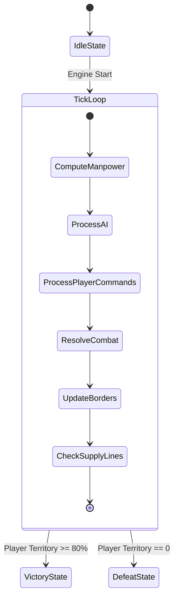

# ⚔️ WarFront.io — 01. Core Gameplay Mechanics & Combat Physics

**Version:** 1.2.0 | **Last Updated:** 2026-08-12  

---

## 1. Game State Machine & Simulation Loop

การประมวลผลของเกมขับเคลื่อนด้วย **Singleplayer Local Simulation Ticker Engine** ทำงานที่ความถี่ 60 FPS (`GAME_TICK_INTERVAL_MS = 16.66ms`):

---

## 2. Mathematical Combat Formulas (สูตรคำนวณการรบ)

เมื่อกองทัพเคลื่อนที่ข้ามพรมแดนเข้าสู่เขตแดนศัตรู หรือปะทะกันในเขตพิพาท ระบบจะคำนวณความเสียหายที่เกิดขึ้นจริงต่อ Tick การรบดังนี้:

### 2.1 Attack & Defense Power Equations

$$\text{Power}_{\text{Attack}} = N_{\text{Attacker}} \times \alpha_{\text{Attack}} \times \left( \frac{\text{Morale}_{\text{Attacker}}}{100} \right) \times M_{\text{TerrainAttack}}$$

$$\text{Power}_{\text{Defense}} = N_{\text{Defender}} \times \beta_{\text{Defense}} \times \left( \frac{\text{Morale}_{\text{Defender}}}{100} \right) \times M_{\text{TerrainDefense}} \times B_{\text{Building}}$$

### 2.2 Casualty Losses per Tick (อัตราความสูญเสีย)

$$\Delta N_{\text{Attacker}} = \text{Clamp}\left( \text{Power}_{\text{Defense}} \times \gamma_{\text{Casualty}}, \, 0.1, \, N_{\text{Attacker}} \right)$$

$$\Delta N_{\text{Defender}} = \text{Clamp}\left( \text{Power}_{\text{Attack}} \times \gamma_{\text{Casualty}}, \, 0.1, \, N_{\text{Defender}} \right)$$

| ตัวแปรในสูตร | สัญลักษณ์ตัวแปรในโค้ด | ค่ามาตรฐาน (Default) | ช่วงปรับจูน (Range) |
| :--- | :--- | :---: | :---: |
| $\alpha_{\text{Attack}}$ | `BASE_ATTACK_FACTOR` | `1.00` | `0.8` – `1.5` |
| $\beta_{\text{Defense}}$ | `BASE_DEFENSE_FACTOR` | `1.20` | `1.0` – `2.0` |
| $\gamma_{\text{Casualty}}$ | `CASUALTY_RATE_PER_TICK` | `0.025` | `0.01` – `0.1` |
| $B_{\text{Building}}$ | `FORTRESS_DEFENSE_MULT` | `1.80` | `1.2` – `3.0` |

---

## 3. Conquest & Territory Flipping Thresholds

การยึดสิทธิ์ครอบครองภูมิภาค (Territory Ownership Flip) จะเกิดขึ้นเมื่อกำลังพลฝ่ายเข้าตีบดขยี้ฝ่ายตั้งรับจนเหลือน้อยกว่าเกณฑ์พลิกพื้นที่:

$$\text{ConquestCondition}: \quad N_{\text{AttackerRemaining}} > N_{\text{DefenderRemaining}} \times \theta_{\text{Conquest}}$$

- **`CONQUEST_THRESHOLD_RATIO` ($\theta_{\text{Conquest}}$):** ค่ามาตรฐาน = `1.15` (ต้องการกำลังพลมากกว่าฝ่ายตั้งรับอย่างน้อย 15% เพื่อพลิกขอบเขตพรมแดน)
- **Capital Capture Shock:** หากเมืองหลวง (Capital Region) ของ Factions ใดถูกยึด ขวัญกำลังใจของภูมิภาคอื่นทั้งหมดในสังกัดจะลดลงทันที -40% (`CAPITAL_FALL_MORALE_DROP = 40`)

---

## 4. Supply Line Connectivity & Morale Decay

### 4.1 สายส่งกำลังบำรุง (Supply Line Graph)
ทุกภูมิภาคในสังกัดต้องสามารถลากเส้นเชื่อมต่อกลับไปยัง **Capital Region** หรือ **Naval Port** ที่เปิดทางทะเลได้ หากถูกกองทัพศัตรูตัดขาด (Cut-off Region):

$$\text{SupplyState} = \begin{cases} 1.0 & \text{หากมีเส้นทางเชื่อมต่อกับ Capital} \\ 0.4 & \text{หากถูกตัดขาดสายส่งกำลังบำรุง (Isolated)} \end{cases}$$

### 4.2 ผลกระทบของการถูกตัดสายส่งกำลังบำรุง (Isolation Penalties)
1. **อัตราการเติบโตกำลังพล:** ลดลง 60% (`ISOLATED_PRODUCTION_PENALTY = 0.4`)
2. **อัตราขวัญกำลังใจ:** ลดลงเรื่อยๆ วินาทีละ -2.0 (`ISOLATED_MORALE_DECAY_RATE = 2.0`)
3. **อัตราการรบ:** พลังโจมตีและตั้งรับลดลงตามขวัญกำลังใจที่ดรอป

---

## 🔗 Related Documents
- [Specification Index](./spec.md)
- [Economy & Strategic Buildings](./02-economy-and-buildings.md)
- [Terrain & Naval Logistics](./03-terrain-and-naval.md)
