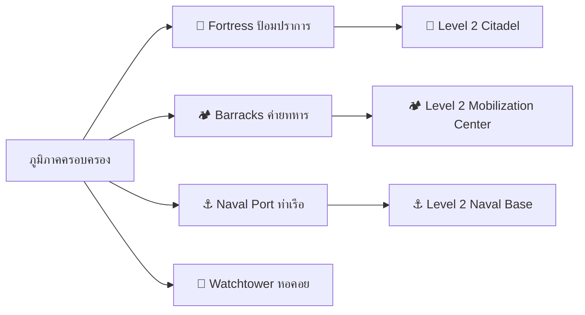

# 🏰 WarFront.io — 02. Economy & Strategic Buildings

**Version:** 1.2.0 | **Last Updated:** 2026-08-12  

---

## 1. Population & Manpower Generation Model

เศรษฐกิจในเกมขับเคลื่อนด้วยกำลังพล (Manpower) ซึ่งทำหน้าที่เป็นทั้ง **"ประชากรในการผลิต"**, **"กำลังทหารในการโจมตี"**, และ **"ทรัพยากรในการสร้างสิ่งปลูกสร้าง"**

### 1.1 Population Growth Formula

$$P(t+\Delta t) = P(t) + \left[ K_{\text{Base}} \times (\text{Area})^{0.8} \times M_{\text{Building}} \times S_{\text{Supply}} \right] \times \Delta t$$

- **`K_BASE_GROWTH`:** `1.0` (อัตราการเกิดประชากรพื้นฐานต่อตารางหน่วยพื้นที่)
- **`AREA_EXPONENT`:** `0.8` (มิติพื้นที่ที่มีผลต่อความจุประชากร)
- **`DENSITY_CAP`:** `500` Manpower / Tile

---

## 2. Strategic Buildings Specs & Upgrade Tree

ผู้เล่นและ AI สามารถใช้กำลังพลที่มีอยู่ในภูมิภาคสั่งสร้างสิ่งปลูกสร้างยุทธศาสตร์เพื่อเสริมความได้เปรียบ:

---

### 2.1 Detailed Building Parameters Matrix

| สิ่งปลูกสร้าง (Building) | ระดับ (Level) | ต้นทุนสร้าง (Cost) | เวลาสร้าง (Build Time) | ผลกระทบยุทธศาสตร์ (Strategic Effect) | ตัวแปรจูนในโค้ด |
| :--- | :---: | :---: | :---: | :--- | :--- |
| **🏰 Fortress** | Lvl 1 | 300 Manpower | 5.0 sec | เพิ่มพลังตั้งรับ +80% (`+0.80`) | `FORT_DEFENSE_L1 = 1.80` |
| | Lvl 2 | 600 Manpower | 8.0 sec | เพิ่มพลังตั้งรับ +160% (`+1.60`) | `FORT_DEFENSE_L2 = 2.60` |
| **🏕️ Barracks** | Lvl 1 | 400 Manpower | 6.0 sec | เร่งการผลิตกำลังพล +100% (`2.0x`) | `BARRACKS_MULT_L1 = 2.00` |
| | Lvl 2 | 800 Manpower | 10.0 sec | เร่งการผลิตกำลังพล +250% (`3.5x`) | `BARRACKS_MULT_L2 = 3.50` |
| **⚓ Naval Port** | Lvl 1 | 500 Manpower | 8.0 sec | เปิดการลำเลียงเรือ + ลดเวลาขึ้นเรือ 50% | `PORT_EMBARK_REDUCTION = 0.5` |
| | Lvl 2 | 1000 Manpower | 12.0 sec | เพิ่มความเร็วเรือลำเลียง +40% | `PORT_BOAT_SPEED_BOOST = 1.4` |
| **📡 Watchtower** | Lvl 1 | 200 Manpower | 3.0 sec | ขยายระยะการมองเห็น Fog of War +50% | `TOWER_VISION_L1 = 1.50` |
| | Lvl 2 | 400 Manpower | 5.0 sec | ขยายระยะการมองเห็น Fog of War +120% | `TOWER_VISION_L2 = 2.20` |

---

## 3. Building Destruction & Demolition Mechanics

1. **การถูกทำลายจากการรบ (Combat Damage to Buildings):**  
   เมื่อภูมิภาคที่มีสิ่งปลูกสร้างถูกยึดครองโดยฝั่งตรงข้าม สิ่งปลูกสร้างจะมีโอกาส 50% ที่จะถูกทำลายลง 1 ระดับ (`BUILDING_DEGRADE_CHANCE_ON_CAP = 0.50`)
2. **การรื้อถอน (Demolition):**  
   ผู้เล่นสามารถสั่งรื้อถอนสิ่งปลูกสร้างเพื่อรับกำลังพลคืน 40% ของต้นทุนสร้าง (`DEMOLISH_REFUND_RATIO = 0.40`)

---

## 🔗 Related Documents
- [Specification Index](./spec.md)
- [Core Mechanics & Combat Physics](./01-mechanics.md)
- [Terrain & Naval Logistics](./03-terrain-and-naval.md)
