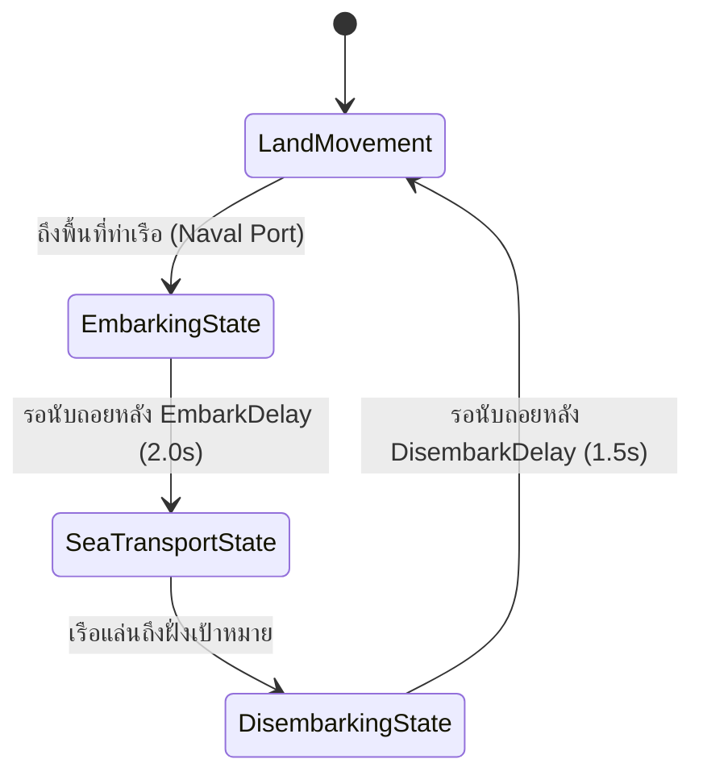

# 🌲 WarFront.io — 03. Terrain Modifiers, Fog of War & Naval Logistics

**Version:** 1.2.0 | **Last Updated:** 2026-08-12  

---

## 1. Terrain Types & Movement Modifiers

ภูมิประเทศแต่ละประเภทมีผลโดยตรงต่อความเร็วในการสืบเท้าของทหาร พลังการตั้งรับในพื้นที่ และระยะสายตาในหมอกควันสงคราม:

```
┌────────────────────────────────────────────────────────────────────────────┐
│                           TERRAIN MODIFIER TABLE                           │
├──────────────┬──────────────────┬──────────────────┬───────────────────────┤
│ ภูมิประเทศ   │ ความเร็วเคลื่อนที่│ พลังการตั้งรับ   │ ผลกระทบหมอกควัน       │
│ (Terrain)    │ (Speed Multiplier)│ (Defense Mult)   │ (Fog of War Modifier) │
├──────────────┼──────────────────┼──────────────────┼───────────────────────┤
│ 🌾 Plains    │ 1.00x            │ 1.00x            │ 100% Normal Vision    │
│ 🌲 Forest    │ 0.75x            │ 1.35x            │ 75% Vision (Cover)    │
│ ⛰️ Mountain  │ 0.40x            │ 2.00x            │ 150% High Ground      │
│ 🌊 River     │ 0.50x            │ 0.65x            │ 90% Normal Vision     │
│ 🚢 Sea Route │ 1.50x – 2.20x    │ 0.50x            │ 120% Naval Recon      │
└──────────────┴──────────────────┴──────────────────┴───────────────────────┘
```

---

## 2. Maritime Transport & Naval Logistics (การขนส่งทางเรือ)

### 2.1 Sea Crossing State Machine



### 2.2 Parameters for Naval Transport Tuning

| ตัวแปรในโค้ด (JS/TS Variable) | ค่ามาตรฐาน (Default) | ช่วงการปรับจูน (Tuning Range) | คำอธิบาย |
| :--- | :---: | :---: | :--- |
| `BOAT_BASE_SPEED` | `2.2` | `1.5` – `4.0` | ความเร็วในการแล่นเรือลำเลียงข้ามทะเล |
| `EMBARK_DELAY_SEC` | `2.0` sec | `0.5` – `5.0` | เวลาตั้งแถวขึ้นเรือบริเวณท่าเรือ |
| `DISEMBARK_DELAY_SEC` | `1.5` sec | `0.5` – `4.0` | เวลาขึ้นฝั่งและจัดขบวนทหาร |
| `NAVAL_COMBAT_PENALTY` | `0.50` | `0.20` – `0.80` | ตัวคูณการตั้งรับขณะแล่นเรือกลางทะเล (ตกเป็นเป้าได้ง่าย) |
| `INTERCEPT_RANGE` | `1.5` tiles | `0.8` – `3.0` | ระยะรัศมีของเรือรบในการเข้าสกัดเรือลำเลียงศัตรู |

---

## 3. Fog of War & Line of Sight (ระบบหมอกควันสงคราม)

### 3.1 Line of Sight (LOS) Calculation
พื้นที่ที่ไม่ได้รับการมองเห็นจากภูมิภาคของตนเอง ป้อมปราการ หรือหอคอยตรวจการณ์ จะถูกปกคลุมด้วย **Fog of War (หมอกควันสงคราม)**:

- **Base Region Vision Radius:** 1.5 Tiles รอบขอบพรมแดน
- **Watchtower Lvl 1 Vision Radius:** 3.0 Tiles
- **Watchtower Lvl 2 Vision Radius:** 5.0 Tiles
- **Mountain High-Ground Bonus:** +50% Vision Radius

### 3.2 Dynamic Vision Update Loop
เมื่อกองทัพเคลื่อนที่ ขอบเขตการมองเห็นจะอัปเดตแบบ Dynamic ตามตำแหน่งยูนิตทุกๆ 100ms (`FOG_UPDATE_INTERVAL_MS = 100`)

---

## 🔗 Related Documents
- [Specification Index](./spec.md)
- [Core Mechanics & Combat Physics](./01-mechanics.md)
- [Economy & Strategic Buildings](./02-economy-and-buildings.md)
