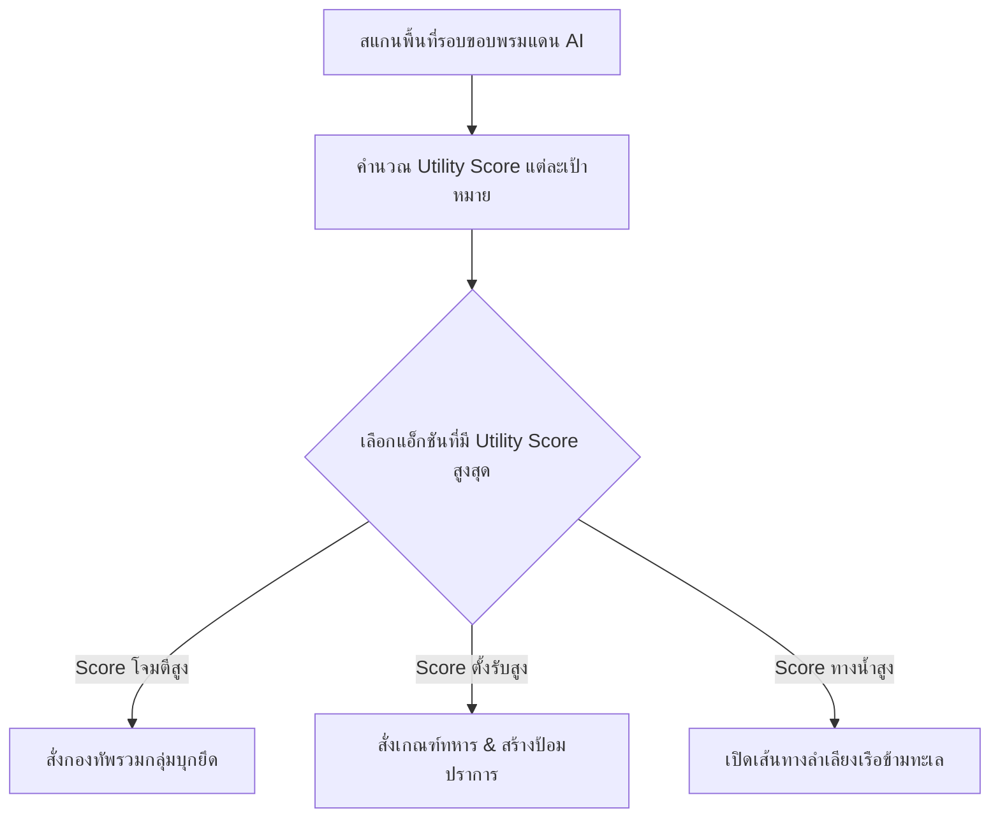

# 🤖 WarFront.io — 04. AI Behavior Matrix & Difficulty Balancing

**Version:** 1.2.0 | **Last Updated:** 2026-08-12  

---

## 1. AI Bot Decision Matrix & Utility System

บอท AI ตัดสินใจการเลือกเป้าหมาย การขยายดินแดน การป้องกัน และการลำเลียงเรือด้วยระบบ **Utility Function Score Matrix**:

$$S_{\text{Target}} = \left( W_{\text{Weakness}} \times S_{\text{Weakness}} \right) + \left( W_{\text{SupplyCut}} \times S_{\text{SupplyCut}} \right) + \left( W_{\text{CapitalDist}} \times S_{\text{CapitalDist}} \right) + \left( W_{\text{StrategicBuilding}} \times S_{\text{StrategicBuilding}} \right)$$



---

## 2. AI Bot Personalities Breakdown

เกมกำหนดบุคลิกภาพของบอท AI ออกเป็น 4 สายเพื่อสร้างความท้าทายที่หลากหลาย:

| บุคลิกภาพ AI (Personality) | น้ำหนักบุก (`W_Weakness`) | น้ำหนักตัดสายส่ง (`W_SupplyCut`) | น้ำหนักป้อม (`W_Fortify`) | น้ำหนักเรือ (`W_Naval`) |
| :--- | :---: | :---: | :---: | :---: |
| **💥 Aggressive Blitzkrieg** | **0.55** | 0.25 | 0.05 | 0.15 |
| **🗺️ Tactical Expansionist** | 0.35 | **0.45** | 0.10 | 0.10 |
| **🏰 Turtle Fortifier** | 0.15 | 0.15 | **0.60** | 0.10 |
| **⚓ Naval Specialist** | 0.20 | 0.20 | 0.10 | **0.50** |

---

## 3. Difficulty Tiers & Parameter Tuning Matrix

ระดับความยาก 4 ระดับปรับแต่งผ่านตัวแปรในระบบ AI ดังนี้:

```
┌────────────────────────────────────────────────────────────────────────────┐
│                       DIFFICULTY BALANCING MATRIX                          │
├───────────────────┬──────────────┬──────────────┬──────────────┬───────────┤
│ ตัวแปร (Variable) │ Easy (ง่าย)  │ Normal (ปกติ)│ Hard (ยาก)   │ Nightmare │
├───────────────────┼──────────────┼──────────────┼──────────────┼───────────┤
│ `AI_GROWTH_MULT`  │ 0.75x        │ 1.00x        │ 1.25x        │ 1.50x     │
│ `AI_TICK_DELAY`   │ 3.0 sec      │ 1.5 sec      │ 0.6 sec      │ 0.2 sec   │
│ `AI_SPLIT_TROOPS` │ 25% Random   │ 50% Grouped  │ 80% Smart    │ 100% Max  │
│ `AI_CUT_SUPPLY`   │ Disabled     │ Occasional   │ High Priority│ Master    │
│ `AI_FOG_CHEATING` │ Disabled     │ Disabled     │ Shared Vision│ Complete  │
└───────────────────┴──────────────┴──────────────┴──────────────┴───────────┘
```

---

## 4. Parameter Checklist for Game Balancing (สำหรับ Dev Tuning)

```typescript
// ตำแหน่งตัวแปรสำคัญในซอร์สโค้ดสำหรับปรับแต่งความสมดุล
export const BALANCE_CONFIG = {
    MANPOWER_GROWTH_RATE: 1.0,        // ปรับความเร็วเกมโดยรวม
    COMBAT_DEFENSE_FACTOR: 1.2,       // ปรับความยากในการเข้าตี
    TERRAIN_MOUNTAIN_DEFENSE: 2.0,    // ปรับความได้เปรียบพื้นที่สูง
    SUPPLY_CUT_PENALTY: 0.6,          // ปรับความสำคัญของสายส่งกำลัง
    FORTRESS_DEFENSE_BONUS: 1.8,      // ปรับความคุ้มค่าของการสร้างป้อม
    AI_DECISION_INTERVAL_MS: 1500     // ปรับความฉลาด/ความไวของ AI
};
```

---

## 🔗 Related Documents
- [Specification Index](./spec.md)
- [Core Mechanics & Combat Physics](./01-mechanics.md)
- [Controls, Hotkeys & UI/UX](./05-controls-and-ux.md)
