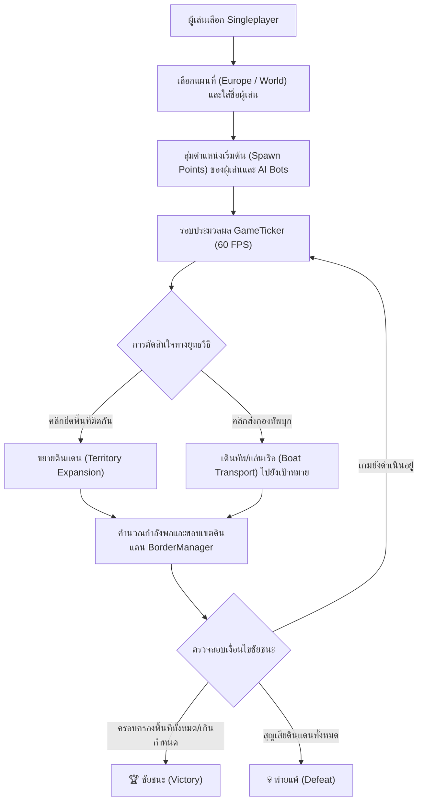

# Game Design Document (GDD) — WarFront.io & FrontWars Strategy

## Real-Time Tactical Territory Domination Game

**ชื่อโครงการ (Project Title):** WarFront.io & FrontWars Strategy  
**ประเภทเกม (Genre):** Real-Time Strategy (RTS) / Territory Domination / Browser IO Strategy  
**แพลตฟอร์ม (Platform):** Web Browser (HTML5 WebGL/Canvas + TypeScript / JavaScript Standalone Bundle)  
**เวอร์ชัน (Version):** 1.0.0  
**เจ้าของเอกสาร (Document Owner):** Antigravity Gamedev Team  

---

## 1. บทนำ แหล่งอ้างอิง และวิสัยทัศน์เกม (Introduction, References & Vision)

### 1.1 แหล่งอ้างอิงงานออกแบบหลัก (Design & Reference Repositories)
เอกสารงานออกแบบและสถาปัตยกรรมซอฟต์แวร์ของเกมนี้ถูกบันทึกและพัฒนาขึ้นโดยอ้างอิงจาก Repository หลักดังต่อไปนี้:

1. **FrontWars Repository (Primary Concept & Gameplay Reference):**  
   [https://github.com/Elitis/FrontWars](https://github.com/Elitis/FrontWars)  
   *ต้นแบบแนวคิดระบบเกมการยึดดินแดนแบบเรียลไทม์ การจัดการกองทัพ และโหมดต่อสู้ Strategic RTS*

2. **WarFront.io Client Repository (Production Engine & Implementation Reference):**  
   [https://github.com/WarFrontIO/client](https://github.com/WarFrontIO/client)  
   *ซอร์สโค้ดฝั่ง Client, WebGL/Canvas Renderer Engine, MapCodec Binary Map Encoder/Decoder, UI System และ AI Bot System*

3. **OpenFrontIO / FrontWars Open-Source Evolution:**  
   [https://github.com/openfrontio/OpenFrontIO](https://github.com/openfrontio/OpenFrontIO)  
   *แหล่งอ้างอิงเพิ่มเติมสำหรับการพัฒนาและต่อยอดระบบในอนาคต*

---

### 1.2 Elevator Pitch
**WarFront.io & FrontWars** คือเกม RTS วางแผนยึดครองโลกแบบเรียลไทม์บนเว็บเบราว์เซอร์ ผู้เล่นสั่งการขยายดินแดน ส่งกองกำลังรบ สร้างเส้นทางลำเลียงเรือ (Boat Routes) และวางยุทธศาสตร์ขับเคี่ยวกับ AI Bots บนแผนที่โลกทวีปต่างๆ (เช่น แผนที่ยุโรป Europe และแผนที่โลก World) โดยตัวเกมทำงานแบบ Standalone 100% ผ่านเบราว์เซอร์ ไม่ต้องลงทะเบียนหรือพึ่งพาเซิร์ฟเวอร์ภายนอกสำหรับการเล่นคนเดียว

---

## 2. สถาปัตยกรรมเทคนิค (Technical Architecture)

| Component | Technology | Notes |
|:---|:---|:---|
| **Core Client** | TypeScript, Webpack | รวมเอารันไทม์และสคริปต์เข้าเป็น Bundled Output Single HTML |
| **Renderer Engine** | Custom WebGL & Canvas 2D Shader Engine | การเรนเดอร์ขอบเขตดินแดน (Borders), กองทัพ, เส้นทางเรือ และ UI แผนที่ |
| **Binary Map Codec** | `MapCodec` Submodule (`src/map/codec`) | โหลดและเข้ารหัส/ถอดรหัสไฟล์แผนที่ความละเอียดสูง |
| **Game Ticker & AI** | Singleplayer Local Simulation (`GameTicker.ts`, `bot/`) | ประมวลผลยูนิต บอท และการขยายเขตแดนแบบเรียลไทม์ 60 FPS |

---

## 3. ระบบการเล่นหลัก (Core Gameplay Loop)

---

## 4. โครงสร้างไฟล์และจุดเชื่อมต่อ (File Locations & Links)

- **GDD Document:** [docs/gdd/games/warfront/gdd.md](file:///c:/Users/noppon/source/06-WEB/webJS/docs/gdd/games/warfront/gdd.md)
- **Standalone Game Bundle:** [public/games/warfront/index.html](file:///c:/Users/noppon/source/06-WEB/webJS/public/games/warfront/index.html)
- **Web Hub Integration:** [src/app/page.js](file:///c:/Users/noppon/source/06-WEB/webJS/src/app/page.js#L86-L93)

---

## 5. เอกสารอ้างอิงที่เกี่ยวข้อง (Related Documents)
- [Project Concept & Architecture](../../00-concept.md)
- [System Design Overview](../../../software/01-system-design.md)
- [Product Backlog](../../../agile/01-product-backlog.md)
- [Document Index](../../../index.md)
