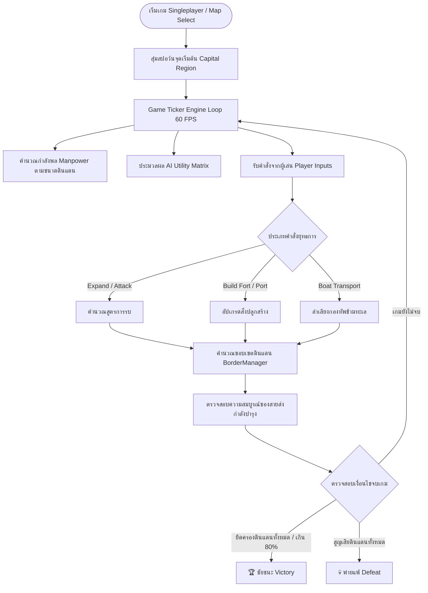

# ⚔️ Master Game Design Document (GDD) — WarFront.io & FrontWars Strategy

## Real-Time Tactical Territory Domination Game

**ชื่อโครงการ (Project Title):** WarFront.io & FrontWars Strategy  
**ประเภทเกม (Genre):** Real-Time Strategy (RTS) / Territory Domination / Browser IO Strategy  
**แพลตฟอร์ม (Platform):** Web Browser (HTML5 WebGL/Canvas + TypeScript / JavaScript Standalone Bundle)  
**เวอร์ชัน (Version):** 1.2.0  
**เจ้าของเอกสาร (Document Owner):** Antigravity Gamedev Team  

---

## 📘 Detailed Document Suite Index

เอกสารงานออกแบบฉบับเต็มถูกแบ่งออกเป็น 6 หมวดหมู่หลักในโฟลเดอร์นี้เพื่อความสะดวกในการจูนค่า Gameplay:

| หมวดหมู่เอกสาร | ลิงก์เอกสาร | รายละเอียดและจุดเน้นการปรับจูน |
| :--- | :--- | :--- |
| **00. Concept & World Lore** | [00-concept.md](./00-concept.md) | คอนเซปต์ ธีมสงคราม การแบ่งฝ่าย Factions (Blue, Red, Green, Gold) และแผนที่โลก |
| **01. Core Mechanics & Combat** | [01-mechanics.md](./01-mechanics.md) | สูตรคำนวณการรบ อัตราความสูญเสีย ขวัญกำลังใจ และสายส่งกำลังบำรุง |
| **02. Economy & Buildings** | [02-economy-and-buildings.md](./02-economy-and-buildings.md) | สูตรการผลิตกำลังพล การอัปเกรดป้อมปราการ ท่าเรือ และค่ายทหาร |
| **03. Terrain & Naval Logistics** | [03-terrain-and-naval.md](./03-terrain-and-naval.md) | ตัวคูณพื้นที่ (ป่า, ภูเขา, แม่น้ำ), หมอกควันสงคราม และการขนส่งทางเรือ |
| **04. AI Behavior & Balancing** | [04-ai-and-balancing.md](./04-ai-and-balancing.md) | ตารางการตัดสินใจบอท บุคลิกภาพ AI 4 สาย และระดับความยาก 4 ระดับ |
| **05. Controls & UI/UX** | [05-controls-and-ux.md](./05-controls-and-ux.md) | ระบบการควบคุมเมาส์ Drag-Select, คีย์ลัดแป้นพิมพ์ และเลย์เอาต์ HUD |
| **Technical Specification** | [spec.md](./spec.md) | ดรรชนีรวมเอกสาร สแตกรันไทม์ และซอร์สอ้างอิง |

---

## 1. Executive Summary & Core Gameplay Loop

**WarFront.io & FrontWars** คือเกมวางแผนยึดครองโลกแบบเรียลไทม์ (Real-Time Strategy) บนเว็บเบราว์เซอร์ ที่มุ่งเน้นการตัดสินใจระดับมหภาค (Macro RTS):
- การบริหารขอบเขตดินแดน (Border Control)
- การสร้างลู่ลำเลียงกำลังบำรุง (Supply Lines)
- การจัดสรรกำลังพลระหว่างแนวหน้า (Frontline) กับแนวหลัง (Rear Guard)

---

## 2. Technical Architecture & File Locations

- **GDD Document Suite:** [docs/gdd/games/warfront/](file:///c:/Users/noppon/source/06-WEB/webJS/docs/gdd/games/warfront/)
- **Standalone Game Bundle:** [public/games/warfront/index.html](file:///c:/Users/noppon/source/06-WEB/webJS/public/games/warfront/index.html)
- **Web Hub Integration:** [src/app/page.js](file:///c:/Users/noppon/source/06-WEB/webJS/src/app/page.js#L95-L101)

---

## 🔗 Reference Repositories

1. **FrontWars Concept Reference:** [https://github.com/Elitis/FrontWars](https://github.com/Elitis/FrontWars)
2. **WarFront.io Production Client:** [https://github.com/WarFrontIO/client](https://github.com/WarFrontIO/client)
3. **OpenFrontIO Strategic Expansion:** [https://github.com/openfrontio/OpenFrontIO](https://github.com/openfrontio/OpenFrontIO)
