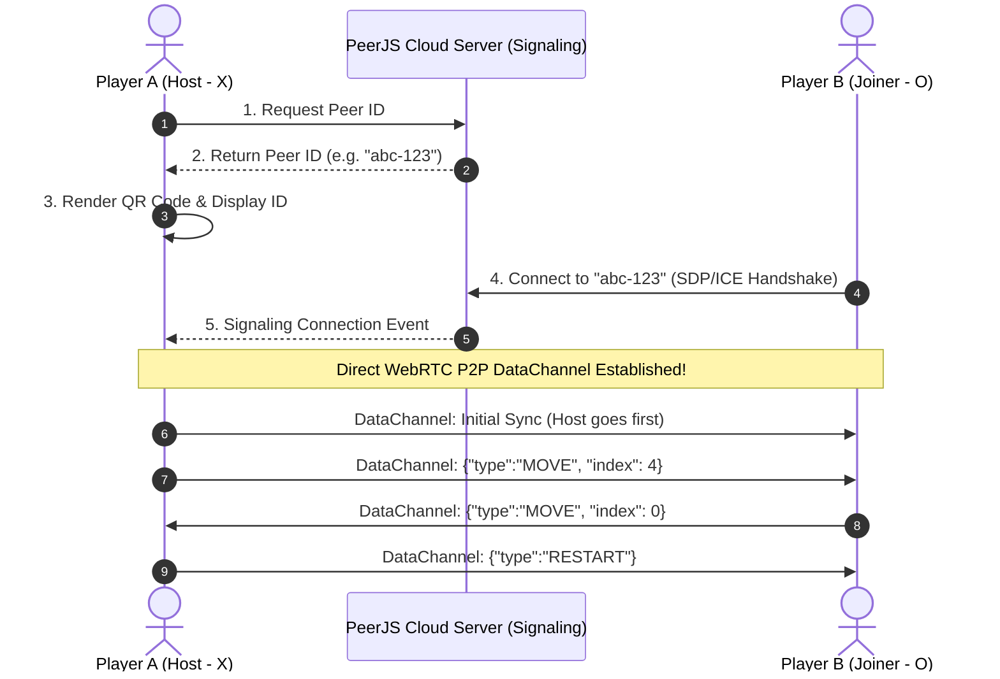

# 🎮 XO Multiplayer (WebRTC P2P) — Game Design Document & Technical Specification

**Code Name:** `webrtc-xo` (G027)  
**Game ID:** `webrtc-xo`  
**Engine / Tech:** HTML5 / Vanilla JavaScript / CSS Grid / PeerJS (WebRTC DataChannel) / QRCode.js  
**Category:** กระดาน / มัลติเพลเยอร์ (P2P)  
**Deployment / URL:** `/games/webrtc-xo/index.html`  

---

## 1. Game Overview

### 1.1 Elevator Pitch
**XO Multiplayer (WebRTC P2P)** เป็นเกมกระดาน Tic-Tac-Toe แบบผู้เล่น 2 คน (2-Player Turn-based) ที่เชื่อมต่อแบบ **Peer-to-Peer (P2P)** โดยตรงผ่านบราวเซอร์ด้วยเทคโนโลยี **WebRTC** และ **PeerJS** ผู้เล่นสามารถแชร์ **Peer ID** หรือ **QR Code / Direct Link** ให้เพื่อนเพื่อเข้าห้องเล่นเกมได้ทันที โดยไม่ต้องผ่านฐานข้อมูลหรือสมัครสมาชิก

### 1.2 Target Audience & Core Value
- ผู้เล่นที่ต้องการเล่นเกมกระดานแบบ Real-time กับเพื่อนข้ามอุปกรณ์ (Mobile & Desktop)
- ความหน่วงต่ำมาก (Low Latency) เนื่องจากข้อมูลส่งตรงระหว่างเครื่องผู้เล่น (Browser-to-Browser)
- ปลอดภัยและเป็นส่วนตัว (End-to-End DataChannel) ไม่มีการเก็บประวัติหรือข้อมูลผู้เล่นบนเซิร์ฟเวอร์

---

## 2. Core Gameplay Mechanics & Systems

### 2.1 Game Loop & Turn-based Flow
1. **Lobby & Handshake**:
   - ผู้เล่นคนที่ 1 (**Host**) เปิดเกม -> ระบบสุ่มสร้าง `Peer ID` และ `QR Code`
   - ผู้เล่นคนที่ 2 (**Joiner**) ใส่ `Peer ID` ของ Host (หรือสแกน QR Code / เปิด Link URL) แล้วกด **Connect**
   - เมื่อเชื่อมต่อสำเร็จ: Host ได้รับบทบาทสัญลักษณ์ **X** (เริ่มก่อน) และ Joiner ได้รับสัญลักษณ์ **O** (รอตาถัดไป)
2. **Turn Progression**:
   - ผู้เล่นที่เป็นเจ้าของตา (Turn Active) สามารถคลิกเลือกช่องว่างบนกระดาน 3x3 ได้
   - เมื่อคลิก ระบบจะวางสัญลักษณ์ตัวเองลงกระดาน และส่งแพ็กเก็ตข้อมูล `{ type: 'MOVE', index }` ไปยังคู่แข่งผ่าน WebRTC
   - เปลี่ยนสถานะเป็นตารอ (Opponent's Turn)
3. **Endgame Evaluation**:
   - ทุกครั้งที่มีการเดิน ระบบจะตรวจสอบเงื่อนไขการชนะ 8 รูปแบบ (3 แนวนอน, 3 แนวตั้ง, 2 แนวทแยง)
   - หากชนะ: ไฮไลต์ช่องที่ชนะ (Glow Effect) และแสดงข้อความ **"🎉 You Win!"** หรือ **"😢 You Lose"**
   - หากเสมอ (Draw): กระดานเต็ม 9 ช่องโดยไม่มีผู้ชนะ แสดงข้อความ **"🤝 Draw!"**
4. **Rematch & Session Loop**:
   - ผู้เล่นสามารถกดปุ่ม **"🔄 Rematch"** เพื่อส่งสัญญาณ `{ type: 'RESTART' }` ล้างกระดานและเริ่มเล่นตาใหม่ได้ทันทีโดยไม่ต้องเชื่อมต่อใหม่

---

## 3. WebRTC Networking & Data Protocol

### 3.1 Architecture Diagram


### 3.2 JSON Data Packet Schema

| Packet Type | Payload Example | Description |
|---|---|---|
| `MOVE` | `{"type": "MOVE", "index": 4}` | ส่งตำแหน่งช่องกระดาน (0 - 8) ที่ผู้เล่นกดเดิน |
| `RESTART` | `{"type": "RESTART"}` | ขอเริ่มกระดานใหม่ (Rematch) และล้างสถานะกระดานทั้งสองฝั่ง |

---

## 4. User Interface & Responsive Design

### 4.1 Design Philosophy
- **Dark Neon / Glassmorphism**: ใช้โทนสีมืด `rgba(15, 23, 42, 0.95)` ผสานกับ Accent สีฟ้า Cyan `#00f2fe`, Indigo `#6366f1` และ Emerald `#10b981`
- **Responsive 3x3 Grid**: ปรับขนาดอัตโนมัติรองรับทั้งจอมือถือแนวตั้ง (Mobile Portrait) และจอคอมพิวเตอร์ (Desktop)

### 4.2 Key UI Components
1. **Header Section**: โลโก้เกมและคำอธิบาย
2. **Lobby Card (Connection Panel)**:
   - **My Peer ID Box**: ช่องแสดง ID พร้อมปุ่ม **Copy ID** (พร้อมระบบ Fallback Clipboard) และปุ่ม **QR Code**
   - **QR Code Popup Modal**: Canvas แสดง QR Code สำหรับสแกนเข้าห้องทันที
   - **Friend ID Input**: ช่องกรอก ID ของเพื่อน และปุ่ม Connect
   - **Status Indicator**: แสดงสถานะการเชื่อมต่อ (Waiting, Connecting, Connected, Error)
3. **Game Card (Board Panel)**:
   - **Player Role Badge**: แสดงสัญลักษณ์ประจำตัว (**You are: X** หรือ **You are: O**)
   - **Turn Indicator**: แจ้งสถานะ Real-time (**🎯 Your Turn** / **⏳ Opponent's Turn**)
   - **3x3 Interactive Grid**: ตาราง 9 ช่อง พร้อมแอนิเมชัน Pop-in เมื่อวางเครื่องหมาย และ Winning Line Glow
   - **Control Buttons**: ปุ่ม **Rematch (🔄)** และ **Leave Game (🚪)**

---

## 5. Controls & Input Mapping

| Action | Input / Interaction |
|---|---|
| **Copy Peer ID** | คลิกปุ่ม Copy ข้างช่อง My Peer ID (คัดลอกลง Clipboard อัตโนมัติ) |
| **Show QR Code** | คลิกปุ่ม QR Code เพื่อแสดง QR ภาพสำหรับสแกน |
| **Connect Peer** | กรอก ID ของเพื่อนแล้วกดปุ่ม "Connect" หรือกด Enter |
| **Make Move** | คลิกที่ช่องว่างบนกระดาน 3x3 (เฉพาะในตาของตัวเอง) |
| **Rematch** | คลิกปุ่ม "🔄 Rematch" เพื่อรีเซ็ตกระดานและเริ่มรอบใหม่ |
| **Leave Game** | คลิกปุ่ม "🚪 Leave Game" เพื่อตัดการเชื่อมต่อและกลับสู่หน้า Lobby |

---

## 6. Technical File Structure & Hub Integration

```
public/games/webrtc-xo/
├── index.html        # โครงสร้างหน้าเว็บ โหลดไลบรารี CDN (PeerJS, QRCode.js)
├── style.css         # สไตล์ Glassmorphism, CSS Grid, Media Queries, Neon Effects
└── game.js           # ระบบ PeerJS P2P, DataChannel Events, Game State, Win Checking
```

### 6.1 Hub Integration Specifications
- **Iframe Permissions in [GameModal.jsx](../../../src/components/GameModal.jsx)**:  
  เปิดสิทธิ์ `allow="fullscreen; autoplay; gamepad; clipboard-write; clipboard-read"`
- **Hub Catalog in [src/app/page.js](../../../src/app/page.js)**:  
  ลงทะเบียนภายใต้หมวดหมู่ `"กระดาน / มัลติเพลเยอร์"`

---

## 🔗 Related Documents
- [00-concept.md — Game Concept & Architecture](../../00-concept.md)
- [01-mechanics.md — Core Gameplay Loops & Rules](../../01-mechanics.md)
- [Project Index](../../index.md)
- [Agile Product Backlog](../../../agile/01-product-backlog.md)
