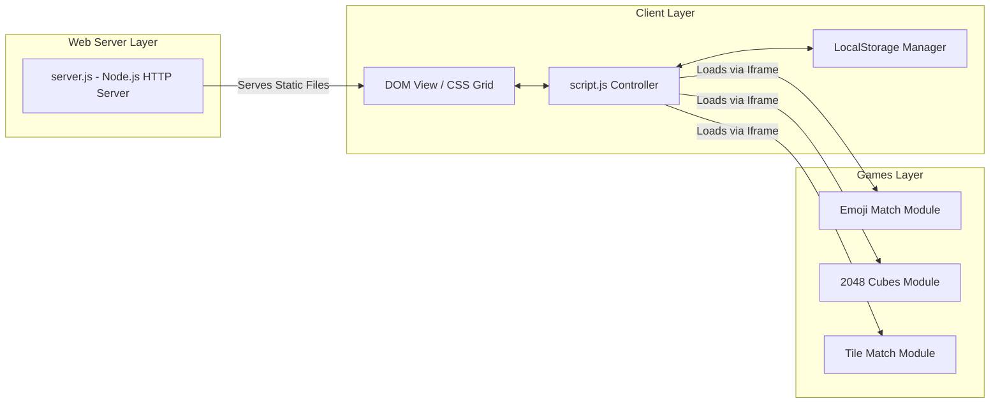

# Software System Design — webJS Game Portfolio

**Version:** 1.0.0 | **Last Updated:** 2026-07-26

---

## 1. System Architecture Overview

โปรเจค `webJS` ถูกออกแบบให้เป็น **Single Page Portfolio App (SPA-style)** ที่ทำหน้าที่เป็น Container หลักในการจัดการ ค้นหา กรอง และโหลดมินิเกมแยกแต่ละไดเรกทอรีผ่าน HTML5 Iframe Modal Architecture

---

## 2. Core Subsystems

---

## 3. Subsystem Breakdown

### 3.1 Portfolio Controller (`script.js`)
- **Card Rendering**: สร้าง HTML Elements สำหรับการ์ดเกมจากโครงสร้างข้อมูล `gamesData`
- **Filtering System**: กรองรายการเกมตาม Category หรือคำค้นหาใน Search Bar
- **Modal Manager**: จัดการเปิด/ปิด Iframe Modal พร้อมส่ง Keyboard Events (`Space`, `F`, `Esc`)

### 3.2 Native HTTP Server (`server.js`)
- **Zero-Dependency Native Server**: พัฒนาด้วย Node.js Built-in Modules (`http`, `fs`, `path`, `url`)
- **MIME Type Handling**: รองรับการส่งไฟล์ `.html`, `.css`, `.js`, `.json`, `.png`, `.jpg`, `.svg`
- **Automatic Port Fallback**: หาก Port `5500` ไม่ว่าง ระบบจะสลับไปใช้ Port ถัดไปโดยอัตโนมัติ

---

## Related Documents
- Concept: [Game Concept & Architecture](../gdd/00-concept.md)
- Class Diagrams: [Class Diagram & Data Flow](./02-class-diagram.md)
- Data Schema: [Data Schema & Persistence](./03-data-schema.md)
