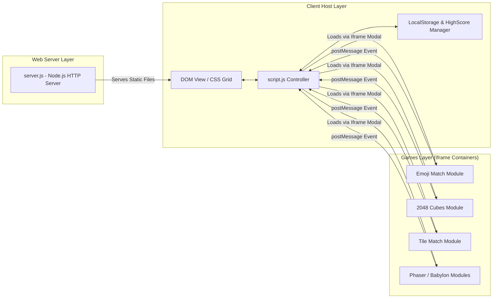

# Software System Design — webJS Game Portfolio

**Version:** 1.1.0 | **Last Updated:** 2026-07-28

---

## 1. System Architecture Overview

โปรเจค `webJS` ถูกออกแบบให้เป็น **Single Page Portfolio App (SPA-style)** ที่ทำหน้าที่เป็น Container หลักในการจัดการ ค้นหา กรอง และโหลดมินิเกมแยกแต่ละไดเรกทอรีผ่าน HTML5 Iframe Modal Architecture พร้อมระบบจัดการข้อมูลส่วนกลาง (Global Storage Controller) สำหรับรับและบันทึกคะแนนสูงสุด (High Score) แบบเรียลไทม์

---

## 2. Core Subsystems

---

## 3. Subsystem Breakdown

### 3.1 Portfolio Controller (`script.js`)
- **Card Grid Rendering**: สร้าง HTML Elements สำหรับการ์ดเกมจากโครงสร้างข้อมูล `gamesData` ([US-01-01](../agile/user-stories/US-01-01-portfolio-cards.md))
- **Filtering & Search System**: กรองรายการเกมตาม Category หรือคำค้นหาใน Search Bar แบบ Real-Time ([US-01-03](../agile/user-stories/US-01-03-search-filter.md))
- **Modal Manager**: จัดการเปิด/ปิด Iframe Modal พร้อมส่ง Keyboard Events (`Space`, `F`, `Esc`) ([US-01-02](../agile/user-stories/US-01-02-modal-loader.md))
- **Cross-Iframe Event Listener**: ดักรับ `message` events จากมินิเกมผ่าน `window.addEventListener('message', ...)` เพื่อรับค่าคะแนน

### 3.2 High Score & LocalStorage Manager Subsystem
- **Score Persistence Manager**: บันทึกและดึงคะแนนสูงสุดของแต่ละเกมผ่าน Browser `localStorage` ([US-03-01](../agile/01-product-backlog.md))
- **High Score Validation**: ตรวจสอบว่าคะแนนใหม่สูงกว่าคะแนนเดิมหรือไม่ หากสูงกว่า จะทำการอัปเดตลง storage และแสดง Badge สรุปสถิติบนการ์ดเกม

### 3.3 Native HTTP Server (`server.js`) ([US-03-02](../agile/01-product-backlog.md))
- **Zero-Dependency Native Server**: พัฒนาด้วย Node.js Built-in Modules (`http`, `fs`, `path`, `url`) โดยไม่ต้องติดตั้ง npm packages ภายนอก
- **MIME Type Handling**: รองรับการส่งไฟล์ `.html`, `.css`, `.js`, `.json`, `.png`, `.jpg`, `.svg`, `.wasm`
- **Automatic Port Fallback**: หาก Port `5500` ไม่ว่าง ระบบจะสลับไปใช้ Port ถัดไปโดยอัตโนมัติ

---

## Related Documents
- Concept: [Game Concept & Architecture](../gdd/00-concept.md)
- Class Diagrams: [Class Diagram & Data Flow](./02-class-diagram.md)
- Data Schema: [Data Schema & Persistence](./03-data-schema.md)
- Product Backlog: [Product Backlog](../agile/01-product-backlog.md)
