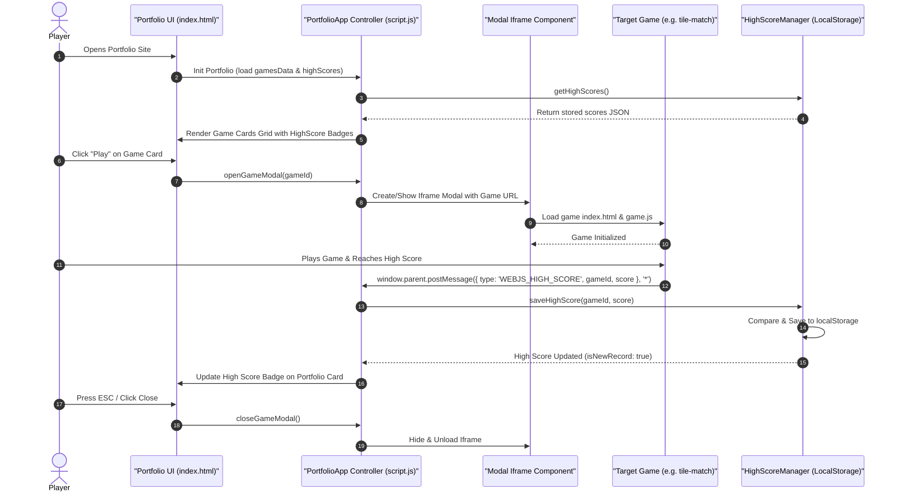
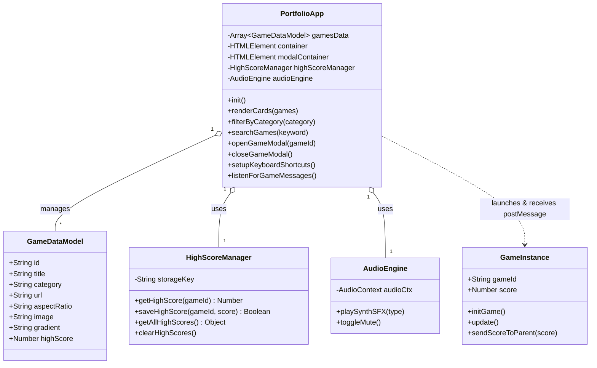

# Software Class Diagram & Flow — webJS Game Portfolio

**Version:** 1.1.0 | **Last Updated:** 2026-07-28

---

## 1. Portfolio Data Flow & High Score Sequence Diagram

---

## 2. Component Class Diagram

---

## Related Documents
- System Design: [Subsystem Breakdown](./01-system-design.md)
- Data Schema: [Data Structures & Persistence](./03-data-schema.md)
- Backlog: [Product Backlog](../agile/01-product-backlog.md)
