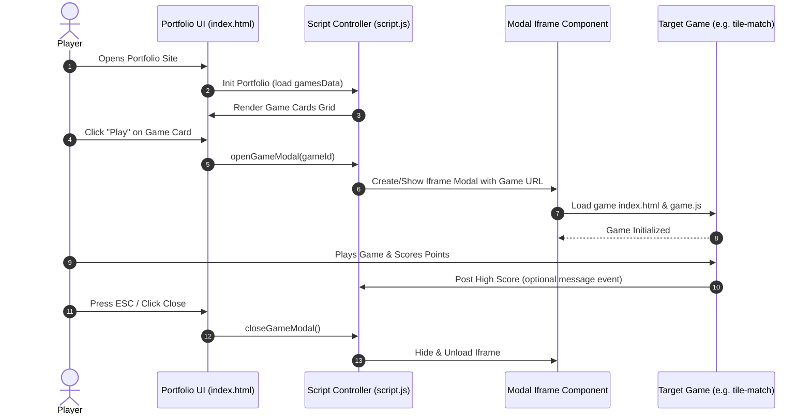
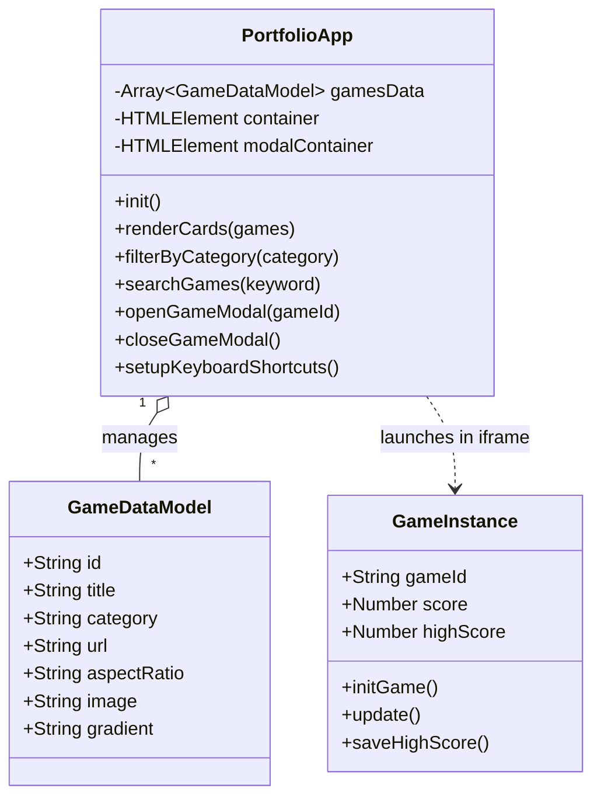

# Software Class Diagram & Flow — webJS Game Portfolio

**Version:** 1.0.0 | **Last Updated:** 2026-07-26

---

## 1. Portfolio Data Flow Diagram

---

## 2. Component Class / Model Diagram

---

## Related Documents
- System Design: [Subsystem Breakdown](./01-system-design.md)
- Data Schema: [Data Structures & Persistence](./03-data-schema.md)
