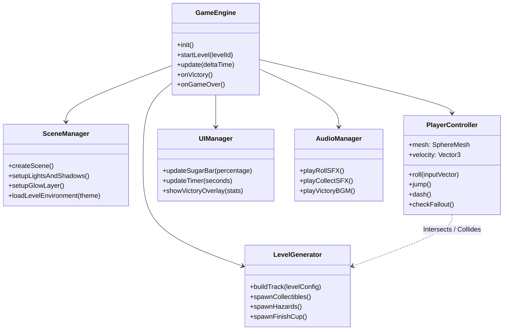

# 💻 BOBA PEARL DROP: 100% SUGAR — System Architecture & Design

---

## 🏗 Subsystem Breakdown (BabylonJS Architecture)

ระบบซอฟต์แวร์ของ **BOBA PEARL DROP: 100% SUGAR** แบ่งออกเป็น Subsystems หลัก 6 ส่วนที่ทำงานร่วมกันแบบ Modular:

---

## 🛠 Key Component Descriptions

### 1. `GameEngine` (Core Manager)
- ทำหน้าที่บริหารจัดการ Lifecycle ของเกม (State Machine: Title, Playing, Paused, Victory, Respawn)
- คำนวณ Frame Delta Time และประสานงานระหว่าง Player, Physics, UI และ Audio

### 2. `PlayerController` (Sphere Movement & Physics)
- สร้างเม็ดไข่มุก 3D ด้วย `BABYLON.MeshBuilder.CreateSphere("bobaPearl", {diameter: 1.0})`
- รับทิศทางจากกล้อง `ArcRotateCamera.getForwardVector()` และคำนวณเวกเตอร์แรงกลิ้ง (Impulse Vector)
- ตรวจสอบตำแหน่ง Y หากต่ำกว่า Fall-Zone Threshold (`Y < -10`) จะส่งสัญญาณ Respawn

### 3. `LevelGenerator` (Procedural Track & Props)
- สร้างโครงสร้างลู่กลิ้ง 3D จาก Primitives (`CreateBox`, `CreateCylinder`, `CreateTube`)
- กำหนด Material PBR ประจำด่าน (Milk Tea, Taro, Matcha)
- จัดวางไอเทม Sugar Cubes และจุด Checkpoint / Finish Cup

### 4. `UIManager` & `AudioManager`
- ควบคุม DOM Canvas Overlay หน้าต่าง Glassmorphic HUD
- เล่นเสียงสะท้อน Synth sound เมื่อเก็บไอเทม และ BGM ดนตรีธีมชิลๆ

---

## 🔗 Related Documents
- [GDD Specification](../../gdd/games/boba-pearl-drop/spec.md)
- [GDD Mechanics](../../gdd/games/boba-pearl-drop/01-mechanics.md)
